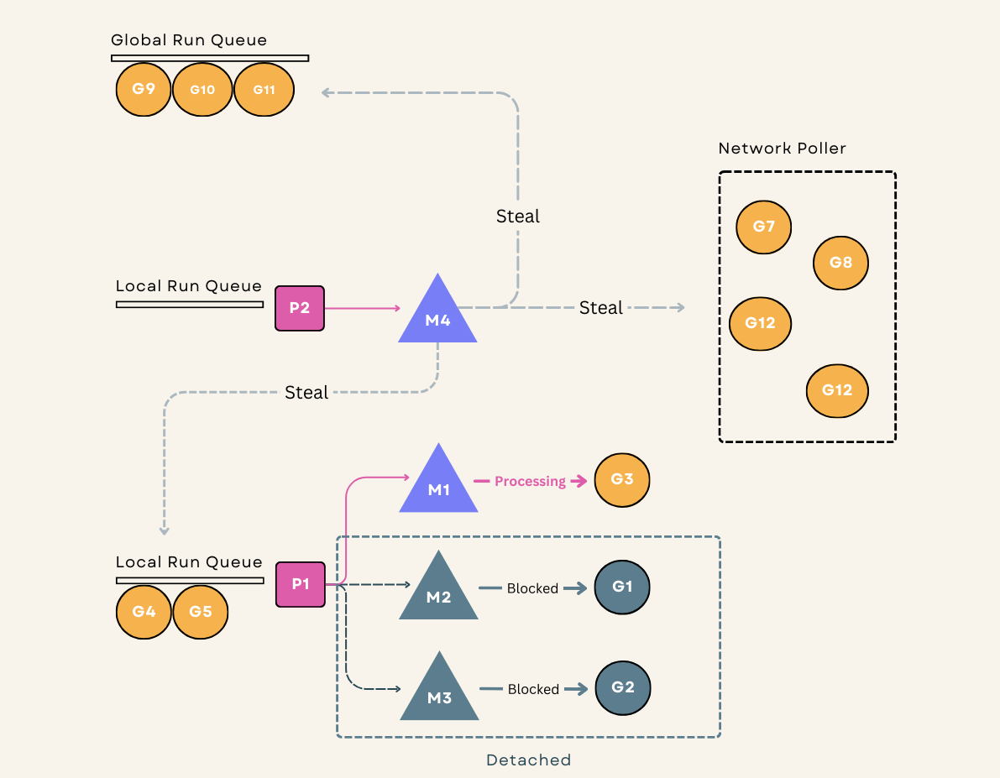

## 基础概念

### 进程和线程

线程是操作系统调度时的最基本单元，而 Linux 在调度器并不区分进程和线程的调度，它们在不同操作系统上也有不同的实现，但是在大多数的实现中线程都属于进程


- 多个线程可以属于同一个进程并共享内存空间，因为多线程不需要创建新的虚拟内存空间，所以它们也不需要内存管理单元处理上下文的切换

- 线程之间的通信也正是基于共享的内存进行的

与重量级的进程相比，线程显得比较轻量

### Go 协程

虽然线程比较轻量，但是在调度时也有比较大的额外开销。每个线程会都占用 1M 以上的内存空间，在切换线程时不止会消耗较多的内存，恢复寄存器中的内容还需要向操作系统申请或者销毁资源，每一次线程上下文的切换都需要消耗 ~1us 左右的时间，但是 Go 调度器对 Goroutine 的上下文切换约为 ~0.2us，减少了 80% 的额外开销


Goroutines 分布在线程中，由 Goroutine 调度器在幕后处理

Go 语言的调度器通过使用与 CPU 数量相等的线程减少线程频繁切换的内存开销，同时在每一个线程上执行额外开销更低的 Goroutine 来降低操作系统和硬件的负载

对比线程

- 从原始执行速度来看，Goroutines 不一定比线程更快，因为它们需要一个实际的线程来运行
- Goroutines 的真正优势在于上下文切换、内存占用、创建和拆除的成本等方面

## 历史版本

历史上几个不同版本的调度器引入了不同的改进，也存在着不同的缺陷:

- 单线程调度器 0.x
  - 只包含 40 多行代码；
  - 程序中只能存在一个活跃线程，由 G-M 模型组成；
- 多线程调度器 1.0
  - 允许运行多线程的程序；
  - 全局锁导致竞争严重；

- 任务窃取调度器 1.1
  - 引入了处理器 P，构成了目前的 G-M-P 模型；
  - 在处理器 P 的基础上实现了基于工作窃取的调度器；
  - 在某些情况下，Goroutine 不会让出线程，进而造成饥饿问题；
  - 时间过长的垃圾回收（Stop-the-world，STW）会导致程序长时间无法工作；

- 抢占式调度器 1.2 ~ 至今
  - 基于协作的抢占式调度器 - 1.2 ~ 1.13
    - 通过编译器在函数调用时插入抢占检查指令，在函数调用时检查当前 Goroutine 是否发起了抢占请求，实现基于协作的抢占式调度；
    - Goroutine 可能会因为垃圾回收和循环长时间占用资源导致程序暂停；
  - 基于信号的抢占式调度器 - 1.14 ~ 至今
    - 实现基于信号的真抢占式调度；
    - 垃圾回收在扫描栈时会触发抢占调度；
    - 抢占的时间点不够多，还不能覆盖全部的边缘情况；
- 非均匀存储访问调度器 提案
  - 对运行时的各种资源进行分区；
  - 实现非常复杂，到今天还没有提上日程；

除了多线程、任务窃取和抢占式调度器之外，Go 语言社区目前还有一个非均匀存储访问（Non-uniform memory access，NUMA）调度器的提案

## 单线程调度器

0.x 版本调度器只包含表示 Goroutine 的 G 和表示线程的 M 两种结构，全局也只有一个线程

源码：<https://github.com/golang/go/blob/96824000ed89d13665f6f24ddc10b3bf812e7f47/src/runtime/proc.c#L338-L383>

```c
// Scheduler loop: find g to run, run it, repeat.
static void
scheduler(void)
{
	G* gp;

	// Initialization.
	m->procid = getprocid();
	lock(&sched);

	if(gosave(&m->sched)){
		// Jumped here via gosave/gogo, so didn'
		// execute lock(&sched) above.
		lock(&sched);

		// Just finished running m->curg.
		gp = m->curg;
		gp->m = nil;	// for debugger
		switch(gp->status){
		case Grunnable:
		case Gdead:
			// Shouldn't have been running!
			throw("bad gp->status in sched");
		case Grunning:
			gp->status = Grunnable;
			gput(gp);
			break;
		case Gmoribund:
			gp->status = Gdead;
			if(--sched.gcount == 0)
				sys·exit(0);
			break;
		}
		notewakeup(&gp->stopped);
	}

	// Find (or wait for) g to run.  Unlocks sched.
	gp = nextgandunlock();
	
	noteclear(&gp->stopped);
	gp->status = Grunning;
	m->curg = gp;
	gp->m = m;	// for debugger
	g = gp;
	gogo(&gp->sched);
}

```

该函数会遵循如下的过程调度 Goroutine：

1. 获取调度器的全局锁；
2. 调用 [`runtime.gosave:9682400`](https://draveness.me/golang/tree/runtime.gosave:9682400) 保存栈寄存器和程序计数器；
3. 调用 [`runtime.nextgandunlock:9682400`](https://draveness.me/golang/tree/runtime.nextgandunlock:9682400) 获取下一个需要运行的 Goroutine 并解锁调度器；
4. 修改全局线程 `m` 上要执行的 Goroutine；
5. 调用 [`runtime.gogo:9682400`](https://draveness.me/golang/tree/runtime.gogo:9682400) 函数运行最新的 Goroutine；

源码：


这次提交已经包含了 G 和 M 两个重要的数据结构，也建立了 Go 语言调度器的框架


