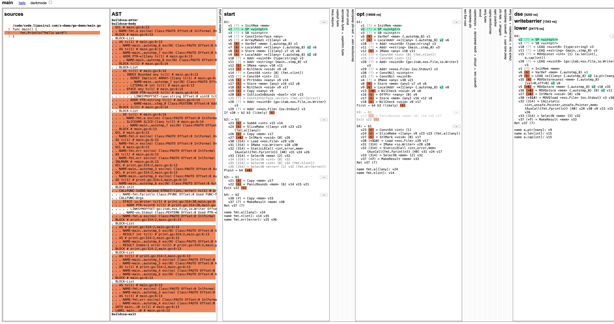

## SSA

### SSA 简介

遍历函数后，编译器会将抽象语法树转换为下一个重要的中间表示形态，称为 `SSA（Static Single Assignment，静态单赋值）`

`SSA` 被大多数现代的编译器（包括 `GCC` 和 `LLVM`）使用，在 `Go 1.7` 中被正式引入并替换了之前的编译器后端，用于最终生成更有效的机器码

在 `SSA` 生成阶段，每个变量在声明之前都需要被定义，并且，每个变量只会被赋值一次

### SSA阶段作用

`SSA` 生成阶段是编译器进行后续优化的保证，例如

- 常量传播（Constant Propagation）
- 无效代码清除
- 消除冗余
- 强度降低（Strength Reduction）
- ...

在 `SSA` 阶段，编译器先执行与特定指令集无关的优化，再执行与特定指令集有关的优化，并最终生成与特定指令集有关的指令和寄存器分配方式

- **`SSA lower `阶段之后**：开始执行与特定指令集有关的重写与优化
- **`genssa` 阶段**：编译器会生成与单个指令对应的 `Prog` 结构

## 生成 SSA

`Go` 语言提供了强有力的工具查看 `SSA` 初始及其后续优化阶段生成的代码片段

可以通过在编译时指定 `GOSSAFUNC=main` 实现

例如

```bash
GOSSAFUNC=main go build main.go
```

会输出文件到 `ssa.html`

```plain
# runtime
dumped SSA to /code/code.liaosirui.com/z-demo/go-demo/ssa.html
# command-line-arguments
dumped SSA to ./ssa.html
```

点击左侧的源码，会自动标亮对应代码生成的信息

展示了 `SSA 的初始阶段`、`优化阶段`、`最终阶段` 的代码片段


