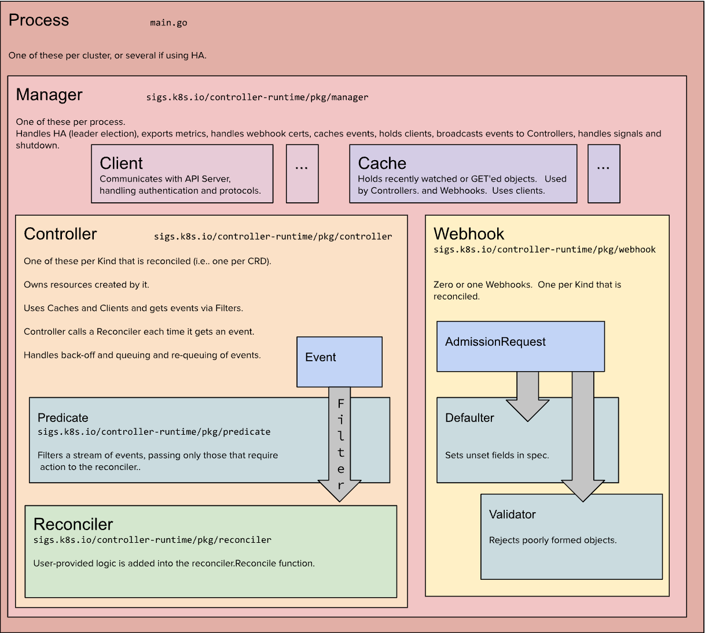

## 简介

Kubebuilder 是一个基于 CRD 来构建 Kubernetes API 的框架，可以使用 CRD 来构建 API、Controller 和 Admission Webhook

### 动机

目前扩展 Kubernetes 的 API 的方式有创建 CRD、使用 Operator SDK 等方式，都需要写很多的样本文件（boilerplate），使用起来十分麻烦

为了能够更方便构建 Kubernetes API 和工具，就需要一款能够事半功倍的工具，与其他 Kubernetes API 扩展方案相比，kubebuilder 更加简单易用，并获得了社区的广泛支持

### 设计哲学

Kubebuilder 提供基于简洁的精心设计的示例 godoc 来提供整洁的库抽象

1. 能使用 go 接口和库，就不使用代码生成
1. 能使用代码生成，就不用使用多于一次的存根初始化
1. 能使用一次存根，就不 fork 和修改 boilerplate
1. 绝不 fork 和修改 boilerplate

## 工作流程

Kubebuilder 的工作流程如下：

1. 创建一个新的工程目录
1. 创建一个或多个资源 API CRD 然后将字段添加到资源
1. 在控制器中实现协调循环（reconcile loop），watch 额外的资源
1. 在集群中运行测试（自动安装 CRD 并自动启动控制器）
1. 更新引导集成测试测试新字段和业务逻辑
1. 使用用户提供的 Dockerfile 构建和发布容器

## 参考资料

- <https://blog.csdn.net/xixihahalelehehe/article/details/110648384>

- <https://lihaoquan.me/posts/k8s-crd-develop/>

- <https://blog.gmem.cc/crd>

- <https://lailin.xyz/post/operator-kubebuilder-clientset.html>

- <https://kubebyexample.com/learning-paths/operator-framework/operator-sdk-go/watching-resources>

- <https://developer.aliyun.com/article/719215>