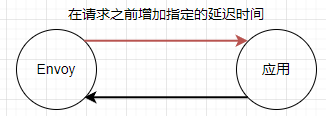

##  故障注入

官方文档：<https://istio.io/latest/zh/docs/tasks/traffic-management/fault-injection/>

故障注入是 Istio 模拟故障的一种手段，通过故障注入可以模拟一个服务出现故障的情况，然后从实际请求中看到出现故障时，整个微服务是否会乱套。通过故意在服务间通信中引入错误，例如延迟、中断或错误的返回值，可以测试系统在不理想的运行状况下的表现。这有助于发现潜在的问题，提高系统的健壮性和可靠性。

```yaml
apiVersion: networking.istio.io/v1alpha3
kind: VirtualService
metadata:
  name: ratings
spec:
  hosts:
  - ratings
  http:
  - match:
    - headers:
        end-user:
          exact: admin
    fault:
      delay:
        percentage:
          value: 100.0
        fixedDelay: 7s
    route:
    - destination:
        host: ratings
        subset: v1
  - route:
    - destination:
        host: ratings
        subset: v1
```

再次访问网页，发现评论区已经加载不出来了，因为超时

## 两种故障注入

在 Istio 的 VirtualService 中，`fault` 配置用于注入故障，以模拟和测试应用程序在出现问题时的行为。主要有两种类型的故障注入：延迟（delay）和异常（abort）。

### 延迟故障注入

延迟故障注入用于在应答之前向请求添加指定的延迟时间。这可以测试应用程序在网络延迟或服务响应缓慢的情况下的表现。以下是一个示例，演示了如何在 VirtualService 中添加一个延迟故障注入：

```yaml
  http:  
  - fault:  
      delay:  
        percentage:  
          value: 100.0  
        fixedDelay: 5s
```



延迟（delay）故障注入有两个主要属性。

- `percentage`: 表示注入延迟的概率，取值范围为 0.0 到 100.0。例如，50.0 表示有 50% 的概率注入延迟。
- `fixedDelay`: 表示注入的固定延迟时间，通常以秒（s）或毫秒（ms）为单位。例如，`5s` 表示 5 秒延迟。

延迟故障注入的示例：

```yaml
fault:  
  delay:  
    percentage:  
      value: 50.0  
    fixedDelay: 5s
```

在这个示例中，`delay` 配置了一个 50% 概率发生的 5 秒固定延迟。

### 异常故障注入

异常故障注入用于模拟请求失败的情况，例如 HTTP 错误状态码或 gRPC 状态码。这可以帮助测试应用程序在遇到故障时的恢复能力。以下是一个示例，演示了如何在 VirtualService 中添加一个异常故障注入：

```
  http:  
  - fault:  
      abort:  
        percentage:  
          value: 100.0  
        httpStatus: 503
```

也可以将延迟故障注入 和 异常故障注入两者放在一起同时使用。

```yaml
  http:  
  - fault:  
      delay:  
        percentage:  
          value: 50.0  
        fixedDelay: 5s  
      abort:  
        percentage:  
          value: 50.0  
        httpStatus: 503
```

虽然放在一起使用，但是并不会两种情况同时发生，而是通过 percentage 来配置出现的概率。

异常（abort）故障注入有四个主要属性。

- `percentage`: 表示注入异常的概率，取值范围为 0.0 到 100.0。例如，50.0 表示有 50% 的概率注入异常。
- `httpStatus`: 表示要注入的 HTTP 错误状态码。例如，`503` 表示 HTTP 503 错误。
- `grpcStatus`: 表示要注入的 gRPC 错误状态码。例如，`UNAVAILABLE` 表示 gRPC 服务不可用错误。
- `http2Error`: 表示要注入的 HTTP/2 错误。例如，`CANCEL` 表示 HTTP/2 流被取消。

异常故障注入的示例：

```yaml
fault:  
  abort:  
    percentage:  
      value: 50.0  
    httpStatus: 503
```