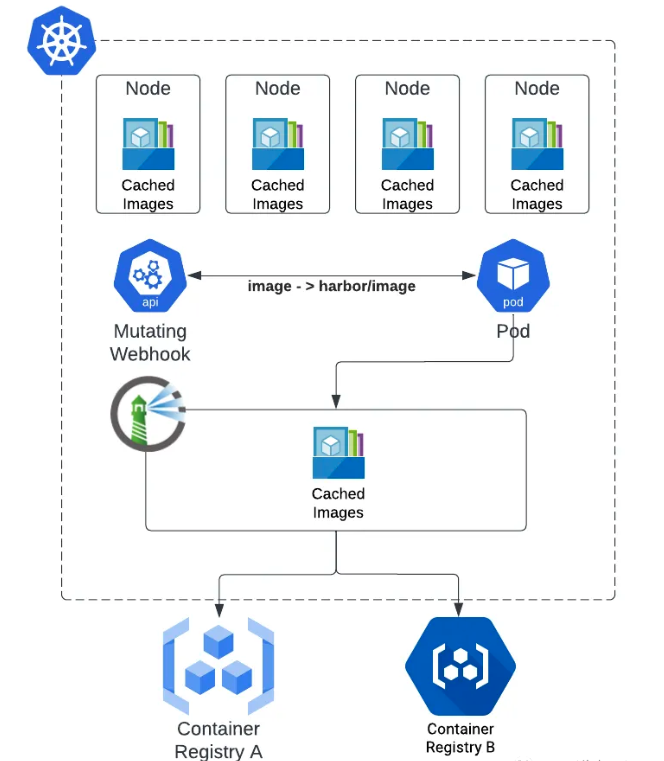

在 Kubernetes 之上有一个缓存层，这样 Kubernetes 就有一个集中的镜像缓存，所有节点都从它“拉取”。但由于缓存需要非常快，因此缓存解决方案需要位于 Kubernetes 内部，并且所有节点都应具有最快的延迟

Harbor：拉取代理缓存是一种缓存机制，旨在优化容器仓库环境中容器镜像的分发和检索。它充当客户端（例如容器运行时或构建系统）和上游容器仓库之间的中介。当客户端请求容器镜像时，代理缓存会检查是否已有所请求镜像的本地副本

- 如果镜像存在，代理缓存会直接将其提供给客户端，从而无需从上游仓库下载它。这可以减少网络延迟并节省带宽
- 如果本地缓存中不存在所请求的镜像，则代理缓存将充当常规代理并将请求转发到上游仓库。然后，代理缓存从参控股中检索镜像并将其提供给客户端。

此外，代理缓存还会在其本地缓存中存储镜像的副本以供将来请求。这种缓存机制具有多种优点，包括提高性能、减少网络流量和增强可靠性。通过减少对上游仓库的依赖，可以显著加快容器化环境中容器镜像的分发和部署速度

项目：<https://github.com/indeedeng-alpha/harbor-container-webhook.git>

这个 webhook 将“转换”具有特定前缀/逻辑的所有镜像以使用 harbor 而不是其原始存储库

Kubernetes 如何以及何时拉取镜像的设置可以在文档（https://kubernetes.io/docs/concepts/containers/images/）中找到



配置示例

```yaml
rules:
  - name: 'docker.io rewrite rule'
    matches:
      - '^docker.io'
    excludes:
      - '.*goharbor.*'            
    replace: 'my-harbor.my-domain/dockerhub'
    checkUpstream: true
```

还可以使用命名空间和 Pod 中的标签添加保护，这将允许您精细地添加此功能，而不是一次全部添加

```yaml
webhook:
  namespaceSelector:
    matchExpressions:
      - key: "goharbor.io/harbor-container-webhook-enable"
        operator: In
        values: ["true"]
  objectSelector:
    matchExpressions:
      - key: "goharbor.io/harbor-container-webhook-disable"
        operator: NotIn
        values: ["true"]
```

