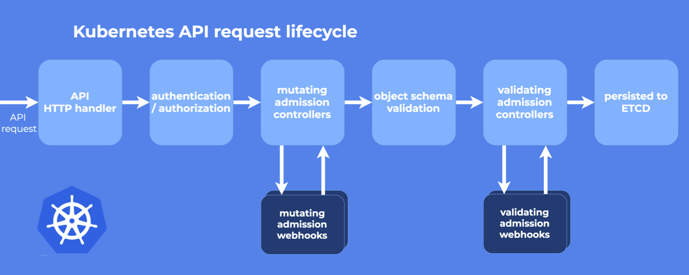

## 准入控制器

准入控制器是在对象持久化之前用于对 Kubernetes API Server 的请求进行拦截的代码段，在请求经过身份验证和授权之后放行通过

时序图如下所示：



准入控制器（Admission Controller）是一种插件，它会拦截在 API Server 层面的请求，执行对应的检查和处理。这些处理可能包含验证、默认设置以及请求的条件限制等。准入控制器不会（也不能）阻止读取（get、watch 或 list）对象的请求

准入控制存在两种 WebHook

- 变更准入控制 MutatingAdmissionWebhook：Mutating 控制器可以修改他们处理的资源对象，该 Webhook 在验证阶段之前调用，可以改变用户提交的 API server 的对象。例如，可能希望所有创建的Pod具有某些标签，或者你想修改特定资源的规格以满足某种需求，这可以通过 Mutating Admission Webhook 实现
- 验证准入控制 ValidatingAdmissionWebhook：如果任何一个阶段中的任何控制器拒绝了请求，则会立即拒绝整个请求，并将错误返回给最终的用户，它仅是在对象持久化之前对其进行验证检查，并接收或拒绝该对象

执行的顺序是先执行 MutatingAdmissionWebhook 再执行 ValidatingAdmissionWebhook

## 常见的准入控制器

更多准入控制器，请查看：<https://kubernetes.io/zh-cn/docs/reference/access-authn-authz/admission-controllers/#alwaysadmit>

- NamespaceExists ：此准入控制器检查针对名字空间作用域的资源（除 Namespace 自身）的所有请求。如果请求引用的名字空间不存在，则拒绝该请求
- NamespaceLifecycle：该准入控制器禁止在一个正在被终止的 Namespace 中创建新对象，并确保针对不存在的 Namespace 的请求被拒绝。该准入控制器还会禁止删除三个系统保留的名字空间，即 default、 kube-system 和 kube-public。Namespace 的删除操作会触发一系列删除该名字空间中所有对象（Pod、Service 等）的操作。为了确保这个过程的完整性，我们强烈建议启用这个准入控制器

- LimitRanger：此准入控制器会监测传入的请求，并确保请求不会违反 Namespace 中 LimitRange 对象所设置的任何约束。如果你在 Kubernetes 部署中使用了 LimitRange 对象，则必须使用此准入控制器来执行这些约束。LimitRanger 还可以用于将默认资源请求应用到没有设定资源约束的 Pod；当前，默认的 LimitRanger 对 default 名字空间中的所有 Pod 都设置 0.1 CPU 的需求
- ServiceAccount：此准入控制器实现了 ServiceAccount 的自动化。强烈推荐为 Kubernetes 项目启用此准入控制器。如果你打算使用 Kubernetes 的 ServiceAccount 对象，你应启用这个准入控制器
- DefaultStorageClass：此准入控制器监测没有请求任何特定存储类的 PersistentVolumeClaim 对象的创建请求， 并自动向其添加默认存储类。这样，没有任何特殊存储类需求的用户根本不需要关心它们，它们将被设置为使用默认存储类。当未配置默认存储类时，此准入控制器不执行任何操作。如果将多个存储类标记为默认存储类， 此控制器将拒绝所有创建 PersistentVolumeClaim 的请求，并返回错误信息。要修复此错误，管理员必须重新检查其 StorageClass 对象，并仅将其中一个标记为默认。此准入控制器会忽略所有 PersistentVolumeClaim 更新操作，仅处理创建操作
- PodSecurity：PodSecurity 准入控制器在新 Pod 被准入之前对其进行检查， 根据请求的安全上下文和 Pod 所在名字空间允许的 Pod 安全性标准的限制来确定新 Pod 是否应该被准入

可以通过以下命令查看 Kubernetes 集群已经启用哪些准入控制器

```bash
kube-apiserver -h | grep enable-admission-plugins
```

在 Kubernetes 1.27 中，默认启用的插件有

```bash
CertificateApproval, CertificateSigning, CertificateSubjectRestriction, DefaultIngressClass, DefaultStorageClass, DefaultTolerationSeconds, LimitRanger, MutatingAdmissionWebhook, NamespaceLifecycle, PersistentVolumeClaimResize, PodSecurity, Priority, ResourceQuota, RuntimeClass, ServiceAccount, StorageObjectInUseProtection, TaintNodesByCondition, ValidatingAdmissionPolicy, ValidatingAdmissionWebhook
```

## Webhook 请求和响应

官方文档：https://kubernetes.io/zh-cn/docs/reference/access-authn-authz/extensible-admission-controllers/

### 请求

Webhook 发送 POST 请求时，请设置 `Content-Type: application/json` 并对 admission.k8s.io API 组中的 AdmissionReview 对象进行序列化，将所得到的 JSON 作为请求的主体

Webhook 可以在配置中的 admissionReviewVersions 字段指定可接受的 AdmissionReview 对象版本：

```yaml
apiVersion: admissionregistration.k8s.io/v1
kind: ValidatingWebhookConfiguration
webhooks:
- name: my-webhook.example.com
  admissionReviewVersions: ["v1", "v1beta1"]
```

创建 Webhook 配置时，admissionReviewVersions 是必填字段。Webhook 必须支持至少一个当前和以前的 API 服务器都可以解析的 AdmissionReview 版本

API 服务器将发送的是 admissionReviewVersions 列表中所支持的第一个 AdmissionReview 版本。如果 API 服务器不支持列表中的任何版本，则不允许创建配置

如果 API 服务器遇到以前创建的 Webhook 配置，并且不支持该 API 服务器知道如何发送的任何 AdmissionReview 版本，则调用 Webhook 的尝试将失败，并依据失败策略进行处理

此示例显示了 AdmissionReview 对象中包含的数据，该数据用于请求更新 apps/v1 Deployment 的 scale 子资源：

```yaml
apiVersion: admission.k8s.io/v1
kind: AdmissionReview
request:
  # 唯一标识此准入回调的随机 uid
  uid: 705ab4f5-6393-11e8-b7cc-42010a800002

  # 传入完全正确的 group/version/kind 对象
  kind:
    group: autoscaling
    version: v1
    kind: Scale

  # 修改 resource 的完全正确的的 group/version/kind
  resource:
    group: apps
    version: v1
    resource: deployments

  # subResource（如果请求是针对 subResource 的）
  subResource: scale

  # 在对 API 服务器的原始请求中，传入对象的标准 group/version/kind
  # 仅当 Webhook 指定 `matchPolicy: Equivalent` 且将对 API 服务器的原始请求
  # 转换为 Webhook 注册的版本时，这才与 `kind` 不同。
  requestKind:
    group: autoscaling
    version: v1
    kind: Scale

  # 在对 API 服务器的原始请求中正在修改的资源的标准 group/version/kind
  # 仅当 Webhook 指定了 `matchPolicy：Equivalent` 并且将对 API 服务器的原始请求转换为
  # Webhook 注册的版本时，这才与 `resource` 不同。
  requestResource:
    group: apps
    version: v1
    resource: deployments

  # subResource（如果请求是针对 subResource 的）
  # 仅当 Webhook 指定了 `matchPolicy：Equivalent` 并且将对
  # API 服务器的原始请求转换为该 Webhook 注册的版本时，这才与 `subResource` 不同。
  requestSubResource: scale

  # 被修改资源的名称
  name: my-deployment

  # 如果资源是属于名字空间（或者是名字空间对象），则这是被修改的资源的名字空间
  namespace: my-namespace

  # 操作可以是 CREATE、UPDATE、DELETE 或 CONNECT
  operation: UPDATE

  userInfo:
    # 向 API 服务器发出请求的经过身份验证的用户的用户名
    username: admin

    # 向 API 服务器发出请求的经过身份验证的用户的 UID
    uid: 014fbff9a07c

    # 向 API 服务器发出请求的经过身份验证的用户的组成员身份
    groups:
      - system:authenticated
      - my-admin-group
    # 向 API 服务器发出请求的用户相关的任意附加信息
    # 该字段由 API 服务器身份验证层填充，并且如果 webhook 执行了任何
    # SubjectAccessReview 检查，则应将其包括在内。
    extra:
      some-key:
        - some-value1
        - some-value2

  # object 是被接纳的新对象。
  # 对于 DELETE 操作，它为 null。
  object:
    apiVersion: autoscaling/v1
    kind: Scale

  # oldObject 是现有对象。
  # 对于 CREATE 和 CONNECT 操作，它为 null。
  oldObject:
    apiVersion: autoscaling/v1
    kind: Scale

  # options 包含要接受的操作的选项，例如 meta.k8s.io/v CreateOptions、UpdateOptions 或 DeleteOptions。
  # 对于 CONNECT 操作，它为 null。
  options:
    apiVersion: meta.k8s.io/v1
    kind: UpdateOptions

  # dryRun 表示 API 请求正在以 `dryrun` 模式运行，并且将不会保留。
  # 带有副作用的 Webhook 应该避免在 dryRun 为 true 时激活这些副作用。
  # 有关更多详细信息，请参见 http://k8s.io/docs/reference/using-api/api-concepts/#make-a-dry-run-request
  dryRun: False
```

### 响应

Webhook 使用 HTTP 200 状态码、`Content-Type: application/json` 和一个包含 AdmissionReview 对象的 JSON 序列化格式来发送响应。该 AdmissionReview 对象与发送的版本相同，且其中包含的 response 字段已被有效填充

response 至少必须包含以下字段：

- uid，从发送到 Webhook 的 request.uid 中复制而来
- allowed，设置为 true 或 false

Webhook 允许请求的最简单响应示例：

```json
{
  "apiVersion": "admission.k8s.io/v1",
  "kind": "AdmissionReview",
  "response": {
    "uid": "<value from request.uid>",
    "allowed": true
  }
}
```

Webhook 禁止请求的最简单响应示例：

```json
{
  "apiVersion": "admission.k8s.io/v1",
  "kind": "AdmissionReview",
  "response": {
    "uid": "<value from request.uid>",
    "allowed": false
  }
}
```

当拒绝请求时，Webhook 可以使用 status 字段自定义 http 响应码和返回给用户的消息。有关状态类型的详细信息，请参见 API 文档 (https://kubernetes.io/docs/reference/generated/kubernetes-api/v1.27/#status-v1-meta)。禁止请求的响应示例，它定制了向用户显示的 HTTP 状态码和消息：

```json
{
  "apiVersion": "admission.k8s.io/v1",
  "kind": "AdmissionReview",
  "response": {
    "uid": "<value from request.uid>",
    "allowed": false,
    "status": {
      "code": 403,
      "message": "You cannot do this because it is Tuesday and your name starts with A"
    }
  }
}
```

当允许请求时，mutating准入 Webhook 也可以选择修改传入的对象。这是通过在响应中使用 patch 和 patchType 字段来完成的。当前唯一支持的 patchType 是 JSONPatch。有关更多详细信息，请参见 JSON patch。对于 patchType: JSONPatch，patch 字段包含一个以 base64 编码的 JSON patch 操作数组。

例如，设置 spec.replicas 的单个补丁操作将是 `[{"op": "add", "path": "/spec/replicas", "value": 3}]`。

如果以 Base64 形式编码，结果将是 `W3sib3AiOiAiYWRkIiwgInBhdGgiOiAiL3NwZWMvcmVwbGljYXMiLCAidmFsdWUiOiAzfV0=`

因此，添加该标签的 Webhook 响应为：

```yaml
{
  "apiVersion": "admission.k8s.io/v1",
  "kind": "AdmissionReview",
  "response": {
    "uid": "<value from request.uid>",
    "allowed": true,
    "patchType": "JSONPatch",
    "patch": "W3sib3AiOiAiYWRkIiwgInBhdGgiOiAiL3NwZWMvcmVwbGljYXMiLCAidmFsdWUiOiAzfV0="
  }
}
```

准入 Webhook 可以选择性地返回在 HTTP Warning 头中返回给请求客户端的警告消息，警告代码为 299。警告可以与允许或拒绝的准入响应一起发送。

如果你正在实现返回一条警告的 webhook，则：

- 不要在消息中包括 "Warning:" 前缀
- 使用警告消息描述该客户端进行 API 请求时会遇到或应意识到的问题
- 如果可能，将警告限制为 120 个字符

注意：超过 256 个字符的单条警告消息在返回给客户之前可能会被 API 服务器截断。如果超过 4096 个字符的警告消息（来自所有来源），则额外的警告消息会被忽略

```json
{
  "apiVersion": "admission.k8s.io/v1",
  "kind": "AdmissionReview",
  "response": {
    "uid": "<value from request.uid>",
    "allowed": true,
    "warnings": [
      "duplicate envvar entries specified with name MY_ENV",
      "memory request less than 4MB specified for container mycontainer, which will not start successfully"
    ]
  }
}
```
