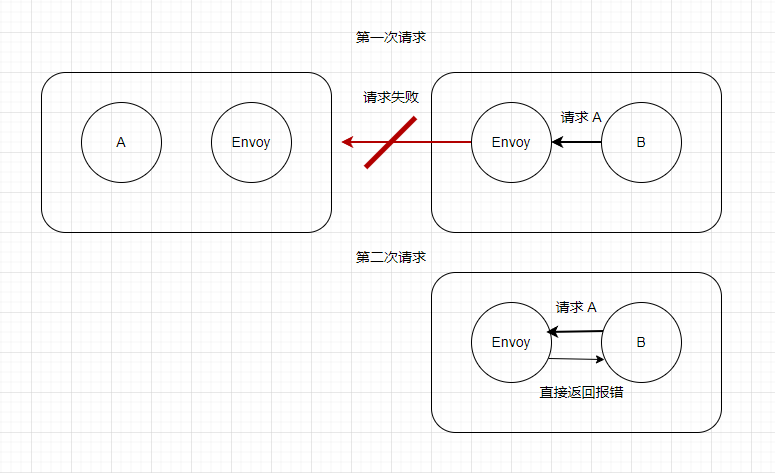

## 熔断

文档：<https://istio.io/latest/zh/docs/tasks/traffic-management/circuit-breaking/>

### 什么是熔断

熔断（Circuit Breaking）是微服务架构中的一种重要的弹性设计模式，在微服务环境中，不同的服务存在依赖关系，当其中一个依赖的服务出现问题时，可能导致请求积压，从而影响到其他服务和整个系统的稳定性。比如说，B 服务来了 100 个请求，B 需要请求 100 次 A 服务，但是 A 服务故障了，那么每次失败时都会重试一次，那么整体上就一共请求了 200 次。这样就会造成很大的浪费。而熔断器可以检测到这种情况，当检测到 A 服务故障之后，一段时间内所有对 A 的请求都会直接返回错误。



熔断器模式的工作原理如下：

1. 正常状态：熔断器处于关闭状态，允许请求通过（熔断器会监控请求的成功和失败率）。
2. 故障检测：当失败率达到预先定义的阈值时，熔断器就会启动。
3. 熔断状态：熔断器处于打开状态时，将拒绝所有新的请求，并返回错误响应。这可以防止故障级联和给故障服务带来更多的压力。
4. 恢复状态：在一段时间后，熔断器会进入半打开状态，允许一部分请求通过。如果这些请求成功，则熔断器将返回到关闭状态；如果仍然存在失败请求，则熔断器继续保持打开状态。

使用熔断器模式可以提高微服务系统的弹性和稳定性。这些工具提供了熔断器模式的实现，以及其他弹性设计模式，如负载均衡、重试和超时等。

## 示例

### 创建 httpbin 服务

接下来本节将会使用一个 httpbin 服务，这个服务代码可以在 istio 官方仓库中找到： https://github.com/istio/istio/tree/release-1.17/samples/httpbin

```yaml
apiVersion: v1
kind: ServiceAccount
metadata:
  name: httpbin
---
apiVersion: v1
kind: Service
metadata:
  name: httpbin
  labels:
    app: httpbin
    service: httpbin
spec:
  ports:
  - name: http
    port: 8000
    targetPort: 80
  selector:
    app: httpbin
  type: NodePort
---
apiVersion: apps/v1
kind: Deployment
metadata:
  name: httpbin
spec:
  replicas: 1
  selector:
    matchLabels:
      app: httpbin
      version: v1
  template:
    metadata:
      labels:
        app: httpbin
        version: v1
    spec:
      serviceAccountName: httpbin
      containers:
      - image: docker.io/kennethreitz/httpbin
        imagePullPolicy: IfNotPresent
        name: httpbin
        ports:
        - containerPort: 80
```

接着给 httpbin 创建一个 DestinationRule ，里面配置了熔断规则。

```yaml
apiVersion: networking.istio.io/v1alpha3
kind: DestinationRule
metadata:
  name: httpbin
spec:
  host: httpbin
  trafficPolicy:
    connectionPool:
      tcp:
        maxConnections: 1
      http:
        http1MaxPendingRequests: 1
        maxRequestsPerConnection: 1
    outlierDetection:
      consecutive5xxErrors: 1
      interval: 1s
      baseEjectionTime: 3m
      maxEjectionPercent: 100

```

`DestinationRule`（目标规则）用于定义访问特定服务的流量策略。`DestinationRule` 配置中的 `trafficPolicy` 属性允许为服务指定全局的流量策略，这些策略包括负载均衡设置、连接池设置、异常检测等。

另外，在创建熔断时也可以设置重试次数。

```
    retries:
      attempts: 3
      perTryTimeout: 1s
      retryOn: 5xx
```

### 创建访问者服务

在 Istio 服务网格环境下，流量进入网格后会被 Envoy 拦截，接着根据相应的配置实现路由，熔断也是在 Envoy 之间实现的，只有流量经过 Envoy ，才会触发 Istio 的熔断机制。

熔断是服务之间通讯出现的，所以还需要部署一个服务请求 httpbin，才能观察到熔断过程。Istio 官方推荐使用 fortio

```yaml
apiVersion: v1
kind: Service
metadata:
  name: fortio
  labels:
    app: fortio
    service: fortio
spec:
  ports:
  - port: 8080
    name: http
  selector:
    app: fortio
---
apiVersion: apps/v1
kind: Deployment
metadata:
  name: fortio-deploy
spec:
  replicas: 1
  selector:
    matchLabels:
      app: fortio
  template:
    metadata:
      annotations:
        # This annotation causes Envoy to serve cluster.outbound statistics via 15000/stats
        # in addition to the stats normally served by Istio. The Circuit Breaking example task
        # gives an example of inspecting Envoy stats via proxy config.
        proxy.istio.io/config: |-
          proxyStatsMatcher:
            inclusionPrefixes:
            - "cluster.outbound"
            - "cluster_manager"
            - "listener_manager"
            - "server"
            - "cluster.xds-grpc"
      labels:
        app: fortio
    spec:
      containers:
      - name: fortio
        image: fortio/fortio:latest_release
        imagePullPolicy: Always
        ports:
        - containerPort: 8080
          name: http-fortio
        - containerPort: 8079
          name: grpc-ping
```

部署 fortio 之后，进入到 fortio 容器中，执行命令请求 httpbin。

执行命令获取 fortio 的 Pod 名称：

```bash
export FORTIO_POD=$(kubectl get pods -n default -l app=fortio -o 'jsonpath={.items[0].metadata.name}')
```

然后让 Pod 容器执行命令：

```bash
kubectl -n default exec "$FORTIO_POD" -c fortio -- /usr/bin/fortio curl -quiet http://httpbin:8000/get
```

如果上面的命令执行没问题的话，可以通过下面的命令对 httpbin 服务进行大量请求，并且分析请求统计结果。

```bash
kubectl -n default exec "$FORTIO_POD" -c fortio -- /usr/bin/fortio load -c 3 -qps 0 -n 20 -loglevel Warning http://httpbin:8000/get
```

在控制台中可以看到请求返回 200 和 503 的比例

```bash
...
Uniform: false, Jitter: false, Catchup allowed: true
IP addresses distribution:
10.110.174.129:8000: 4
Code 200 : 19 (95.0 %)
Code 503 : 1 (5.0 %)
Response Header Sizes : count 20 avg 218.5 +/- 50.13 min 0 max 230 sum 4370
Response Body/Total Sizes : count 20 avg 592.3 +/- 72.79 min 275 max 609 sum 11846
All done 20 calls (plus 0 warmup) 2.510 ms avg, 1039.7 qps
```

