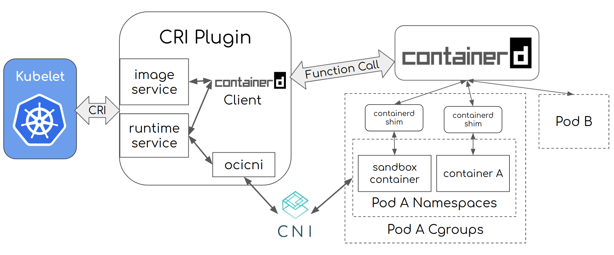
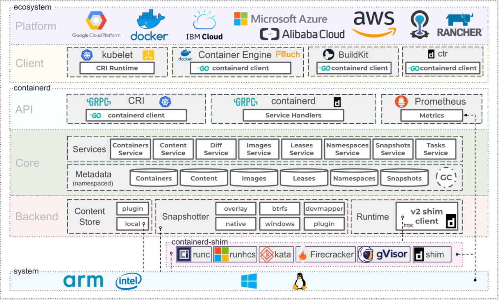
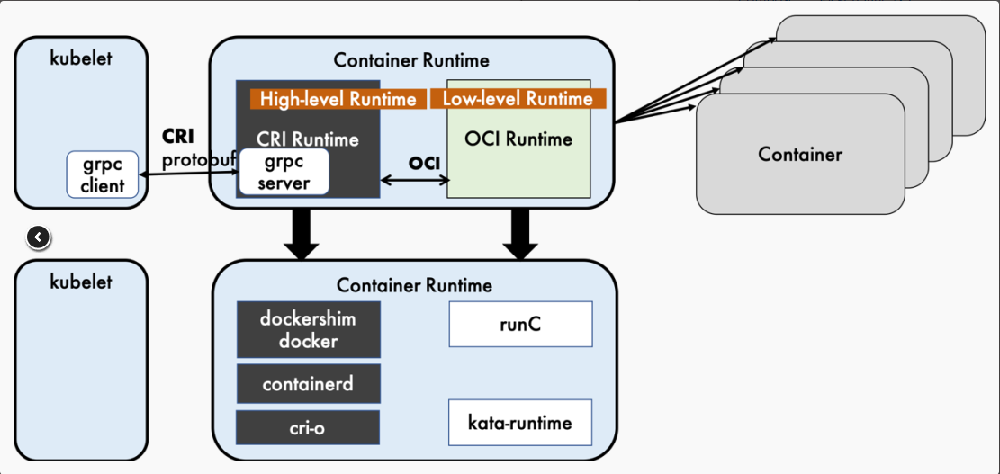
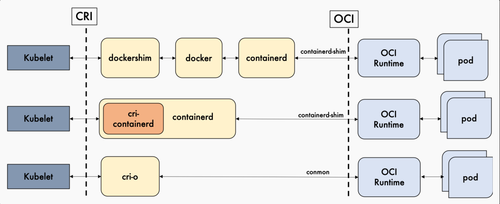
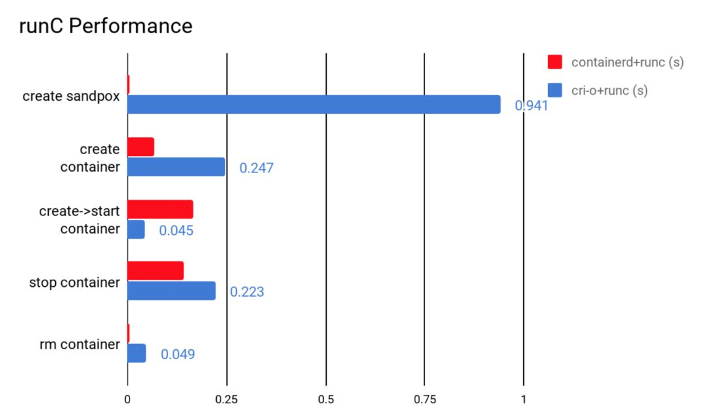

## 什么是 Containerd

containerd 致力于提供简洁、可靠、可扩展的容器运行时；它被设计用来集成到 kubernetes 等系统使用，而不是像 docker 那样独立使用。

Containerd 是从 Docker 中分离出的容器运行时，与 runc 一样被分解为 Docker 的高级运行时部分，它支持 OCI 的镜像标准、可以实现拉取和推送镜像、管理操作镜像负责容器的整个生命周期。

例如当它需要运行一个容器时,它会将映像解压到一个 OCI 运行时包中，并将其发送给 runc 来运行它，Containerd 还提供了一个 API 和客户端应用程序可以用来与之交互，containerd 命令行客户端是 ctr 命令。

## Containerd 有何特点

- OCI Image Spec support - OCI 镜像规范支持
- OCI Runtime Spec support - OCI 运行时规范支持
- Image push and pull support - 镜像推拉支持
- Container runtime and lifecycle support - 容器运行时和生命周期支持
- Network primitives for creation, modification, and deletion of interfaces - 用于创建、修改和删除接口的网络原语
- Management of network namespaces containers to join existing namespaces - 管理连接现有名称空间的网络名称空间容器
- Multi-tenant supported with CAS storage for global images - CAS 存储支持用于全局映像的多租户

## 容器运行时相关概念及组件原理

### OCI

Docker 公司与 CoreOS 和 Google 共同创建了 OCI (Open Container Initial) 并提供了两种规范：

- 镜像规范 (<https://github.com/opencontainers/image-spec>) 镜像规范定义了OCI镜像的标准，high level 运行时将会下载一个OCI 镜像，并把它解压成 OCI 运行时文件系统包（filesystem bundle），例如制定镜像格式、操作等
- 运行时规范 (<https://github.com/opencontainers/runtime-spec>)：描述了如何从OCI 运行时文件系统包运行容器程序，并且定义它的配置、运行环境和生命周期，如何为新容器设置命名空间（namepsaces）和控制组（cgroups），以及挂载根文件系统等等操作，都是在这里定义的。它的一个参考实现是runC（低层级运行时 - Low-level Runtime）除它以外也有很多其他的运行时遵循 OCI 标准，例如 kata-runtime。

文件系统束(filesystem bundle)：定义了一种将容器编码为文件系统束的格式，即以某种方式组织的一组文件，并包含所有符合要求的运行时对其执行所有标准操作的必要数据和元数据，即 config.json 与 根文件系统。

### Runtime

容器运行时(Container Runtime): 运行于 Docker 或者 Kubernetes 集群的每个节点中, 负责容器的整个生命周期，包括构建、创建、运行、管理、删除等对容器的操作。其中 Docker 是目前应用最广的，随着容器云的发展，越来越多的容器运行时涌现。

容器运行时分成了 low-level 和 high-level 两类

- low-level：指的是仅关注运行容器的容器运行时，调用操作系统，使用 namespace 和 cgroup 实现资源隔离和限制
- high-level：指包含了更多上层功能，例如 grpc 调用，镜像存储管理等。

Docker、Google 等开源了用于运行容器的工具和库 runC 作为 OCI 的一种实现参考, 随后各种运行时和库也慢慢出现例如 rkt、containerd、cri-o，然而这些工具所拥有的功能却不尽相同，有的只有运行容器（runc、lxc），而有的除此之外也可以对镜像进行管理（containerd、cri-o）， 按照前面容器运行时进行分为两类，其不同容器运行时工具分类关系图如下。

解决方案
- containerd -- 从 Docker 中分离出的容器运行时，与 runc 一样被分解为 Docker 的高级运行时部分，它支持 OCI 的镜像标准、可以实现拉取和推送镜像、管理操作镜像负责容器的整个生命周期
- rkt -- 与 Docker 类似的容器引擎更加专注于解决安全、兼容、执行效率等方面的问题。

### CRI

CRI（Container Runtime Interface，容器运行时接口）：它是为了解决这些容器运行时和 Kubernetes 的集成问题在 Kubernetes 1.5 版本中推出。

CRI 是 Kubernetes 定义的一组 gRPC 服务。Kubelet 作为客户端，基于 gRPC 框架，通过 Socket 和容器运行时通信。

它包括两类服务：镜像服务（Image Service）和运行时服务（Runtime Service）。镜像服务提供下载、检查和删除镜像的远程程序调用。运行时服务包含用于管理容器生命周期，以及与容器交互的调用 ( exec / attach / port-forward ) 的远程程序调用。

CRI 接口客户端工具：

- ctr: 是containerd本身的 CLI (<https://github.com/containerd/containerd/tree/master/cmd/ctr>)
- crictl: 是 Kubernetes 社区定义的专门 CLI 工具 (<https://github.com/kubernetes-sigs/cri-tools>)

## CRI 的架构

CRI 插件是 Kubernetes 容器运行时接口 （CRI） 的实现, Containerd 与 Kubelet 在同一节点上运行。

containerd 中的插件处理来自 Kubelet 的所有 CRI 服务请求，并使用容器内部来管理容器和容器映像,该插件使用 containerd 来管理整个容器生命周期和所有容器映像，并通过 CNI（另一个 CNCF 项目）管理 pod 网络，如下图所示。

当 Kubelet 创建一个单容器 pod 时，插件是如何工作的：

- Kubelet 通过 CRI 运行时服务 API 调用插件来创建 pod；
- cri 创建 Pod 的网络命名空间，然后使用 CNI 对其进行配置；
- cri 使用 containerd internal 创建和启动一个特殊的暂停容器（沙盒容器），并将该容器放在 pod 的 cgroup 和命名空间中；
- Kubelet 随后通过 CRI 镜像服务 API 调用插件，拉取应用容器镜像；
- cri 进一步使用容器来拉取镜像，如果镜像不存在于节点上；
- 然后 Kubelet 通过 CRI 运行时服务 API 调用，使用拉取的容器镜像在 pod 内创建和启动应用程序容器；
- cri 最后使用 containerd internal 创建应用程序容器，将其放在 pod 的 cgroup 和命名空间中，然后启动 pod 的新应用程序容器。完成这些步骤后，将创建并运行 Pod 及其相应的应用程序容器。

## Containerd 的架构

containerd 是一个守护程序。它管理其主机系统的完整容器生命周期，从镜像传输和存储到容器执行和监督，再到低级存储到网络附件等等。

Containerd 的设计是一个大的插件系统。

- 1. 底层系统支持 Linux 、Windows 操作系统和支持 arm 和 x86 架构
- 2. 中间 containerd 包含 Backend、core、API 三层
  - Backend 层: Runtime plugin 提供了容器运行时的具体操作，为了支持不同的容器运行时 containerd 也提供了一系列的 containerd-shim
  - Core 层: 则是核心部分，提供了各种功能的服务
    - 其中比较常用的是 Content service ，提供对镜像中可寻址内容的访问，所有不可变的内容都被存储在这里；
    - Images Service 提供镜像相关的操作；
    - Snapshot Plugin 来管理容器镜像的文件系统快照。镜像中的每一个 layer 都会被解压成文件系统快照，类似于 Docker 中的 graphdriver
  - API 层: 通过 GRPC 与客户端连接，例如提供了给 Prometheus 使用 API 来进行监控，给 kubernetes 提供了 CRI 接口，给 containerd 提供了服务处理程序。
- 3. 高层提供各种客户端，包括 K8s 的 kubelet，containerd 自己的命令行 ctr 等。

Containerd 仍然采用标准的 C/S 架构，服务端通过 GRPC 协议提供稳定的 API，客户端通过调用服务端的 API 进行高级的操作。

为了解耦，Containerd 将不同的职责划分给不同的组件，每个组件就相当于一个子系统（subsystem）。连接不同子系统的组件被称为模块。

总体上 Containerd 被划分为两个子系统：

- Bundle : 在 Containerd 中，Bundle 包含了配置、元数据和根文件系统数据，可以理解为容器的文件系统。而 Bundle 子系统允许用户从镜像中提取和打包 Bundles。
- Runtime : Runtime 子系统用来执行 Bundles，比如创建容器。

其中，每一个子系统的行为都由一个或多个模块协作完成（架构图中的 Core 部分）。每一种类型的模块都以插件的形式集成到 Containerd 中，而且插件之间是相互依赖的。例如，上图中的每一个长虚线的方框都表示一种类型的插件，包括 Service Plugin、Metadata Plugin、GC Plugin、Runtime Plugin 等，其中Service Plugin 又会依赖 Metadata Plugin、GC Plugin 和 Runtime Plugin。每一个小方框都表示一个细分的插件，例如 Metadata Plugin 依赖 Containers Plugin、Content Plugin 等。

总之，万物皆插件，插件就是模块，模块就是插件。

![img](.assets/containerd_plugin.png"  />

几个常用的插件：

- Content Plugin : 提供对镜像中可寻址内容的访问，所有不可变的内容都被存储在这里。
- Snapshot Plugin : 用来管理容器镜像的文件系统快照。镜像中的每一个 layer 都会被解压成文件系统快照，类似于 Docker 中的 graphdriver。
- Metrics : 暴露各个组件的监控指标。

将上面的架构图简化如下, 简化后的 Containerd 分为三大块

- 【Storage】管理镜像文件的存储；
- 【Metadata】 管理镜像和容器的元数据；
- 【Runtime】由 Task 触发运行时, 并对外提供 GRPC 方式的 API 以及 Metrics 接口。

 以上两者均有自己实现的 shim。

## Containerd vs Cri-o

如下图所示 dockershim，containerd 和 cri-o 都是遵循 CRI 的容器运行时，我们称他们为高层级运行时（High-level Runtime）

kubernetes 为啥会替换掉 Docker 呢？主要原因就是其复杂性，由于 Docker 的多层封装和调用，导致其在可维护性上略逊一筹，增加了线上问题的定位难度。

如下图所示，总结了 Docker，containerd 以及 cri-o 的详细调用层级, Containerd 和 cri-o 的方案比起 Docker 简洁很多, 因此我们更偏向于选用更加简单和纯粹的 containerd 和 cri-o 作为我们的容器运行时，kubernetes 1.20.x 之上的版本建议使用 containerd 作为容器运行时。

- 如下图所示，对 containerd 和 cri-o 进行了一组性能测试，包括创建、启动、停止和删除容器，得出它们所耗的时间。

containerd 在各个方面都表现良好，除了启动容器这项。从总用时来看 containerd 的用时还是要比 cri-o 要短的。

- 从功能性来讲 containerd 和 cri-o 都符合 CRI 和 OCI 的标准。从稳定性来说，单独使用 containerd 和 cri-o 都没有足够的生产环境经验。但 containerd 一直在 Docker 里使用，而 Docker 的生产环境经验可以说比较充足。可见在稳定性上 containerd 略胜一筹。
