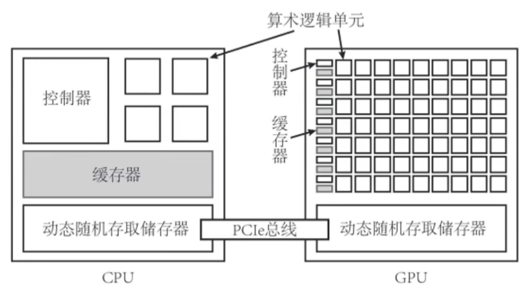
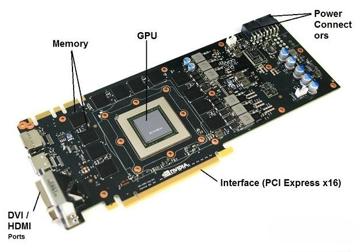

## GPU 简介

GPU 全称 Graphics Processing Unit，即图形处理单元。正如其名，早期主要把 GPU 应用在图形数据处理方面，但随着技术的发展以及 GPU 高度并行化特点，使得它越来越多的应用到了深度学习与人工智能等需要并行处理大量数学运算的场景

### CPU 与 GPU

CPU 与 GPU 的关系如下图所示，它们一般通过 PCIe 总线 通信。PCIe 总线的传输速率较慢，在计算量不大的时候，有可能出现数据在 PCIe 总线传输的时间长于 GPU 计算时间，所以在一些小型任务上，使用 GPU 也未必能达到加速的效果

虽然 CPU 和 GPU 都具有计算能力，但是还是存在一定差异：

- CPU 拥有少量（个位数）计算核心（上图的算术逻辑单元），GPU 拥有大量（几千甚至更多）计算核心
- CPU 单个核计算能力更强，GPU 单个核计算能力更弱
- CPU 擅长逻辑处理，GPU 擅长高度并行的数据运算
- CPU 线程重量，切换开销大。GPU 线程轻量，切换开销小
- GPU 不能单独计算，需要与 CPU 组成异构架构才能用于计算
- 在 CPU+GPU 组成的异构计算平台中，CPU 起控制作用，一般称做主机（host），GPU 可以看做 CPU 的协处理器，一般称做设备（device）
- CPU 有配套的内存，GPU 也有配套的内存（通常叫显存），CPU 无法直接使用 GPU 内存，GPU 也无法直接使用 CPU 内存
- CPU 要求的是实时响应，对单任务的速度要求很高，会采用多层缓存的办法来保证单任务的速度。GPU 是把所有的任务都排好，然后再批处理，对缓存的要求相对很低

### GPU 与显卡

在某些不严谨的场景下，口头上会把显卡和 GPU 等价，实际上它俩是一个包含关系：GPU 是显卡的一个组成部分。如下图所示，显卡一般由 GPU、DRAM 内存（显存）、PCIe 接口、电源接口、HDMI 接口等部分组成

## GPU 公司

从全球范围来看，排名靠前的 GPU 公司有 NVIDIA、AMD、Intel、高通、苹果等，国内也有生产 GPU 的公司，例如景嘉微、摩尔线程等，但是目前国内 GPU 和头部公司 GPU 还存在不小的差距。从商用角度来看，NVIDIA 的 GPU 应该是目前最常见的