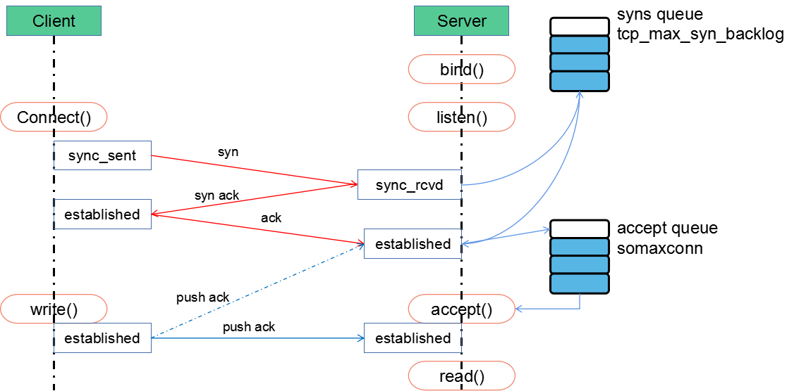

<https://takefive.cn/?p=678#i>

<https://cloud.tencent.com/developer/article/1503688>

TCP 连接建立，关注 sync 阶段的两队列，一个是 syns queue 半开连接队列，一个是 accept queue 全连接队列。

## ipv4

### tcp_max_syn_backlog

tcp_max_syn_backlog，半连接队列 syns queue 大小，建议根据并发量进行放大，4096-32768

```bash
echo "net.ipv4.tcp_max_syn_backlog=32767" >> /etc/sysctl.conf
```


1）半连接一旦收到 ack，便将消除原先 syns queue 的 socket 结构，进入全连接队列（accept queue)。

2）半连接队列长度 = min (backlog, 内核参数 net.core.somaxconn，内核参数 tcp_max_syn_backlog)。这个公式实际上规定半连接队列长度不能超过全连接队列长度。

3）半连接队列满与 “tcp_syncookies” 密切相关，若 tcp_syncookies=1（sync backlog 满时启用）或者 = 2（始终启用），那么 syn_backlog 的参数将失去意义，TCP 不再拒绝半开连接，将采用 syncookie 的连接机制（独立的 socket struct、ISN 队列：initialsequencenumber，挪用 tcp_option 带校验）。但此时也只是 syns queue 不限制了，如果真的是高并发 syn 仍然太多，堆满 accept queue，仍然会持续产生问题。

## core

### somaxconn

`net.core.somaxconn` 表示 socket 监听（listen）的 backlog 上限。

什么是 backlog 呢？backlog 就是 socket 的监听队列，当一个请求（request）尚未被处理或建立时，他会进入 backlog。而 socket server 可以一次性处理 backlog 中的所有请求，处理后的请求不再位于监听队列中。当 server 处理请求较慢，以至于监听队列被填满后，新来的请求会被拒绝。

`net.core.somaxconn` 建议根据并发量进行放大，`4096-32768`，且要大于等于 `tcp_max_syn_backlog`。

server 监听端，允许保持 established 的连接数量

```bash
echo "net.core.somaxconn=32768" >> /etc/sysctl.conf
```

1） 全连接队列长度 = min (backlog, 内核参数 net.core.somaxconn)，net.core.somaxconn 默认为 128。 backlog 是应用层传入的参数，不可能超过内核 somax 参数，所以 backlog 必须小于等于 net.core.somaxconn。

2）当 accept queue 溢出时，tcp_abort_on_overflow 这个参数就会进行判断 TCP 如何返回了，参数为 0 表示直接丢弃该 ACK，参数为 1 表示发送 RST 通知 client；相应的，client 则会分别返回 read timeout 或者 connection reset by peer。

3）当 accept queue 溢出是由于 sync 请求时，同样也是由 tcp_abort_on_overflow 进行判断，需要注意的是如果参数为 0 的话，半连接还具有 synack retry 的机制。

### netdev_max_backlog

netdev_max_backlog 是内核从网卡收到数据包后，交由协议栈（如 IP、TCP）处理之前的缓冲队列。每个 CPU 核都有一个 backlog 队列，当协议栈处理速度满足不了接收包速率时会发生丢包。

查看数据处理情况：

```bash
> cat /proc/net/softnet_stat
010c5949 00000000 00000000 00000000 00000000 00000000 00000000 00000000 00000000 00000000 00000000 00000000 00000000
010cb832 00000000 00000000 00000000 00000000 00000000 00000000 00000000 00000000 00000000 00000000 00000000 00000001
010534ed 00000000 00000000 00000000 00000000 00000000 00000000 00000000 00000000 00000000 00000000 00000000 00000002
0106d093 00000000 00000000 00000000 00000000 00000000 00000000 00000000 00000000 00000000 00000000 00000000 00000003
00ffb811 00000000 00000000 00000000 00000000 00000000 00000000 00000000 00000000 00000000 00000000 00000000 00000004
0101edc8 00000000 00000000 00000000 00000000 00000000 00000000 00000000 00000000 00000000 00000000 00000000 00000005
0100dfbc 00000000 00000000 00000000 00000000 00000000 00000000 00000000 00000000 00000000 00000000 00000000 00000006
010380cd 00000000 00000000 00000000 00000000 00000000 00000000 00000000 00000000 00000000 00000000 00000000 00000007
01204ceb 00000000 00000000 00000000 00000000 00000000 00000000 00000000 00000000 00000000 00000000 00000000 00000008
01192bb3 00000000 00000000 00000000 00000000 00000000 00000000 00000000 00000000 00000000 00000000 00000000 00000009
0113c035 00000000 00000000 00000000 00000000 00000000 00000000 00000000 00000000 00000000 00000000 00000000 0000000a
09543280 00000000 00000000 00000000 00000000 00000000 00000000 00000000 00000000 00000000 00000000 00000000 0000000b
016b82af 00000000 00000000 00000000 00000000 00000000 00000000 00000000 00000000 00000000 00000000 00000000 0000000c
0ba495b6 00000000 00000002 00000000 00000000 00000000 00000000 00000000 00000000 00000000 00000000 00000000 0000000d
01627ccb 00000000 00000001 00000000 00000000 00000000 00000000 00000000 00000000 00000000 00000000 00000000 0000000e
012b46fb 00000000 00000000 00000000 00000000 00000000 00000000 00000000 00000000 00000000 00000000 00000000 0000000f
012026d0 00000000 00000000 00000000 00000000 00000000 00000000 00000000 00000000 00000000 00000000 00000000 00000010
012f29a2 00000000 00000000 00000000 00000000 00000000 00000000 00000000 00000000 00000000 00000000 00000000 00000011
012803c0 00000000 00000000 00000000 00000000 00000000 00000000 00000000 00000000 00000000 00000000 00000000 00000012
012c06d9 00000000 00000000 00000000 00000000 00000000 00000000 00000000 00000000 00000000 00000000 00000000 00000013
0133523e 00000000 00000000 00000000 00000000 00000000 00000000 00000000 00000000 00000000 00000000 00000000 00000014
0135e848 00000000 00000000 00000000 00000000 00000000 00000000 00000000 00000000 00000000 00000000 00000000 00000015
012fd6b7 00000000 00000000 00000000 00000000 00000000 00000000 00000000 00000000 00000000 00000000 00000000 00000016
0124e3ce 00000000 00000000 00000000 00000000 00000000 00000000 00000000 00000000 00000000 00000000 00000000 00000017
0133b436 00000000 00000000 00000000 00000000 00000000 00000000 00000000 00000000 00000000 00000000 00000000 00000018
0130d55a 00000000 00000000 00000000 00000000 00000000 00000000 00000000 00000000 00000000 00000000 00000000 00000019
01375ada 00000000 00000000 00000000 00000000 00000000 00000000 00000000 00000000 00000000 00000000 00000000 0000001a
013ed502 00000000 00000000 00000000 00000000 00000000 00000000 00000000 00000000 00000000 00000000 00000000 0000001b
013390c4 00000000 00000000 00000000 00000000 00000000 00000000 00000000 00000000 00000000 00000000 00000000 0000001c
013f968b 00000000 00000000 00000000 00000000 00000000 00000000 00000000 00000000 00000000 00000000 00000000 0000001d
0139836e 00000000 00000000 00000000 00000000 00000000 00000000 00000000 00000000 00000000 00000000 00000000 0000001e
013ac7d0 00000000 00000000 00000000 00000000 00000000 00000000 00000000 00000000 00000000 00000000 00000000 0000001f
```

行：一行代表一个 cpu 

列：第一列为接收的总包数；第二列为由于溢出丢弃的包数。

```bash
echo "net.core.netdev_max_backlog=16384" >> /etc/sysctl.conf
```

