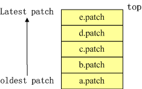
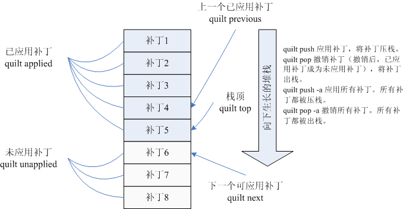

## quilt 简介

quilt 命令具有生成补丁和应用补丁的功能，但它的优势是还可以作为管理补丁的工具

一个比较大的项目可能由不同开发者共同维护，其中很多修改都以补丁的方式提供，这些补丁可能存在依赖关系

git 仓库：<http://savannah.nongnu.org/git/?group=quilt>

```
git clone https://git.savannah.nongnu.org/git/quilt.git
```

## 补丁管理

quilt 工具在源代码目录中生成一个 `patches/` 目录，里面存放所有可用的补丁，记录了所有 patches 的先后顺序，并提供了一系列操作这些补丁的命令。quilt 以栈的形式管理补丁，最先打上的补丁位于栈底，最后打上的补丁位于栈顶（top）。打 patch 的动作称为 push，取消补丁的动作称为 pop

如下图所示，项目中有 5 个 patch，最新的 patch 为 e.patch，所以 quilt 将这个 patch 放在栈顶，通过维护这样一个结构，quilt 可以继续打新 patch 或按顺序回退 patch



源代码的 patch 文件的先后顺序可以查看 `patches/` 目录下的 series 文件

## 使用

常见的操作如下：



### applied-unapplied

- applied：列出包含在 series 文件中且已经应用（生效）了的补丁
- unapplied：列出包含在 series 文件中但没有应用（生效）的补丁

### diff

指定一个被打过补丁的项目文件并根据其变动生成一个 diff 文件，如果指定了补丁则只把指定补丁对项目文件的改动生成到 diff 文件，当同一个项目文件被多个补丁改动过，这个参数就有用了，如果不指定补丁则默认使用最顶层的补丁，如果被打过补丁的项目文件也没有指定，则将包含指定补丁或最顶层的补丁导致的所有项目文件变动

### files

列出最顶层的一个或指定的补丁改动了的所有项目文件

### patches

列出所有改动了指定的项目文件的补丁

### pop-push

- pop：从栈中移除一个或多个已经生效了的补丁，不会修改 series 文件（使补丁不生效）
- push：根据 series 文件应用一个或多个补丁，不会修改 series 文件（使补丁生效）

### import-delete

- import：将指定的补丁文件导入到项目的补丁系统中，会修改 series 文件，同时将指定的补丁文件复制到 patches 目录下，但不会将这个补丁应用，因此还需要执行 push 命令来让这个补丁生效
- delete：从 series 文件中移除指定或最后一行的补丁文件，会修改 series 文件，也可一起将补丁文件从 patches 目录中删除（默认不会删除），在移除前将取消这个补丁的应用，类似执行 pop 命令

### add-remove

- add：将指定的项目文件添加到指定的或顶层的补丁中，一般是为了要使用下面的 edit 命令修改这个文件
- remove：从指定的或最顶层的补丁中移除指定的项目文件，大概是当一个补丁修改了多个文件时，移除一个指定的文件不让这个补丁修改

### fork-edit-refresh

- fork：使用指定的名字复制一个补丁，并使用复制后的补丁覆盖 series 文件中旧的补丁
- edit：编辑指定的项目文件，这个项目文件应该先被使用 add 命令添加到当前补丁中
- refresh：更新指定的或顶层的补丁

fork 通常用于一个补丁应用后又需要被修改，但这个补丁又需要保留这原始内容，这种情况下就可以先复制出来一个副本，然后修改这个副本

## 示例

例如在一个原始目录中有下列文件：

```bash
> ls

backtrace.c  backtrace.h kernfiles 
main.c  Makefile uallsyms.c
```

### 生成 patch

现在要修改 main.c，并生成 patch：

```bash
> quilt new 00-bt.patch
Patch 00-bt.patch is now on top

> quilt add main.c
File main.c added to patch 00-bt.patch

```

这样，就新建了 patch 文件 00-bt.patch，并关联了源文件 main.c

### remove 关联

如果要解除文件和当前 patch 的关联，使用 `quilt remove`，如 `quilt remove main.c`。

### refresh patch

修改 main.c，增加几行打印信息。修改后，执行：

```bash
> quilt refresh
Refreshed patch 00-bt.patch

```

在 patches 目录下就生成了 00-bt.patch 文件。

`quilt refresh` 命令用来更新位于 top 的 patch 文件，也可以指定现有的 patch 文件。

### 关联多个文件

接下来，我想增加一个函数，并在 `main.c` 中测试，需要修改的文件为 main.c backtrace.h backtrace.c

```bash
> quilt new 02-bt-addr2name.patch
Patch 02-bt-addr2name.patch is now on top

> quilt add main.c backtrace.h backtrace.c
File main.c added to patch 02-bt-addr2name.patch
File backtrace.h added to patch 02-bt-addr2name.patch
File backtrace.c added to patch 02-bt-addr2name.patch

```

此时修改代码，然后生成 patch：

```bash
> quilt refresh
Refreshed patch 02-bt-addr2name.patch
```

### 回退改动（pop patch）

下面我们再生成一个 patch：

```bash
> quilt new 03-bt-delcomments.patch
Patch 03-bt-delcomments.patch is now on top

> quilt add backtrace.c
File backtrace.c added to patch 03-bt-delcomments.patch

> quilt refresh
Refreshed patch 03-bt-delcomments.patch
```

要回退刚才的改动，使用 pop：

```bash
> quilt pop
Removing patch 03-bt-delcomments.patch
Restoring backtrace.c
Now at patch 02-bt-addr2name.patch
```

即现在将 `03-bt-delcomments.patch` 撤销了，代码目前处于打上 `02-bt-addr2name.patch` 的状态。

### 回退所有修改

如果要撤销所有的 patch，则执行

```bash
quilt pop -a
```

### 应用修改

对应的，要应用下一个尚未应用的 patch 的操作为 push：

```bash
quilt push
```

要应用所有可用的 patch，则执行

```
quilt push -a
```

### 指定 patch 进行 push 和 pop

pop 和 push 都可以指定某个 patch，假如现在代码处在最原始的状态：

```bash
> quilt push patches/03-bt-delcomments.patch 
Applying patch 00-bt.patch
patching file main.c

Applying patch 02-bt-addr2name.patch
patching file backtrace.c
patching file backtrace.h
patching file main.c

Applying patch 03-bt-delcomments.patch
patching file backtrace.c

Now at patch 03-bt-delcomments.patch
```


```bash
> quilt pop patches/00-bt.patch 
Removing patch 03-bt-delcomments.patch
Restoring backtrace.c

Removing patch 02-bt-addr2name.patch
Restoring backtrace.h
Restoring main.c
Restoring backtrace.c
Now at patch 00-bt.patch
```

可以看到，quilt 会把中间所有需要 pop 或 push 的 patch 都应用上。

另外，注意 `quilt pop patches/00-bt.patch` 命令效果是回退到打上 `00-bt.patch` 的状态，并不回退 `00-bt.patch `本身

### 查看当前 patch 状态

查看已经打上的 patch：

```bash
> quilt applied
00-bt.patch
02-bt-addr2name.patch
```


查看尚未应用的 patch：

```bash
> quilt unapplied
03-bt-delcomments.patch
```

查看下一个 patch：

```bash
> quilt next
03-bt-delcomments.patch
```

查看前一个 patch：

```bash
> quilt previous
00-bt.patch
```

查看当前的 patch：

```bash
> quilt top
02-bt-addr2name.patch
```

查看当前最新应用的 patch 关联的文件：

```bash
> quilt files
backtrace.c
backtrace.h
main.c
```

查看所有已应用的 patch 的关联文件：

```bash
quilt files -a
```

也可以指定某个 patch：

```bash
> quilt files patches/00-bt.patch 
main.c
```

对应的，查看一个文件所关联的 patch（已经应用的 patches）：

```bash
> quilt patches backtrace.c
02-bt-addr2name.patch
03-bt-delcomments.patch
```

### revert patch

在本地修改文件后，若想撤销修改，则使用 revert 命令：

```bash
> quilt revert main.c
Changes to backtrace.h in patch 02-bt-addr2name.patch reverted
```

### 删除 patch

删除某个 patch：

```bash
> quilt delete patches/02-bt-addr2name.patch 
Removed patch 02-bt-addr2name.patch
```

这个 patch 不再在 `patches/series` 里面记录，并且 pop 和 push 的时候会被略过，如果是它是所有 patch 中间的某个 patch，那在 pop 或 push 的时候可能会出错。

所以这个命令一般用于删除最顶层的 patch。

### patch 重命名

给一个 patch 文件重命名：

```bash
> quilt rename -P patches/00-bt.patch patches/00-bt-addprint.patch
Patch 00-bt.patch renamed to 00-bt-addprint.patch
```

### 修改源文件的补充

编辑一个源文件：

```bash
quilt edit file ...
```

这种修改源文件的方式和不使用 `quilt edit` 编辑的区别是，修改的文件同时与当前 patch 建立关联，不用再执行 quilt add 建立文件关联了

如果修改了文件，但不想生成新的 patch 而是更新原来的 patch 则直接执行

```bash
quilt refresh
```

### 查看 patch diff

查看当前代码和上一个 patch 的区别：

```bash
quilt diff
```

会列出当前patch和上一个patch的区别，包括本地未提交的修改。

`quilt diff -z` 则只能看到本地未提交的修改。但是只能看到当前 patch 关联的那些文件。

例如，如果 backtrace.c 未关联到当前 patch，则即使 backtrace.c 做了修改也看不到，可以用 `-P` 指定关联该文件的最新 patch 来查看本地修改：

```bash
quilt diff -z backtrace.c -P patches/03-bt-delcomments.patch
```
