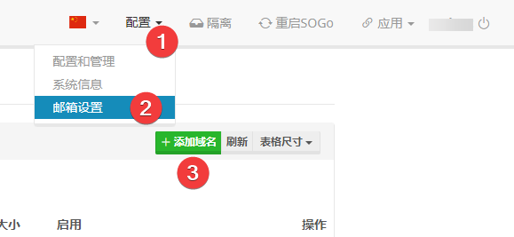

mailcow: dockerized 是一个基于 Docker 的开源组件 / 电子邮件套件。mailcow 依赖于许多广为人知且长期使用的组件，这些组件结合起来构成了一个全方位的无忧电子邮件服务器。每个容器代表一个单一的应用程序，它们通过桥接网络连接在一起。

## 组件

名称	说明
ACME	自动生成Let’s Encrypt SSL证书
ClamAV	反病毒引擎（可选）
Dovecot	IMAP/POP 服务器，用于通过集成的全文搜索引擎“Flatcurve”检索电子邮件
MariaDB	用于存储用户信息的数据库
Memcached	用于缓存SOgo webmail相关数据
Netfilter 	类似Fail2ban的工具，由 @mkuron  提供
Nginx	提供web服务
Olefy	对Office文档进行病毒、宏等分析，主要和Rspamd搭配使用。
PHP	提供WEB相关运行环境
Postfix	提供MTA服务
Redis	用于存储反垃圾、DKIM key相关信息。
Rspamd	带有垃圾邮件自动学习功能的垃圾邮件过滤器
SOGo	一组提供CalDAV、CardDAV、ActiveSync服务的套件。
Solr	（已弃用）（可选）为IMAP连接提供全文搜索功能，以便快速搜索电子邮件
Unbound	集成的DNS服务器，用于验证 DNSSEC 等
Watchdog	用于mailcow内容器状态的基本监控

## 部署

需要二级域名

```bash
git clone https://github.com/mailcow/mailcow-dockerized
```

进入代码目录`cd mailcow-dockerized`执行初始化脚本：`./generate_config.sh`根据提示设置域名和时区等信息。注意：

1. 域名要和上面设置的主机名一致，比如`mail.domain.com`
2. 如果后续需要修改，可以编辑`mailcow.conf`这个配置文件

安装成功后，访问您的IP + 端口进入WEB管理界面，默认用户名：`admin`，密码为：`moohoo`

进入后台后点右上方“配置 - 邮箱设置 - 添加域名”



域名添加完毕后，右侧有个DNS按钮，点击这个按钮会对您的域名DNS进行检测和指引。

