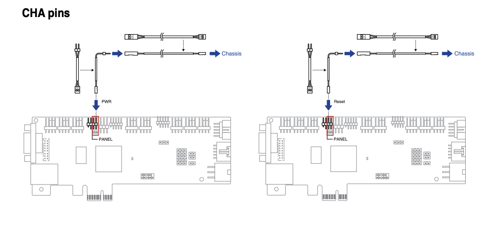

## IPMI EXPANSION CARD


ASPEED AST2600A3-GP 多功能远程管理芯片

I/O 方面，它提供了一个 1GbE 的远程管理网络接口，以及一个用于一些基础显示的 VGA 接口

该 IPMI 扩展卡通过一个 PCI-Express 3.0 x1 主机接口连接到机器上，同时还有一个 BMC、PM-bus 和 SPI 头，并依靠一个 6 针 PCIe 电源连接器满足其电源需求

## 华硕 E21524

必须接的接口：

- （1）USB 接口供电
- （2）如果有显卡需要去掉
- （3）主板→ 带外卡的电源、Reset；带外卡→ 机箱的电源、Reset

### BIOS

BIOS 建议额外设置断电后 USB 仍然供电，通常是华硕主板：

- 英文：

- - 选择 [Advanced] 设定页面的 [APM Configuration] 选项
  - 将 [Erp Ready] 设置为 [Enable (S4+S5)] 或者 [Enable (S5)] (Erp为Energy-related Products欧洲能耗有关联的产品节能要求)；部分主板单独的 USB Standby Power
- 中文
  - 选择高级模式，进入电源管理设置
  - 仍为调整 Erp Ready 或者 USB Standby Power

### 接线图示




为了全面支持 IPMI 扩展卡的功能，安装 IPMI 扩展卡时请注意以下电缆连接：使用 BMC 电缆将 IPMI 扩展卡连接到主板上的 BMC 接头。此连接对于实时监控主板传感器必不可少。

使用 SPI 电缆将 IPMI 扩展卡连接到主板上的 TPM 接头（或 SPI 接头）。此连接对于启用 BIOS 强制更新功能至关重要。

### 操作系统设置

加载内核模块

```bash
modprobe ipmi_devintf
modprobe ipmi_si
modprobe ipmi_ssif
```

### 官方资料

华硕支持：<https://www.asus.com.cn/supportonly/ipmi%20expansion%20card/helpdesk_knowledge/>

<https://www.asus.com/ca-en/support/faq/1050026/>

E21524 说明书：<https://dlcdnets.asus.com.cn/pub/ASUS/mb/Add-on_card/IPMI_EXPANSION_CARD/E21524_IPMI_Card_QSG_V2_WEB.pdf?model=IPMI%20EXPANSION%20CARD>

