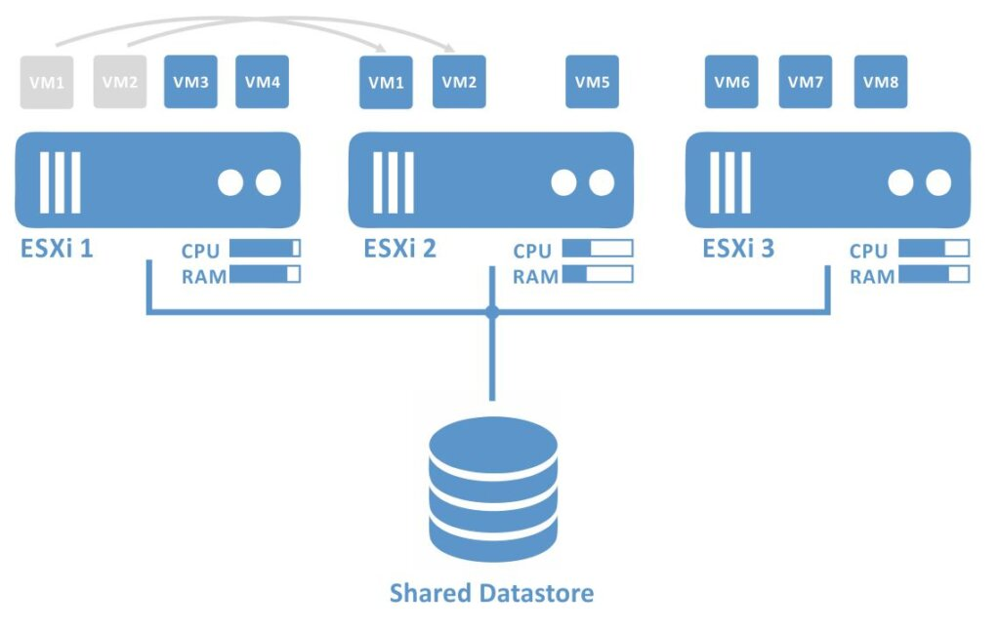
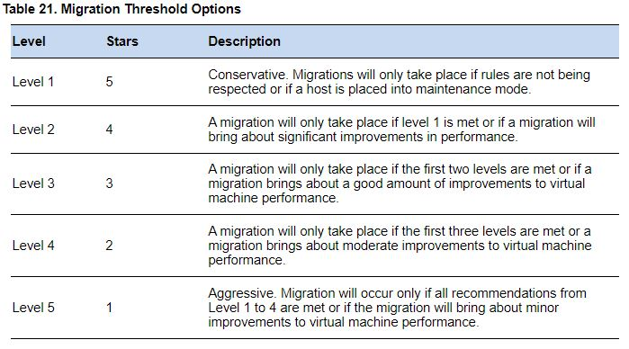

VMware DRS（Distributed Resource Scheduler）是一种资源管理功能，旨在帮助 VMware vSphere 虚拟化环境中的管理员自动化资源分配和负载均衡。DRS 可以监测物理主机的资源利用率（例如 CPU、内存和存储），并根据负载情况自动将虚拟机迁移至其他主机，以避免主机资源瓶颈和性能下降。

简单点来说，DRS 就是会通过 vMotion，自动帮你迁移虚拟机，以达至集群中所有 ESXi 主机整体的 CPU 和内存的资源平衡。

分布式资源调度器（DRS）是一种 VMware vSphere 集群，它通过将虚拟机从负载过重的 ESXi 主机迁移到具有足够计算资源的另一个主机上来实现负载平衡，同时虚拟机仍在运行。这种方法被用于防止 ESXi 主机过载。虚拟机可能在不同时间有不均衡的工作负载，如果一个 ESXi 主机过载，那么在该主机上运行的所有虚拟机的性能都会降低。VMware DRS 集群通过提供自动虚拟机迁移来帮助解决这种情况。

因此，DRS 通常与 HA 一起使用，将故障转移与负载平衡相结合。在故障转移的情况下，虚拟机由 HA 在其他 ESXi 主机上重新启动，而 DRS 则根据可用的计算资源提供 VM 放置建议。vMotion 技术用于这种虚拟机的实时迁移，对用户和应用程序是透明的。

资源池用于 DRS 集群中 ESXi 主机的灵活资源管理。您可以为每个资源池设置处理器和内存限制，然后将虚拟机添加到它们中。例如，您可以创建一个资源池，为开发人员的虚拟机设置高资源限制，第二个池为测试人员的虚拟机设置普通限制，第三个池为其他用户设置低限制。vSphere 允许您创建子资源池和父资源池。

DRS 解决方案通常用于具有不均衡虚拟机工作负载的大型 VMware 虚拟环境中，以提供合理的资源管理。使用 DRS 和 HA 的组合可以实现具有负载均衡的高可用性集群。DRS 还有助于自动迁移虚拟机，使其从由管理员置于维护模式的 ESXi 服务器中迁移。该模式必须开启才能让 ESXi 服务器执行维护操作，如固件升级、安装安全补丁、ESXi 更新等。在进入维护模式的 ESXi 服务器上不能运行任何虚拟机。

DRS 可以通过 vSphere Web Client 或 vSphere Client 管理界面进行配置和管理。

以下是 DRS 的一些常见设置：

DRS 敏感度级别：可以设置 DRS 的敏感度级别以控制 DRS 的自动化程度。级别从 1 到 5，级别越高，DRS 就越敏感。

自动化行为：可以设置 DRS 的自动化行为，例如在何时和如何自动迁移虚拟机以满足资源需求。管理员可以选择手动或自动模式，并设置 DRS 的阈值和规则。

DRS 群集调度策略：可以设置 DRS 的群集调度策略以控制虚拟机的分布。管理员可以选择将虚拟机均匀地分布在物理主机上，或者将虚拟机聚集在较少的主机上以减少迁移。

DRS 事件历史记录：可以查看 DRS 事件历史记录，以便管理员了解 DRS 的活动情况，例如自动迁移的虚拟机，以及为什么要进行迁移。

DRS 预测：可以查看 DRS 的预测结果，以便管理员了解群集中可能会发生的资源需求，并做出相应的计划。

