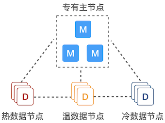
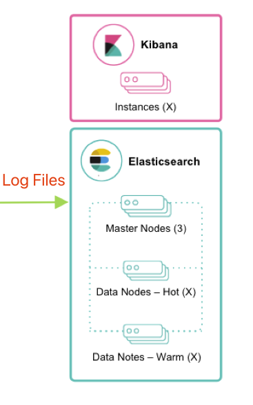

## Hot-Warm 架构

为了保证 Elasticsearch 的读写性能，官方建议使用 SSD 固态硬盘。然而面对海量的数据，如果全部使用 SSD 硬盘来存储数据将需要很大的成本。并且有些数据是有时效性的，例如热点新闻，日志等等，对于这些数据我们可能只关心最近一段时间的数据，如果把所有的数据都存储在 SSD 硬盘中将造成存储空间的浪费。

在某些大规模数据分析场景（比如时间数据分析），可以采用此架构：基于时间创建 index，然后持续地把温/冷数据迁移到相应的数据节点。

为了解决上述问题，可以采用 Hot-Warm 冷热分离的架构来部署 Elasticsearch 集群。可以使用性能好、读写快的节点作为 Hot 节点；使用性能相对差些的大容量节点作为 Warm 节点；使用廉价的存储节点作为 Cold 节点，存储时间较早的冷数据。



- 专有主节点：由于不保存数据，也就不参与索引和查询操作，不会被长 GC 干扰，负载可以保持在较低水平，能极大提高集群的稳定性。
- 热数据节点：保存近期的 index，承担最频繁的写入和查询操作，可以配置较高的资源，如超高性能主机及硬盘。可以在集群配置参数里 Elasticsearch 节点的参数 node.attr.data（热）做修改，默认为 `hot`。
- 温/冷数据节点：保存只读 index，会接收少量的查询请求，可以配置较低的资源。可以在集群配置参数里 Elasticsearch 节点的参数 node.attr.data（温）和 node.attr.data（冷）做修改，默认为 `warm` 和 `cold`。


定义一个 Elasticsearch 类型的资源文件部署一个冷热分离的 Elasticsearch 集群：

- 3 个 Master 节点，不存储数据，负责集群元数据的管理，集群范围的操作（创建或删除索引，跟踪集群节点，分片分配等等）。Master 节点因为没有读写数据的压力，因此选择最便宜的高效云盘。
- 3 个 Hot 节点，新的数据都会首先写入 Hot 节点，承受较大的读写压力，选择使用读写性能最好的 ESSD 硬盘。
- 3 个 Warm 节点，选择读写性能稍差的 SSD 硬盘。
- 3 个 Cold 节点，选择最便宜的高效云盘。

较小的结构为：



## 索引管理

### 创建索引模板

索引存放位置由索引配置 `index.routing.allocation.require.data` 来确定。
例如：

- 存放索引到热节点，索引配置 `index.routing.allocation.require.data: hot`。
- 存放索引到温节点，索引配置 `index.routing.allocation.require.data: warm`。
- 存放索引到冷节点，索引配置 `index.routing.allocation.require.data: cold`。

如果索引不设置 `index.routing.allocation.require.data`，那么索引将被无差别的随机存放在热、温、冷节点，达不到数据分层的效果

执行以下命令为新创建的索引增加 `index.routing.allocation.require.data: hot` 的配置，新创建的索引将被存放在热节点

```bash
PUT _index_template/template_1
{
  "index_patterns": ["mylog*", "otherlog*"],
  "template": {
    "settings": {
      "number_of_shards": 1,
      "number_of_replicas": 1,
      "index.rout_ing.allocation.require.data": "hot"
    }
  }
}
```

### 迁移索引

可以使用如下命令迁移温数据（名为 `last-month` 的 index，可根据实际情况选择相应的 index）到相应节点上

```bash
PUT /last-month/_settings
{
  "index.routing.allocation.require.data": "warm"
}
```

使用如下命令迁移冷数据（名为 `last-year` 的 index，可根据实际情况选择相应的 index）：

```bash
PUT /last-year/_settings
{
  "index.routing.allocation.require.data": "cold"
}
```

### 索引生命周期管理

在 Elasticsearch 中可以通过 Index Lifecycle Management（索引生命周期管理，简称 ILM) 根据时间自动将索引迁移到相应的节点上。
