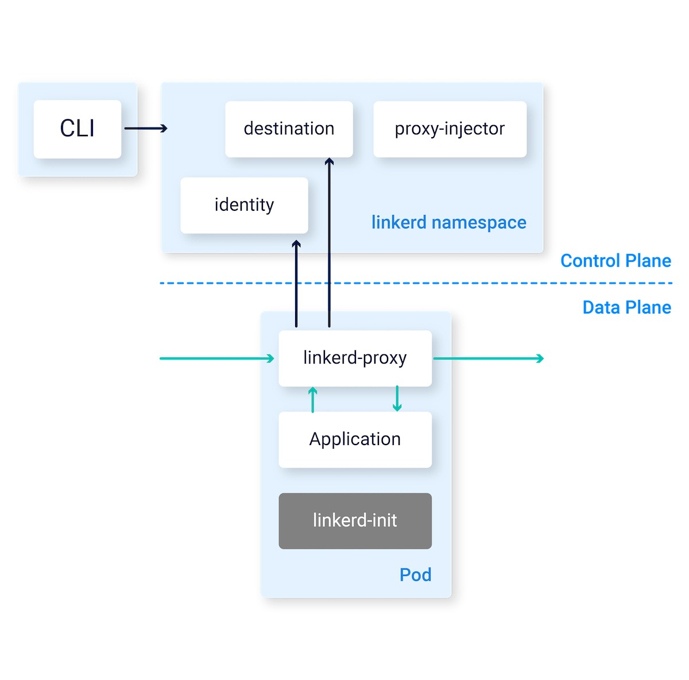

# Linkerd

[Linkerd](https://linkerd.io/) 是 Kubernetes 的一个完全开源的服务网格实现。它通过为你提供运行时调试、可观测性、可靠性和安全性，使运行服务更轻松、更安全，所有这些都不需要对你的代码进行任何更改。

`Linkerd` 通过在每个服务实例旁边安装一组超轻、透明的代理来工作。这些代理会自动处理进出服务的所有流量。由于它们是透明的，这些代理充当高度仪表化的进程外网络堆栈，向控制平面发送遥测数据并从控制平面接收控制信号。这种设计允许 `Linkerd` 测量和操纵进出你的服务的流量，而不会引入过多的延迟。为了尽可能小、轻和安全，`Linkerd` 的代理采用 Rust 编写。

## 功能概述

- `自动 mTLS`：Linkerd 自动为网格应用程序之间的所有通信启用相互传输层安全性 (TLS)。
- `自动代理注入`：Linkerd 会自动将数据平面代理注入到基于 annotations 的 pod 中。
- `容器网络接口插件`：Linkerd 能被配置去运行一个 CNI 插件，该插件自动重写每个 pod 的 iptables 规则。
- `仪表板和 Grafana`：Linkerd 提供了一个 Web 仪表板，以及预配置的 Grafana 仪表板。
- `分布式追踪`：您可以在 Linkerd 中启用分布式跟踪支持。
- `故障注入`：Linkerd 提供了以编程方式将故障注入服务的机制。
- `高可用性`：Linkerd 控制平面可以在高可用性 (HA) 模式下运行。
- `HTTP、HTTP/2 和 gRPC 代理`：Linkerd 将自动为 HTTP、HTTP/2 和 gRPC 连接启用高级功能（包括指标、负载平衡、重试等）。
- `Ingress`：Linkerd 可以与您选择的 ingress controller 一起工作。
- `负载均衡`：Linkerd 会自动对 HTTP、HTTP/2 和 gRPC 连接上所有目标端点的请求进行负载平衡。
- `多集群通信`：Linkerd 可以透明且安全地连接运行在不同集群中的服务。
- `重试和超时`：Linkerd 可以执行特定于服务的重试和超时。
- `服务配置文件`：Linkerd 的服务配置文件支持每条路由指标以及重试和超时。
- `TCP 代理和协议检测`：Linkerd 能够代理所有 TCP 流量，包括 TLS 连接、WebSockets 和 HTTP 隧道。
- `遥测和监控`：Linkerd 会自动从所有通过它发送流量的服务收集指标。
- `流量拆分(金丝雀、蓝/绿部署)`：Linkerd 可以动态地将一部分流量发送到不同的服务。

## 架构

整体上来看 `Linkerd` 由一个控制平面和一个数据平面组成。

- **控制平面**是一组服务，提供对 `Linkerd` 整体的控制。
- 数据平面由在每个服务实例旁边运行的透明微代理(micro-proxies)组成，作为 Pod 中的 Sidecar 容器运行，这些代理会自动处理进出服务的所有 TCP 流量，并与控制平面进行通信以进行配置。

此外 Linkerd 还提供了一个 CLI 工具，可用于控制平面和数据平面进行交互。

**控制平面(control plane)**

Linkerd 控制平面是一组在专用 Kubernetes 命名空间（默认为 linkerd）中运行的服务，控制平面有几个组件组成：

- `目标服务(destination)`：数据平面代理使用 destination 服务来确定其行为的各个方面。它用于获取服务发现信息；获取有关允许哪些类型的请求的策略信息；获取用于通知每条路由指标、重试和超时的服务配置文件信息和其它有用信息。
- `身份服务(identity)`：identity 服务充当 TLS 证书颁发机构，接受来自代理的 CSR 并返回签名证书。这些证书在代理初始化时颁发，用于代理到代理连接以实现 mTLS。
- `代理注入器(proxy injector)`：proxy injector 是一个 Kubernetes admission controller，它在每次创建 pod 时接收一个 webhook 请求。 此 injector 检查特定于 Linkerd 的 annotation（linkerd.io/inject: enabled）的资源。 当该 annotation 存在时，injector 会改变 pod 的规范， 并将 proxy-init 和 linkerd-proxy 容器以及相关的启动时间配置添加到 pod 中。

**数据平面(data plane)**

Linkerd 数据平面包含超轻型微代理，这些微代理部署为应用程序 Pod 内的 sidecar 容器。 由于由 `linkerd-init`（或者，由 Linkerd 的 CNI 插件）制定的 iptables 规则， 这些代理透明地拦截进出每个 pod 的 TCP 连接。

- 代理(Linkerd2-proxy)：`Linkerd2-proxy` 是一个用 Rust 编写的超轻、透明的微代理。`Linkerd2-proxy` 专为 service mesh 用例而设计，并非设计为通用代理。代理的功能包括：
- HTTP、HTTP/2 和任意 TCP 协议的透明、零配置代理。
- HTTP 和 TCP 流量的自动 Prometheus 指标导出。
- 透明、零配置的 WebSocket 代理。
- 自动、延迟感知、第 7 层负载平衡。
- 非 HTTP 流量的自动第 4 层负载平衡。
- 自动 TLS。
- 按需诊断 Tap API。
- 代理支持通过 DNS 和目标 gRPC API 进行服务发现。
- Linkerd init 容器：`linkerd-init` 容器作为 Kubernetes 初始化容器添加到每个网格 Pod 中，该容器在任何其他容器启动之前运行。它使用 iptables 通过代理将所有 TCP 流量，路由到 Pod 和从 Pod 发出。
