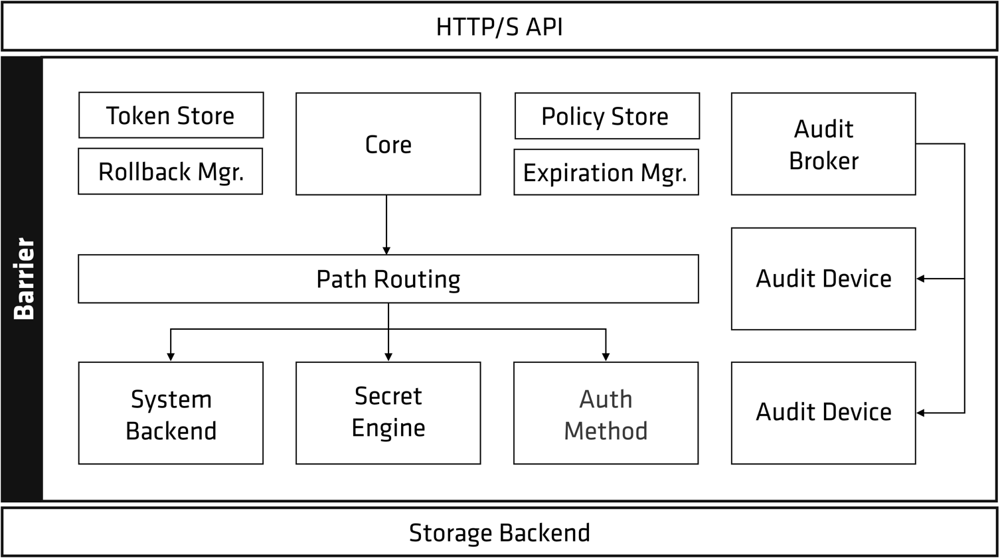
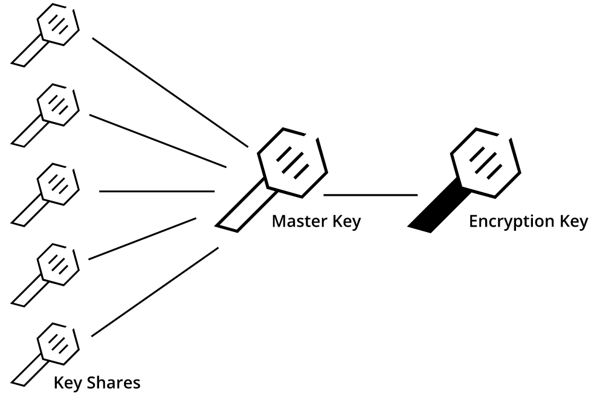
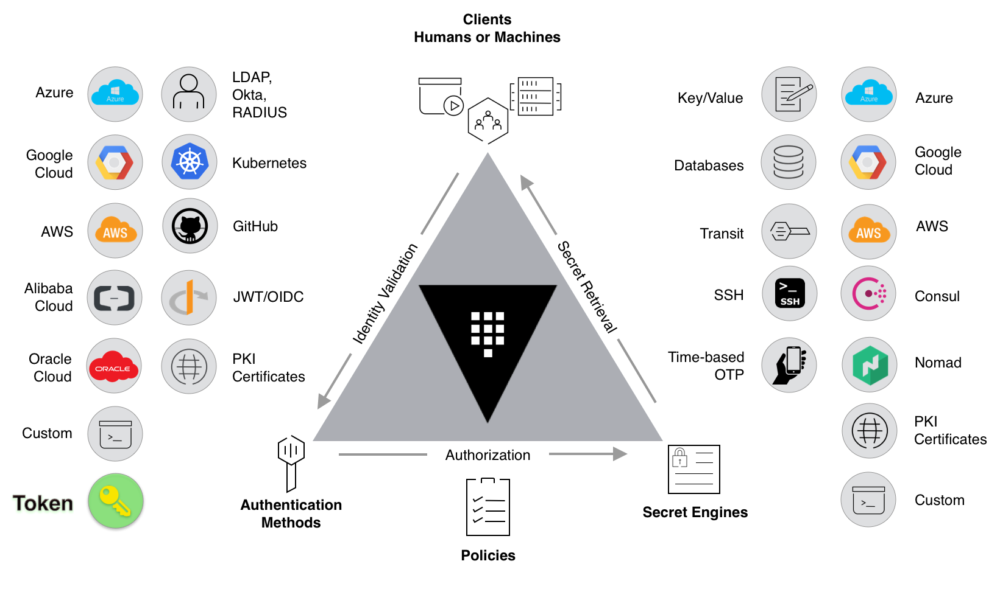

## Vault 简介

- Github 仓库：<https://github.com/hashicorp/vault>
- 文档：<https://developer.hashicorp.com/vault/docs?product_intent=vault>

Vault 是 hashicorp 推出的 secrets 管理、加密即服务与权限管理工具

Vault 是一个基于身份的秘密和加密管理系统。秘密是您想要严格控制访问的任何内容，例如 API 加密密钥、密码和证书。 Vault 提供由身份验证和授权方法控制的加密服务。使用 Vault 的 UI、CLI 或 HTTP API，可以安全地存储和管理、严格控制（限制）和审核对机密和其他敏感数据的访问

应用服务常常需要存取各种各样的机密信息，比如，数据库的访问凭证，依赖的外部服务的 Token 和 Key，服务之间的通信凭证等等。在每个这样的应用中都重复实现机密信息的存取、更新与吊销等管理操作相当繁重，而且容易出问题。HashiCorp 公司的开源项目 Vault 就将这部分工作以独立服务方式来实现，需要机密信息操作的应用可以与 Vault 服务交互完成相应的操作

Vault 的应用场景非常广泛，如:

- 机密信息存取
- 凭证的动态生成，比如数据库凭证、PKI 证书、公有云服务的凭证等等
- 加密即服务

## Vault 架构

官方文档：<https://developer.hashicorp.com/vault/docs/internals/architecture>

Vault 只暴漏了存储后端(Storage Backend) 和 API，其他部分都被保护起来。Vault 并不信任后端存储，存放的都是密文

- HTTP/S API: Vault 服务对外提供 HTTP API 接口
- Storage Backend: 负责加密数据的持久化存储，Vault 支持多种存储机制。
- Barrier: 负责各种机密信息相关的处理逻辑，最核心的组件是 Secrets Engine 和 Auth Method。这两个组件都依赖 Plugin 机制实现，如果官方提供的功能不满足需求，还可以自己写相应 Plugin 实现特有功能或身份校验方法
  - Secrets Engine 负责实际机密信息处理功能的实现，各种不同的 Secrets Engine 有着不同的功能服务
  - Auth Method 提供各种不同的身份校验方法

## 初始化和解封

Vault 服务部署启动后，处于” 密封 (sealed)” 状态，此时不能提供服务。在该服务能接受请求前，需要初始化和” 解封 (unseal)” 两个步骤。

### 初始化

Vault 初始化时内部会生成一个加密密钥 (Encryption Key), 这个密钥用于加密数据，对外是不可见的。Vault 会再生成一个 Master key 来加密 Encryption Key 来保护它。Vault 会使用 Shamir 密钥分享算法将 MasterKey 分割成若干份 KeyShares，而根据其中的若干份 KeyShares 可以计算出原来的 MasterKey。默认配置的 KeyShares 是 5，还原所需要的份数为 3。我们需要记录好所生成的 KeyShares, Vault 自身并不保存 MasterKey。当我们忘记 KeyShares 后，我们就无法得到 MasterKey, 从而数据也无法解密。

- Vault 保存在 Backend 中的数据都是加密的
- Vault 密钥称为 Master Key 主密钥，Vault 默认使用 Shamir 算法，把主密钥切分成 M 份，管理员必须至少提供其中的 N 份才能还原出主密钥（这里的 M 和 N 都是可配置的，M>=N）理想状态下，我们必须把这 M 份密钥分配给公司内 M 个不同的人，只有在获取其中 N 个人的授权后，Vault 才可以成功解密主密钥。

### 解封

解封 (Unseal) 过程就是使用若干份 KeyShares 计算得到 MasterKey, 解封之后，Vault 就可以通过 HTTP API 对外提供服务。

Vault 接收到请求后需要先校验身份请求者身份信息，有多种 Auth method 可以选择，比如用户名 / 密码、Github 帐号等等。支持的方法可以参考官方文档。身份校验通过后，Vault 会根据身份所关联的策略检查该资源请求是否合法。root 策略是内置的策略，它允许访问任何资源。Vault 管理用户可以创建更细粒度的资源访问控制策略。除非在策略中明确允许访问某种资源，否则 Vault 会禁止访问。

身份校验和策略检测都通过后，Vault 会给该客户端分配一个 Token。后续的请求都需要携带该 token，类似于 WEB 访问的 cookie 机制。在 Vault 中，URL 路径会关联一个 Secrets Engine。Vault 的路由组件会将特定的 URL 请求路由所关联的 Secrets Engine 来处理。

## Secrets Engine

机密引擎是存储、生成或加密数据的组件。 机密引擎非常灵活可扩展，功能强大。 向机密引擎发送一些数据，它们会对这些数据执行一些操作，然后返回一个结果。

一些机密引擎只是存储和读取数据——就像是加密存储数据的 Redis/Memcached 那样。另一些机密引擎会连接到其他服务并按需生成动态凭证。还有一些机密引擎提供加密即服务、totp 生成、证书等等。

机密引擎在 Vault 中被挂载在“路径”上启用。当一个请求发送到 Vault，路由器会负责将所有符合路径前缀的请求发送到该路径上挂载的机密引擎里。通过这样的机制，每一个机密引擎都可以定义属于它自己的路径和属性。对于用户来说，机密引擎的行为就像是虚拟文件系统，提供了增删改查功能。

### Secrets Engine 生命周期

大多数秘密引擎可以通过命令行工具或 API 启用、禁用、调整和移动

- 启用 —— 给定路径上启用秘密引擎。除了少数例外之外，机密引擎可以同时在多个路径上启用。每个机密引擎都按照路径隔离。默认情况下，它们在其“类型”名对应路径上启用（例如，aws 启用在 aws/ 路径上）
- 禁用 —— 禁用一个现存的机密引擎。当一个机密引擎被禁用时，它的所有机密都会被吊销（如果这些机密支持吊销的话），并且在物理存储层中该引擎存储的所有数据都会被删除
- 移动 —— 将一个现存机密引擎移动到一个新路径上。该过程会吊销引擎的所有机密，因为这些机密租约都已经在创建时与特定路径相绑定了。已存储的该引擎相关的配置信息会被移动到新路径上。
- 调整 —— 调整该引擎的全局配置，例如 TTL

机密引擎启用之后，就可以在启用路径上通过 API 直接与其交互。使用 `vault path-help` 确定它响应的路径

请注意，Vault 中的挂载点不能相互冲突。这有两个广泛的含义。第一个是要挂载的路径不能以一个现存挂载点路径为前缀。第二个是要挂载的路径本身不能是某个现存挂载点路径的前缀。例如，挂载 `foo/bar` 和 `foo/baz` 可以和平共处，而 `foo` 和 `foo/baz` 不能

### 屏障视图

机密引擎只能透过一个包含屏障的视图访问配置的 Vault 物理存储

启用秘密引擎时，会生成一个随机 UUID，这将成为该引擎的数据根。每当该引擎写入物理存储层时，它的写入路径都会以该 UUID 文件夹为前缀。由于 Vault 存储层不支持相对访问（例如 `../`），这使得启用的机密引擎无法访问其他引擎的数据。

## 参考资料

- <https://lonegunmanb.github.io/essential-vault>