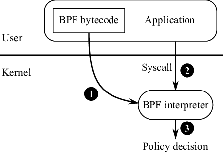

## 简介

https://tbhaxor.com/basics-of-seccomp-for-dockers/



## SECCOMP 的由来

`Seccomp` 是安全计算（Secure Computing）模式的缩写

是 Linux 内核 2.6.12 版本（2005 年 3 月 8 日）中引入

最开始的引入的目的是把服务器上多余的 CPU 出借出去，跑一些安全系数低的程序；所以当时只允许 4 个系统调用：

```
read
write
_exit
sigreturn
```

如果调用其它系统 API，就会收到 SIGKILL 信号退出。

```c
#include <fcntl.h>
#include <stdio.h>
#include <unistd.h>
#include <sys/prctl.h>
#include <linux/seccomp.h>

void configure_seccomp()
{
    printf("Configuring seccomp\n");
    prctl(PR_SET_SECCOMP, SECCOMP_MODE_STRICT);
}

int main(int argc, char *argv[])
{
    int infd, outfd;

    if (argc < 3)
    {
        printf("Usage:\n\t%s <input path> <output_path>\n", argv[0]);
        return -1;
    }

    printf("Starting test seccomp Y/N?");
    char c = getchar();
    if (c == 'y' || c == 'Y')
        configure_seccomp();

    printf("Opening '%s' for reading\n", argv[1]);
    if ((infd = open(argv[1], O_RDONLY)) > 0)
    {
        ssize_t read_bytes;
        char buffer[1024];
        printf("Opening '%s' for writing\n", argv[2]);
        if ((outfd = open(argv[2], O_WRONLY | O_CREAT, 0644)) > 0)
        {
            while ((read_bytes = read(infd, &buffer, 1024)) > 0)
                write(outfd, &buffer, (ssize_t)read_bytes);
        }
        close(infd);
        close(outfd);
    }
    printf("End!\n");

    return 0;
}

```

当 seccomp 功能打开的时候，代码执行到 25 行 `open(argv[1], O_RDONLY)` 时就会退出

## Seccomp 升级 Seccomp-BPF

直到 2012 年 7 月 12 日 Linux 3.5 内核版本中， 引入 seccomp 第二种匹配模式：`SECCOMP_MODE_FILTER`。(以下 Seccomp-BPF 皆指 seccomp 的过滤模式)

而在该模式下，进程可以指定允许哪些系统调用，而不是像最开始的限制到 4 个系统调用中。过滤模式是通过使用 Berkeley 的数据包过滤器做过滤规则匹配，也就是这里的 BPF。使用了 seccomp-BPF 的程序，必须具有此 CAP_SYS_ADMIN 权限；或者通过使用 prctrl 把 no_new_priv 设置 bit 位设置成 1：

```
prctl(PR_SET_NO_NEW_PRIVS, 1);
```

https://cloud.tencent.com/developer/article/1801887

## seccomp 与 capabilities 的区别

一句话总结：seccomp 是比 capabilities 更细粒度的 capabilities 权限限制系统内核提供的能力。

如果针对单一容器来说，配置的工作量都差不多。但是如果需要大批量的配置多个 相同的容器，seccomp 就相对来说容易得多；定义好一份 seccomp 的配置文件，在多个容器加载的时候，指定该份配置文件就可以省掉单个容器的配置。

Capabilities 一共限制了 39 个系统能力：

```
CAP_AUDIT_CONTROL (since Linux 2.6.11)
CAP_AUDIT_READ (since Linux 3.16)
CAP_AUDIT_WRITE (since Linux 2.6.11)
CAP_BLOCK_SUSPEND (since Linux 3.5)
CAP_BPF (since Linux 5.8)
CAP_CHECKPOINT_RESTORE (since Linux 5.9)
CAP_CHOWN
CAP_DAC_OVERRIDE
CAP_DAC_READ_SEARCH
CAP_FOWNER
CAP_FSETID
CAP_IPC_LOCK
CAP_IPC_OWNER
CAP_KILL
CAP_LEASE (since Linux 2.4)
CAP_LINUX_IMMUTABLE
CAP_MAC_ADMIN (since Linux 2.6.25)
CAP_MAC_OVERRIDE (since Linux 2.6.25)
CAP_MKNOD (since Linux 2.4)
CAP_NET_ADMIN
CAP_NET_BIND_SERVICE
CAP_NET_BROADCAST
CAP_NET_RAW
CAP_PERFMON (since Linux 5.8)
CAP_SETGID
CAP_SETFCAP (since Linux 2.6.24)
CAP_SETPCAP
CAP_SETUID
CAP_SYS_ADMIN
CAP_SYS_BOOT
CAP_SYS_CHROOT
CAP_SYS_MODULE
CAP_SYS_NICE
CAP_SYS_PACCT
CAP_SYS_PTRACE
CAP_SYS_RAWIO
CAP_SYS_RESOURCE
CAP_SYSLOG (since Linux 2.6.37)
CAP_WAKE_ALARM (since Linux 3.0)
```

Seccomp 是对系统接口的限制，也就是系统接口有多少个，Seccomp 就能管理多少个

查看上面提到的 unistd_64.h 头文件，一共有 427 个(不同的 Linux 版本会有差异)：

```
#define __NR_statx 332
#define __NR_io_pgetevents 333
#define __NR_rseq 334
#define __NR_io_uring_setup 425
#define __NR_io_uring_enter 426
#define __NR_io_uring_register 427

#endif /* _ASM_X86_UNISTD_64_H */
```

## 容器中 seccomp 的使用

官方文档地址：

- <https://docs.docker.com/engine/security/seccomp/>
- <https://docs.docker.com/reference/compose-file/services/#sequences>

```bash
# docker 关闭 seccomp
docker run --rm -it --security-opt seccomp=unconfined debian:latest
```

compose 关闭 seccomp

```yaml
services:
  common:
    image: busybox
    security_opt:
      - seccomp=unconfined
```

容器中 seccomp的使用，本质是对Seccomp-BPF的再封装使用；通过简单的配置文件来达快速设置多个容器的seccomp安全应用(以下全部以docker为例)。

docker中，通过配置一个profile.json文件来告知容器需要限制的系统 API，比如：

```json
{
    "defaultAction": "SCMP_ACT_ALLOW",
    "syscalls": [
        {
            "name": "mkdir",
            "action": "SCMP_ACT_ERRNO",
            "args": []
        }
    ]
}
```

在这个配置文件中，默认情况下允许容器执行除 `mkdir` 以外的全部系统调用。如 图：在容器内执行 `mkdir /home/test` 生成新目录失败

而 docker 默认加载的 seccomp 配置内容在 github 上可以查看：https://github.com/moby/moby/blob/master/profiles/seccomp/default.json

配置文件里面禁用了 40+ 的系统调用，允许了 300+ 的系统调用。有点黑白名单的意思。

在 kubernetes 中配置：<https://kubernetes.io/zh-cn/docs/tutorials/security/seccomp/>

