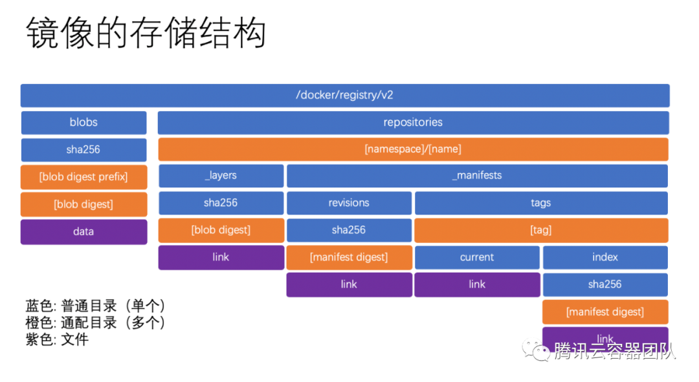

## 简介

Registry 是 docker 官方提供的工具，可以用于构建私有的镜像仓库。

Registry 是一个无状态的、高度可扩展的服务器端应用程序，它存储并允许您分发 Docker 映像。Registry 是开源的，在宽松的Apache 许可下。您可以在GitHub 上找到源代码 。

Docker registry 被组织成 Docker 镜像存储库 ，其中存储库包含特定镜像的所有版本。仓库允许 Docker 用户在本地拉取镜像，以及将新镜像推送到仓库（在适用时给予足够的访问权限）。

默认情况下，Docker engine与 Docker Hub 交互，Docker 的公共仓库实例。但是，可以在本地运行开源 Docker registry 。

## 搭建 registry 仓库

- 包含签名证书 ，本地目录`/certs`
- 包含持久存储，本地目录`/var/lib/registry`
- 用户密码登录，本地目录`/auth`

先生成 https 证书

为了相对安全，可以给仓库加上基本的身份认证。使用 htpasswd 创建用户和登陆密码：

```bash
> htpasswd -Bbn registry 'LSR1142.registry' > ./auth/htpasswd

> cat ./auth/htpasswd
testuser:$2y$05$MO4iv425uurfqY2Y/X71TuNTUPu4Vrn.oNE4NxRTjsPTTU6QywiwG

```

创建 registry 容器：

```bash
docker run \
    -itd \
    -p 5000:5000 \
    --restart=always \
    --name registry \
    -v /registry/docker-registry/registry:/var/lib/registry \
    -v /registry/docker-registry/auth:/auth \
    -v /registry/docker-registry/certs:/certs \
    -e REGISTRY_HTTP_TLS_CERTIFICATE=/certs/tls.crt \
    -e REGISTRY_HTTP_TLS_KEY=/certs/tls.key \
    -e REGISTRY_AUTH=htpasswd \
    -e REGISTRY_AUTH_HTPASSWD_REALM="Registry Realm" \
    -e REGISTRY_AUTH_HTPASSWD_PATH=/auth/htpasswd \
    registry:latest
```

curl 对应的端口，结果如下

````bash
curl http://127.0.0.1:5000/v2/_catalog
````

### 开启删除权限

查询删除权限

```bash
docker exec -it  registry sh -c 'cat /etc/docker/registry/config.yml'
```

开启删除权限

```bash
docker exec -it  registry sh -c "sed -i '/storage:/a\  delete:' /etc/docker/registry/config.yml"
docker exec -it  registry sh -c "sed -i '/delete:/a\    enabled: true' /etc/docker/registry/config.yml"

```

重启镜像

```bash
docker restart registry
```

## 镜像存储结构



目录分为两层：blobs 和 repositories。

- `blobs`：镜像所有内容的实际存储，包括了镜像层和镜像元信息 manifest；
- `repositories`: 是镜像元信息存储的地方，name 代表仓库名称；

每一个仓库下面又分为 `_layers`、`_manifests` 两个部分；

- `_layers` 负责记录该仓库引用了哪些镜像层文件；
- `_manifests` 负责记录镜像的元信息；
- `revisions` 包含了仓库下曾经上传过的所有版本的镜像元信息；
- `tags` 包含了仓库中的所有标签；
- `current` 记录了当前标签指向的镜像；
- `index` 目录则记录了标签指向的历史镜像。