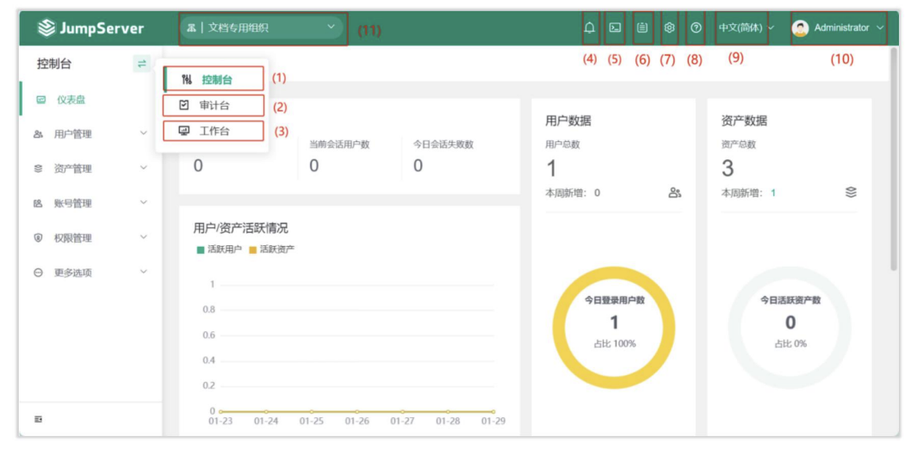

## 视图

JumpServer 页面分为三大视图：“控制台”、“审计台”和“工作台”。点击主页左上方的控制台右侧的切换按钮，选择对应的视图进行切换

页面右上角有工单模块、系统设置模块等，点击相应图标可进入对应的页面



## 控制台

控制台页面是管理员的操作入口，通过控制台，管理员可以进行用户管理、资产管理、账号管理、权限管理、任务中心等配置

### 用户管理

某个JumpServer 用户已经存在于 JumpServer 系统中，但不存在于当前组织中时，邀请该用户加入到当前组织中

当需要将用户从当前组织中移除，点击用户后方的<更多>按钮，选择<移除>按钮（此操作可通过邀请用户重新将用户加入到当前组织中）

JumpServer 系统中角色可以分为系统角色和组织角色。系统角色默认有系统管理员、系统审计员、用户与系统组件；组织角色默认有组织管理员、组织审计员、组织用户

### 资产管理

资产树是对资产类别的一个划分。对于每个资产，可以按照不同维度进行划分，同一资产可 113 以存在多维度的划分，例如：按照组织划分、按照项目划分、按照协议划分等等。划分节点后，可以灵活的分配用户权限，达到高效管理主机的目的

#### Linux 资产

可以控制的权限如下

- 连接
- 文件传输
  - 上传
  - 下载
  - 删除
- 剪切板
  - 复制
  - 粘贴
- 分享

#### Win 资产

- Windows 资产如果需要执行自动化任务，例如：获取硬件信息、可连接性测试等，需在 Windows 资产上安装 OpenSSH 服务

- Windows 资产新增支持了 WINRM 协议，例如：修改账号改密等可以使用 WINRM 协议，需要在 Windows 上面开启 WINRM 协议对于端口

## 添加 WebSite 应用

vCenter

```
https://x.x.x.x/ui/

id=username
id=password
id=submit
```

ESXi

```
https://x.x.x.x/ui/

id=username
id=password 
id=loginButtonRow
```

Sungo BMC

```
id=userid
id=password
id=btn-login
```

SuperMicro BMC

```
name=name
name=pwd
id=login_word
```

华为 USG 防火墙

```javascript
[
  {
    "step": 1,
    "value": "{USERNAME}",
    "target": "id=username",
    "command": "type"
  },
  {
    "step": 2,
    "value": "",
    "target": "id=hide_pwd",
    "command": "click"
  },
  {
    "step": 3,
    "value": "{SECRET}",
    "target": "id=platcontent",
    "command": "type"
  },
  {
    "step": 4,
    "value": "",
    "target": "id=btn_login-button",
    "command": "click"
  }
]
```

