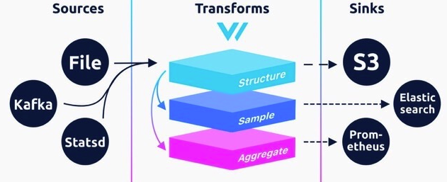

## Vector

Vector 是一种高性能的可观察性数据管道，可以收集、转换所有日志、指标和跟踪信息（ logs, metrics, and traces），并将其写到您想要的存储当中；Vector 可以实现显着的成本降低、丰富的数据处理和数据安全

官方：

- 代码仓库：<https://github.com/vectordotdev/vector>

- 官网：<https://vector.dev/>
- 官方文档：<https://vector.dev/docs/>

## 基本概念

Vector 将整个流程抽象为数据源（Source）、可选的数据处理（Transform）和数据目的地（Sink）三个模块

在数据类型方面，Vector 将所有可观测数据统一抽象为 Event ，包含了指标（Metric）和日志（Log）两大类。其中 Metric 又进一步细分为 Gauge 、Counter 、Distribution、Histogram 和 Summary 等类型，这些分类与 Prometheus 中的概念十分相似



## Vector 使用

配置文件

```bash
cat <<-EOF > $PWD/config/vector.yaml
api:
  enabled: true
  address: 0.0.0.0:8686
sources:
  demo_logs:
    type: demo_logs
    interval: 1
    format: json
sinks:
  console:
    inputs:
      - demo_logs
    target: stdout
    type: console
    encoding:
      codec: json
EOF

```

`docker-compose.yaml` 文件

```yaml
networks:
  vector:
    driver: bridge
    ipam:
      driver: default
      config:
      - subnet: 172.28.0.0/16
        gateway: 172.28.0.1

services:
  vector:
    image: timberio/vector:latest-alpine
    container_name: vector
    networks:
      - vector
    volumes:
      # 挂载配置文件
      - ./config/:/etc/vector/
      - ./logs/:/logs/
    ports:
      # metrics信息暴露端口
      - 29598:9598
      # api
      - 28686:8686
    environment:
      # VECTOR_LOG: debug
      TZ: Asia/Shanghai
    entrypoint: "vector"
    command: ["--config-yaml=/etc/vector/vector.yaml", "-w"]
    restart: always

```

