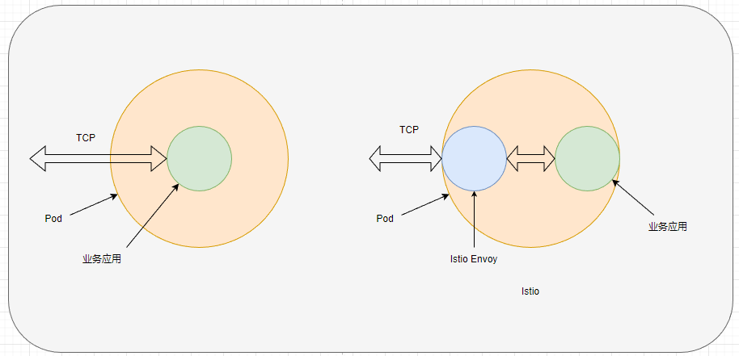
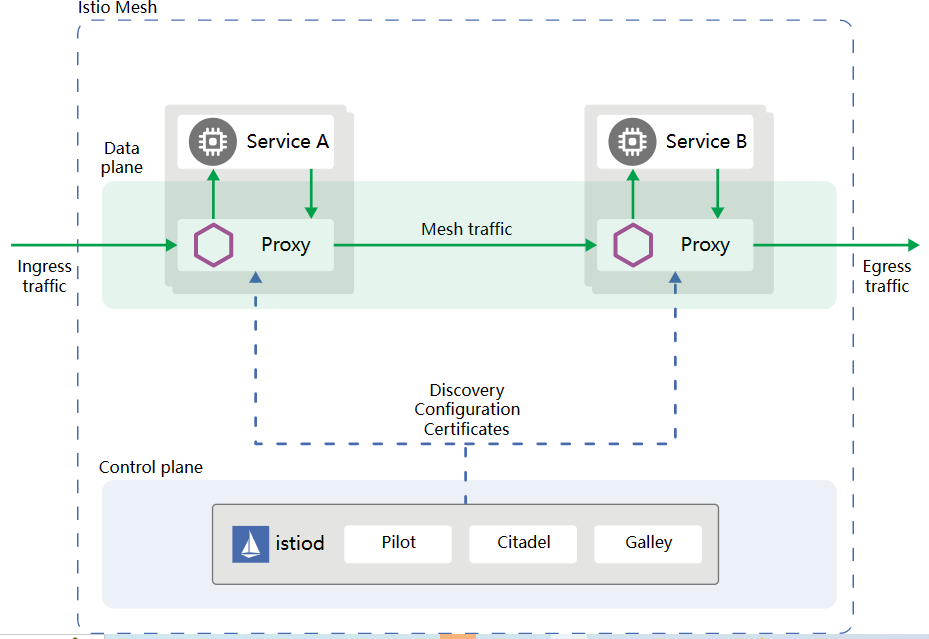

## Istio 原理

Istio 可以的作用原理是拦截 Kubernetes 部署 Pod 的事件，然后从 Pod 中注入一个名为 Envoy 的容器，这个容器会拦截外部到业务应用的流量。由于所有流量都被 Envoy “劫持” 了，所以 Istio 可以对流量进行分析例如收集请求信息，以及一系列的流量管理操作，也可以验证授权信息。当 Envoy 拦截流量并执行一系列操作之后，如果请求没问题，就会转发流量到业务应用的 Pod 中。

【左：普通 Pod；Istio；右：Istio 代理了出入口流量】

由于 Envoy 需要拦截流量之后转发给业务应用，这样就多了一层转发，会导致系统响应速度会有所下降，但是增加的响应时间几乎可以忽略不计。

每个 Pod 都有一个 Envoy 负责拦截、处理和转发进出 Pod 的所有网络流量，这种方式被称为 Sidecar。

以下是 Istio Sidecar 的一些主要功能：

- 流量管理：Envoy 代理可以根据 Istio 配置的路由规则（如 VirtualService 和 DestinationRule）实现流量的转发、分割和镜像等功能。
- 安全通信：Envoy 代理负责在服务之间建立安全的双向 TLS 连接，确保服务间通信的安全性。
- 遥测数据收集：Envoy 代理可以收集关于网络流量的详细遥测数据（如延迟、成功率等），并将这些数据上报给 Istio 的遥测组件，以便进行监控和分析。
- 策略执行：Envoy 代理可以根据 Istio 配置的策略规则（如 RateLimit 和 AuthorizationPolicy）执行限流、访问控制等策略。

由于 Pod 是通过 Envoy 暴露端口的，所有进出口流量都需要经过 Envoy 的检查，所以很容易判断访问来源，如果请求方不是在 Istio 中的服务，那么 Envoy 便会拒绝访问。

在 Istio 中，Envoy 这一块称为数据平面，而负责管理集群的 istiod 组件称为控制平面。

## Istio 架构

组件如下：

- istiod：核心组件，作为服务网格的控制平面（control plane），主要功能是：服务发现、配置及证书管理等
- istio-ingressgateway：服务网格流量入口网关
- istio-egressgateway：服务网格流量出口网关

在 Istio 的架构中，包括以下组件：

- Envoy：Envoy 是一个高性能的 L7 代理和通信总线，它可以作为 sidecar 部署在每个微服务容器中。Envoy 实现了 Isto 中的核心功能，包括流量管理、服务发现、负载均衡、故障恢复和安全等
- Istiod：Istiod 是 Istio 的控制平面，它负责管理 Envoy 和其他 Istio 组件的配置信息，并通过 pilot-discovery 服务将配置信息推送到 Envoy
  - Pilot：Pilot 是 Istio 的数据平面，它负责服务发现、负载均衡和流量管理等功能，同时它也是一个控制平面的客户端，与 Istiod 通信获取配置信息
  - Citadel：Citadel 是 Istio 的安全组件，它负责证书和密钥管理、身份验证和授权等功能。Citadel 将证书和密钥分发给每个 Envoy，以确保安全通信
  - Galley：Galley 是 Istio 的配置验证和分发组件，它负责将配置信息转换为 Istio 内部可用的格式，并将配置信息推送到 Istiod

- Mixer：Mixer 是 Istio 的策略和遥测组件，它负责在 Envoy 中插入策略和遥测代码，并将策略和遥测数据发送到外部服务。Mixer 已被替换为 Envoy 的本地策略代理