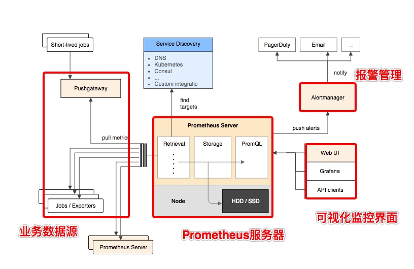

## 基本原理

Prometheus 的基本架构如下图所示：



核心：收集数据、处理数据、可视化展示，再进行数据分析进行报警处理

从上图可以看到，整个 Prometheus 可以分为四大部分，分别是：

- Prometheus 服务器

Prometheus Server 是 Prometheus组件中的核心部分，负责实现对监控数据的获取，存储以及查询

- NodeExporter 业务数据源

业务数据源通过 Pull/Push 两种方式推送数据到 Prometheus Server

- AlertManager 报警管理器

Prometheus 通过配置报警规则，如果符合报警规则，那么就将报警推送到 AlertManager，由其进行报警处理

- 可视化监控界面

Prometheus 收集到数据之后，由 WebUI 界面进行可视化图标展示。目前我们可以通过自定义的 API 客户端进行调用数据展示，也可以直接使用 Grafana 解决方案来展示

### Prometheus 服务端

Prometheus 服务端负责数据的收集

从 <https://prometheus.io/download/> 可以找到最新版本的安装包

```bash
# prometheus.yaml 是 Prometheus 的配置文件
# 默认加载当前路径下的 prometheus.yaml 文件
./prometheus --config.file=prometheus.yaml
```

输入 `http://localhost:9090/graph` 可以看到 Prometheus 自带的监控管理界面

### 客户端数据源

每一个监控指标之前都会有一段类似于如下形式的信息：

```
# HELP node_cpu Seconds the cpus spent in each mode.
# TYPE node_cpu counter
node_cpu{cpu="cpu0",mode="idle"} 362812.7890625
# HELP node_load1 1m load average.
# TYPE node_load1 gauge
node_load1 3.0703125
```

- HELP 用于解释当前指标的含义
- TYPE 则说明当前指标的数据类型

### 配置 Prometheus 的监控数据源

配置一下 Prometheus 的配置文件，让 Prometheus 服务器定时去业务数据源拉取数据

示例：编辑 prometheus.yaml 并在 scrape_configs 节点下添加以下内容

```yaml
scrape_configs:
  - job_name: 'prometheus'
    static_configs:
      - targets: ['localhost:9090']
  # 采集 node exporter 监控数据
  - job_name: 'node'
    static_configs:
      - targets: ['localhost:8080']
```

上面配置文件配置了两个任务。一个是名为 prometheus 的任务，其从`localhost:9090` 地址读取数据。另一个是名为 node 的任务，其从`localhost:8080`地址读取数据

### 查询监控数据

通过 Prometheus UI 可以查询 Prometheus 收集到的数据，而 Prometheus 定义了 PromQL 语言来作为查询监控数据的语言