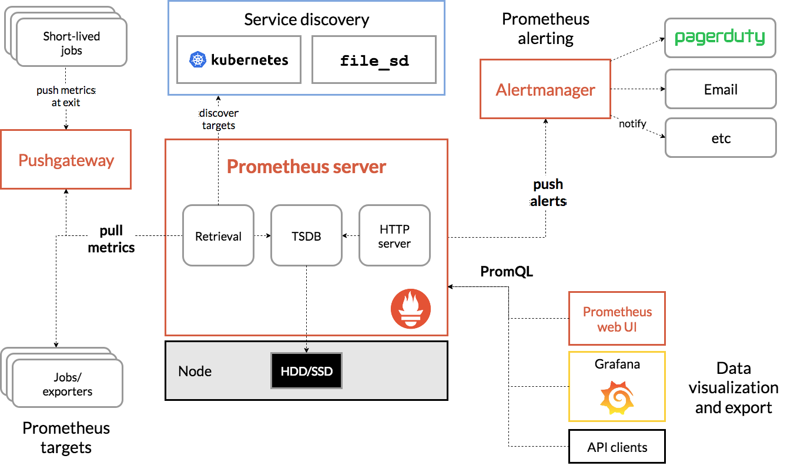

## 简介

一个好的监控系统，不仅可以实时暴露系统的各种问题，更可以根据这些监控到的状态，自动分析和定位大致的瓶颈来源，从而更精确地把问题汇报给相关团队处理。

要做好监控，最核心的就是全面的、可量化的指标，这包括系统和应用两个方面。

- 从系统来说，监控系统要涵盖系统的整体资源使用情况
  - 比如 CPU、内存、磁盘和文件系统、网络等各种系统资源
- 而从应用程序来说，监控系统要涵盖应用程序内部的运行状态
  - 这既包括进程的 CPU、磁盘 I/O 等整体运行状况
  - 更需要包括诸如接口调用耗时、执行过程中的错误、内部对象的内存使用等应用程序内部的运行状况

## 系统监控指标

### 4个黄金指标

Four Golden Signals 是 Google 针对大量分布式监控的经验总结，4 个黄金指标可以在服务级别帮助衡量终端用户体验、服务中断、业务影响等层面的问题

主要关注与以下四种类型的指标：延迟，通讯量，错误以及饱和度

### RED 方法

RED 方法是 Weave Cloud 在基于 Google 的“ 4 个黄金指标”的原则下结合 Prometheus 以及 Kubernetes 容器实践，细化和总结的方法论，特别适合于云原生应用以及微服务架构应用的监控和度量

主要关注以下三种关键指标：

- (请求)速率：服务每秒接收的请求数
- (请求)错误：每秒失败的请求数
- (请求)耗时：每个请求的耗时

### USE 法

用简洁的方法，来描述系统资源的使用情况。每种资源的性能指标可都有很多，使用过多指标本身耗时耗力不说，也不容易建立起系统整体的运行状况

专门用于性能监控的 USE（Utilization Saturation and Errors）法

名词定义：

- 资源： 服务器功能性的物理组成硬件（CPU， 硬盘, 总线）
- 利用率： 资源执行某工作的平均时间
- 饱和：衡量资源超载工作的程度，往往会被塞入队列
- 错误： 错误事件的数量

USE 法把系统资源的性能指标，简化成了三个类别，即使用率、饱和度以及错误数

- **使用率**，表示资源用于服务的时间或容量百分比。100% 的使用率，表示容量已经用尽或者全部时间都用于服务
- **饱和度**，表示资源的繁忙程度，通常与等待队列的长度相关。100% 的饱和度，表示资源无法接受更多的请求
- **错误数**，表示发生错误的事件个数。错误数越多，表明系统的问题越严重

例子：

- 利用率： 以一个时间段内的百分比来表示，例如：一个硬盘以 90% 的利用率运行
- 饱和度： 一个队列的长度，例如：CPUs 平均的运行时队列长度是4
- 错误（数）： 可度量的数量，例如：这个网络接口有 50 次（超时？）

这三个类别的指标，涵盖了系统资源的常见性能瓶颈，所以常被用来快速定位系统资源的性能瓶颈。这样，无论是对 CPU、内存、磁盘和文件系统、网络等硬件资源，还是对文件描述符数、连接数、连接跟踪数等软件资源，USE 方法都可以帮你快速定位出，是哪一种系统资源出现了性能瓶颈。

## 性能指标

常见指标分类（USE 法）：

| 资源         | 类型   | 性能指标                         |
| ------------ | ------ | -------------------------------- |
| CPU          | 使用率 | CPU 使用率                       |
| CPU          | 饱和度 | 运行队列长度或平均负载           |
| CPU          | 错误数 | 硬件 CPU 错误数                  |
| 内存         | 使用率 | 已用内存百分比或 SWAP 用量百分比 |
| 内存         | 饱和度 | 内存换页量                       |
| 内存         | 错误数 | 内存分配失败或者 OOM             |
| 存储设备 I/O | 使用率 | 设备 I/O 时间百分比              |
| 存储设备 I/O | 饱和度 | 等待队列长度或延迟               |
| 存储设备 I/O | 错误数 | I/O 错误数                       |
| 文件系统     | 使用率 | 已用容量百分比                   |
| 文件系统     | 饱和度 | 已用容量百分比                   |
| 文件系统     | 错误数 | 文件读写错误数                   |
| 网络         | 使用率 | 带宽使用率                       |
| 网络         | 饱和度 | 重传报文数                       |
| 网络         | 错误数 | 网卡收发错误数、丢包数           |
| 文件描述符   | 使用率 | 已用文件描述符数百分比           |
| 连接跟踪     | 使用率 | 已用连接跟踪数百分比             |
| 连接数       | 饱和度 | TIMEWAIT 状态连接数              |

需要注意的是，USE 方法只关注能体现系统资源性能瓶颈的核心指标，但这并不是说其他指标不重要。诸如系统日志、进程资源使用量、缓存使用量等其他各类指标，也都需要我们监控起来。只不过，它们通常用作辅助性能分析，而 USE 方法的指标，则直接表明了系统的资源瓶颈

## 监控系统

掌握 USE 方法以及需要监控的性能指标后，接下来要做的，就是建立监控系统，把这些指标保存下来；然后，根据这些监控到的状态，自动分析和定位大致的瓶颈来源；最后，再通过告警系统，把问题及时汇报给相关团队处理

一个完整的监控系统通常由数据采集、数据存储、数据查询和处理、告警以及可视化展示等多个模块组成

如下图所示，就是 Prometheus 的基本架构：

### 数据采集模块

最左边的 Prometheus targets 就是数据采集的对象，而 Retrieval 则负责采集这些数据

Prometheus 同时支持 Push 和 Pull 两种数据采集模式

- Pull 模式，由服务器端的采集模块来触发采集。只要采集目标提供了 HTTP 接口，就可以自由接入（这也是最常用的采集模式）
- Push 模式，则是由各个采集目标主动向 Push Gateway（用于防止数据丢失）推送指标，再由服务器端从 Gateway 中拉取过去（这是移动应用中最常用的采集模式）

### 数据存储模块

为了保持监控数据的持久化，图中的 TSDB（Time series database）模块，负责将采集到的数据持久化到 SSD 等磁盘设备中。TSDB 是专门为时间序列数据设计的一种数据库，特点是以时间为索引、数据量大并且以追加的方式写入。

### 数据查询和处理模块

在存储数据的同时，其实还提供了数据查询和基本的数据处理功能，而这也就是 PromQL 语言。PromQL 提供了简洁的查询、过滤功能，并且支持基本的数据处理方法，是告警系统和可视化展示的基础。

### 告警模块

AlertManager 提供了告警的功能，包括基于 PromQL 语言的触发条件、告警规则的配置管理以及告警的发送等。

不过，虽然告警是必要的，但过于频繁的告警显然也不可取。所以，AlertManager 还支持通过分组、抑制或者静默等多种方式来聚合同类告警，并减少告警数量。

### 可视化展示模块

Prometheus 的 web UI 提供了简单的可视化界面，用于执行 PromQL 查询语句，但结果的展示比较单调。不过，一旦配合 Grafana，就可以构建非常强大的图形界面。

## 应用监控

### 应用监控指标

系统监控一样，在构建应用程序的监控系统之前，首先也需要确定，到底需要监控哪些指标。特别是要清楚，有哪些指标可以用来快速确认应用程序的性能问题。应用程序的核心指标，不再是资源的使用情况，而是请求数、错误率和响应时间。

这些指标不仅直接关系到用户的使用体验，还反映应用整体的可用性和可靠性。有了请求数、错误率和响应时间这三个黄金指标之后，就可以快速知道，应用是否发生了性能问题。但是，只有这些指标显然还是不够的，因为发生性能问题后，我们还希望能够快速定位“性能瓶颈区”。所以，下面几种指标，也是监控应用程序时必不可少的。

1. 应用进程的资源使用情况，比如进程占用的 CPU、内存、磁盘 I/O、网络等。使用过多的系统资源，导致应用程序响应缓慢或者错误数升高，是一个最常见的性能问题。
2. 应用程序之间调用情况，比如调用频率、错误数、延时等。由于应用程序并不是孤立的，如果其依赖的其他应用出现了性能问题，应用自身性能也会受到影响。
3. 应用程序内部核心逻辑的运行情况，比如关键环节的耗时以及执行过程中的错误等。由于这是应用程序内部的状态，从外部通常无法直接获取到详细的性能数据。所以，应用程序在设计和开发时，就应该把这些指标提供出来，以便监控系统可以了解其内部运行状态。

- 有了应用进程的资源使用指标，可以把系统资源的瓶颈跟应用程序关联起来，从而迅速定位因系统资源不足而导致的性能问题；
- 有了应用程序之间的调用指标，可以迅速分析出一个请求处理的调用链中，到底哪个组件才是导致性能问题的罪魁祸首；
- 有了应用程序内部核心逻辑的运行性能，就可以更进一步，直接进入应用程序的内部，定位到底是哪个处理环节的函数导致了性能问题。

基于这些思路，就可以构建出描述应用程序运行状态的性能指标。再将这些指标纳入到监控系统（比如 Prometheus + Grafana）中，就可以跟系统监控一样，一方面通过告警系统，把问题及时汇报给相关团队处理；另一方面，通过直观的图形界面，动态展示应用程序的整体性能。

### 全链路监控

业务系统通常会涉及到一连串的多个服务，形成一个复杂的分布式调用链。为了迅速定位这类跨应用的性能瓶颈，你还可以使用 Zipkin、Jaeger、Pinpoint 等各类开源工具，来构建全链路跟踪系统。

全链路跟踪可以迅速定位出，在一个请求处理过程中，哪个环节才是问题根源。

全链路跟踪除了帮助快速定位跨应用的性能问题外，还可以生成线上系统的调用拓扑图。这些直观的拓扑图，在分析复杂系统（比如微服务）时尤其有效。

### 日志监控

性能指标的监控，可以让你迅速定位发生瓶颈的位置，不过只有指标的话往往还不够。比如，同样的一个接口，当请求传入的参数不同时，就可能会导致完全不同的性能问题。所以，除了指标外，我们还需要对这些指标的上下文信息进行监控，而日志正是这些上下文的最佳来源。

对比来看，指标是特定时间段的数值型测量数据，通常以时间序列的方式处理，适合于实时监控。

而日志则完全不同，日志都是某个时间点的字符串消息，通常需要对搜索引擎进行索引后，才能进行查询和汇总分析。

### 总结

应用程序的监控，可以分为指标监控和日志监控两大部分：

- 指标监控主要是对一定时间段内性能指标进行测量，然后再通过时间序列的方式，进行处理、存储和告警。
- 日志监控则可以提供更详细的上下文信息，通常通过 ELK 技术栈来进行收集、索引和图形化展示。

在跨多个不同应用的复杂业务场景中，你还可以构建全链路跟踪系统。这样可以动态跟踪调用链中各个组件的性能，生成整个流程的调用拓扑图，从而加快定位复杂应用的性能问题。
