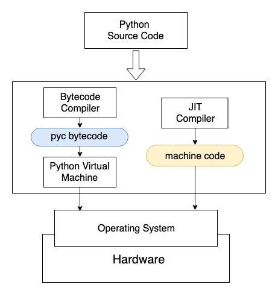

Python 是一门解释语言，Python 为我们提供了基于硬件和操作系统的一个虚拟机，并使用解释器将源代码转化为虚拟机可执行的字节码

字节码在虚拟机上执行，得到结果

- Python 解释器

使用 `python example.py` 来执行一份源代码时，Python 解释器会在后台启动一个字节码编译器（Bytecode Compiler），将源代码转换为字节码；字节码是一种只能运行在虚拟机上的文件，Python 的字节码默认后缀为 `.pyc`，Python 生成 `.pyc` 后一般放在内存中继续使用，并不是每次都将 `.pyc` 文件保存到磁盘上；有时候会看到自己 Python 代码文件夹里有很多 `.pyc` 文件与 `.py` 文件同名，但也有很多时候看不到 `.pyc` 文件；pyc 字节码通过 Python 虚拟机与硬件交互

虚拟机的出现导致程序和硬件之间增加了中间层，运行效率大打折扣

- Just-In-Time

Just-In-Time（JIT）技术为解释语言提供了一种优化，它能克服上述效率问题，极大提升代码执行速度，同时保留 Python 语言的易用性

使用 JIT 技术时，JIT 编译器将 Python 源代码编译成机器直接可以执行的机器语言，并可以直接在 CPU 等硬件上运行；这样就跳过了原来的虚拟机，执行速度几乎与用 C 语言编程速度并无二致

## 参考资料

- <https://juejin.cn/post/7197656815924232251>