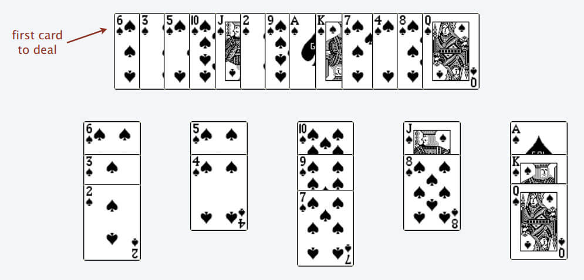

## 题目

- <https://leetcode.cn/problems/longest-increasing-subsequence/>

给一个整数数组 `nums` ，找到其中最长严格递增子序列的长度

**子序列** 是由数组派生而来的序列，删除（或不删除）数组中的元素而不改变其余元素的顺序。例如，`[3,6,2,7]` 是数组 `[0,3,1,6,2,2,7]` 的子序列

示例 1：

```
输入：nums = [10,9,2,5,3,7,101,18]
输出：4
解释：最长递增子序列是 [2,3,7,101]，因此长度为 4
```

示例 2：

```
输入：nums = [0,1,0,3,2,3]
输出：4
```

示例 3：

```
输入：nums = [7,7,7,7,7,7,7]
输出：1
```

 提示：

- `1 <= nums.length <= 2500`
- `-10^4 <= nums[i] <= 10^4`

## 题解


### 方法一：动态规划

#### 思路与算法

最容易想到的是暴力搜索

```go
package main

import "fmt"

func lengthOfLIS(nums []int) int {
	if len(nums) == 0 {
		return 0
	}
	if len(nums) == 1 {
		return 1
	}
	max_len := 1
	for i := 0; i < len(nums); i++ {
		max_len = max(max_len, L(nums, i))
	}
	return max_len
}

func L(nums []int, i int) int {
	// Returns the length of longest increasing subsequence ending to index i
	max_len := 1

	// only one number
	if i == 0 {
		return 1
	}

	// 0, 1, 0, 3, 2, 3
	// i = 2, nums[i] = 0
	// 计算到 0 结束的最长子序列
	// 0, 1, 0
	for j := 0; j < i; j++ { // nums[i] 必须被选取
		if nums[j] < nums[i] {
			// 取最大值
			max_len = max(max_len, 1+L(nums, j))
		}
	}
	return max_len
}

func main() {
	fmt.Printf("%v", lengthOfLIS([]int{0, 1, 0, 3, 2, 3}))
}

```

定义 $\textit{dp}[i]$ 为考虑前 $i$ 个元素，以第 $i$ 个数字结尾的最长上升子序列的长度，**注意 $\textit{nums}[i]$ 必须被选取**

在如上的暴力搜索中对应为

```
L(0) = 1
L(1) = max{L(0)} + 1 (且 nums[1] > nums[i], i 为取到的 max L 对应的 nums 值)
L(2) = max{L(0), L(1)} + 1 (且 nums[2] > nums[i], i 为取到的 max L 对应的 nums 值)
```

从小到大计算 $\textit{dp}$ 数组的值，在计算 $\textit{dp}[i]$ 之前，已经计算出 $\textit{dp}[0 \ldots i-1]$ 的值，则状态转移方程为：
$$
\textit{dp}[i] = \max(\textit{dp}[j]) + 1, \text{其中} \, 0 \leq j < i \, \text{且} \, \textit{num}[j]<\textit{num}[i]
$$

即考虑往 $\textit{dp}[0 \ldots i-1]$ 中最长的上升子序列后面再加一个 $\textit{nums}[i]$。由于 $\textit{dp}[j]$ 代表 $\textit{nums}[0 \ldots j]$ 中以 $\textit{nums}[j]$ 结尾的最长上升子序列，所以如果能从 $\textit{dp}[j]$ 这个状态转移过来，那么 $\textit{nums}[i]$ 必然要大于 $\textit{nums}[j]$，才能将 $\textit{nums}[i]$ 放在 $\textit{nums}[j]$ 后面以形成更长的上升子序列

最后，整个数组的最长上升子序列即所有 $\textit{dp}[i]$ 中的最大值

$$
\text{LIS}_{\textit{length}}= \max(\textit{dp}[i]), \text{其中} \, 0\leq i < n
$$

因此可以实现递归改递推，并且记忆搜索过程中一些计算


#### 复杂度分析

- 时间复杂度：$O(n^2)$，其中 $n$ 为数组 $\textit{nums}$ 的长度。动态规划的状态数为 $n$，计算状态 $dp[i]$ 时，需要 $O(n)$ 的时间遍历 $dp[0 \ldots i-1]$ 的所有状态，所以总时间复杂度为 $O(n^2)$

- 空间复杂度：$O(n)$，需要额外使用长度为 $n$ 的 $dp$ 数组

#### 代码实现

```go
package main

import "fmt"

func lengthOfLIS(nums []int) int {
	if len(nums) == 0 {
		return 0
	}
	dp := make([]int, len(nums))
	dp[0] = 1
	max_len := 1
	for i := 1; i < len(nums); i++ {
		dp[i] = 1
		// ending to i
		for j := 0; j < i; j++ {
			if nums[i] > nums[j] {
				dp[i] = max(dp[i], dp[j]+1)
			}
		}
		max_len = max(max_len, dp[i])
	}
	return max_len
}

func main() {
	fmt.Printf("%v", lengthOfLIS([]int{0, 1, 0, 3, 2, 3}))
}

```

### 方法二：贪心 + 二分查找

#### 思路与算法

考虑一个简单的贪心，如果要使上升子序列尽可能的长，则需要让序列上升得尽可能慢，因此希望每次在上升子序列最后加上的那个数尽可能的小

基于上面的贪心思路，维护一个数组 $d[i]$ ，表示长度为 $i$ 的最长上升子序列的末尾元素的最小值，用 $\textit{len}$ 记录目前最长上升子序列的长度，起始时 $len$ 为 $1$，$d[1] = \textit{nums}[0]$

同时可以注意到 $d[i]$ 是关于 $i$ 单调递增的。因为如果 $d[j] \geq d[i]$ 且 $j < i$，考虑从长度为 $i$ 的最长上升子序列的末尾删除 $i-j$ 个元素，那么这个序列长度变为 $j$ ，且第 $j$ 个元素 $x$（末尾元素）必然小于 $d[i]$，也就小于 $d[j]$。那么就找到了一个长度为 $j$ 的最长上升子序列，并且末尾元素比 $d[j]$ 小，从而产生了矛盾。因此数组 $d$ 的单调性得证

依次遍历数组 $\textit{nums}$ 中的每个元素，并更新数组 $d$ 和 $len$ 的值。如果 $\textit{nums}[i] > d[\textit{len}]$ 则更新 $len = len + 1$，否则在 $d[1 \ldots len]$中找满足 $d[i - 1] < \textit{nums}[j] < d[i]$ 的下标 $i$，并更新 $d[i] = \textit{nums}[j]$

根据 $d$ 数组的单调性，可以使用二分查找寻找下标 $i$，优化时间复杂度

最后整个算法流程为：

- 设当前已求出的最长上升子序列的长度为 $\textit{len}$（初始时为 $1$），从前往后遍历数组 $\textit{nums}$，在遍历到 $\textit{nums}[i]$ 时：

    - 如果 $\textit{nums}[i] > d[\textit{len}]$ ，则直接加入到 $d$ 数组末尾，并更新 $\textit{len} = \textit{len} + 1$

    - 否则，在 $d$ 数组中二分查找，找到第一个比 $\textit{nums}[i]$ 小的数 $d[k]$ ，并更新 $d[k + 1] = \textit{nums}[i]$

以输入序列 $[0, 8, 4, 12, 2]$ 为例：

 - 第一步插入 $0$，$d = [0]$

 - 第二步插入 $8$，$d = [0, 8]$

 - 第三步插入 $4$，$d = [0, 4]$

 - 第四步插入 $12$，$d = [0, 4, 12]$

 - 第五步插入 $2$，$d = [0, 2, 12]$

最终得到最大递增子序列长度为 $3$

#### 复杂度分析

- 时间复杂度：$O(n\log n)$。数组 $\textit{nums}$ 的长度为 $n$，依次用数组中的元素去更新 $d$ 数组，而更新 $d$ 数组时需要进行 $O(\log n)$ 的二分搜索，所以总时间复杂度为 $O(n\log n)$

- 空间复杂度：$O(n)$，需要额外使用长度为 $n$ 的 $d$ 数组

#### 代码实现

额外空间

```go
package main

import (
	"fmt"
	"sort"
)

func lengthOfLIS(nums []int) int {
	g := []int{}
	for _, x := range nums {
		j := sort.SearchInts(g, x)
		if j == len(g) { // >=x 的 g[j] 不存在
			g = append(g, x)
		} else {
			g[j] = x
		}
	}
	return len(g)
}

func main() {
	fmt.Printf("%v", lengthOfLIS([]int{0, 1, 0, 3, 2, 3}))
}

```

原地覆盖

```go
package main

import (
	"fmt"
	"sort"
)

func lengthOfLIS(nums []int) int {
	g := nums[:0] // 原地修改
	for _, x := range nums {
		j := sort.SearchInts(g, x)
		if j == len(g) { // >=x 的 g[j] 不存在
			g = append(g, x)
		} else {
			g[j] = x
		}
	}

	return len(g)
}

func main() {
	fmt.Printf("%v", lengthOfLIS([]int{0, 1, 0, 3, 2, 3}))
}

```

### 方法三：patience game 的纸牌游戏

#### 思路与算法

其实最长递增子序列和一种叫做 patience game 的纸牌游戏有关，甚至有一种排序方法就叫做 patience sorting（耐心排序）

首先，给你一排扑克牌，像遍历数组那样从左到右一张一张处理这些扑克牌，最终要把这些牌分成若干堆


处理这些扑克牌要遵循以下规则：

只能把点数小的牌压到点数比它大的牌上；如果当前牌点数较大没有可以放置的堆，则新建一个堆，把这张牌放进去；如果当前牌有多个堆可供选择，则选择最左边的那一堆放置

比如说上述的扑克牌最终会被分成这样 5 堆（认为纸牌 A 的牌面是最大的，纸牌 2 的牌面是最小的）



为什么遇到多个可选择堆的时候要放到最左边的堆上呢？因为这样可以保证牌堆顶的牌有序（2, 4, 7, 8, Q）


按照上述规则执行，可以算出最长递增子序列，牌的堆数就是最长递增子序列的长度


要把处理扑克牌的过程编程写出来即可。每次处理一张扑克牌不是要找一个合适的牌堆顶来放吗，牌堆顶的牌不是有序吗，这就能用到二分查找了：用二分查找来搜索当前牌应放置的位置

#### 代码实现

```go
package main

import "fmt"

func lengthOfLIS(nums []int) int {
	top := make([]int, len(nums))
	// 牌堆数初始化为 0
	piles := 0
	for i := 0; i < len(nums); i++ {
		// 要处理的扑克牌
		poker := nums[i]

		/***** 搜索左侧边界的二分查找 *****/
		left, right := 0, piles
		for left < right {
			mid := (left + right) / 2
			if top[mid] > poker {
				right = mid
			} else if top[mid] < poker {
				left = mid + 1
			} else {
				right = mid
			}
		}
		/*********************************/

		// 没找到合适的牌堆，新建一堆
		if left == piles {
			piles++
		}
		// 把这张牌放到牌堆顶
		top[left] = poker
	}
	// 牌堆数就是 LIS 长度
	return piles
}

func main() {
	fmt.Printf("%v", lengthOfLIS([]int{0, 1, 0, 3, 2, 3}))
}

```

