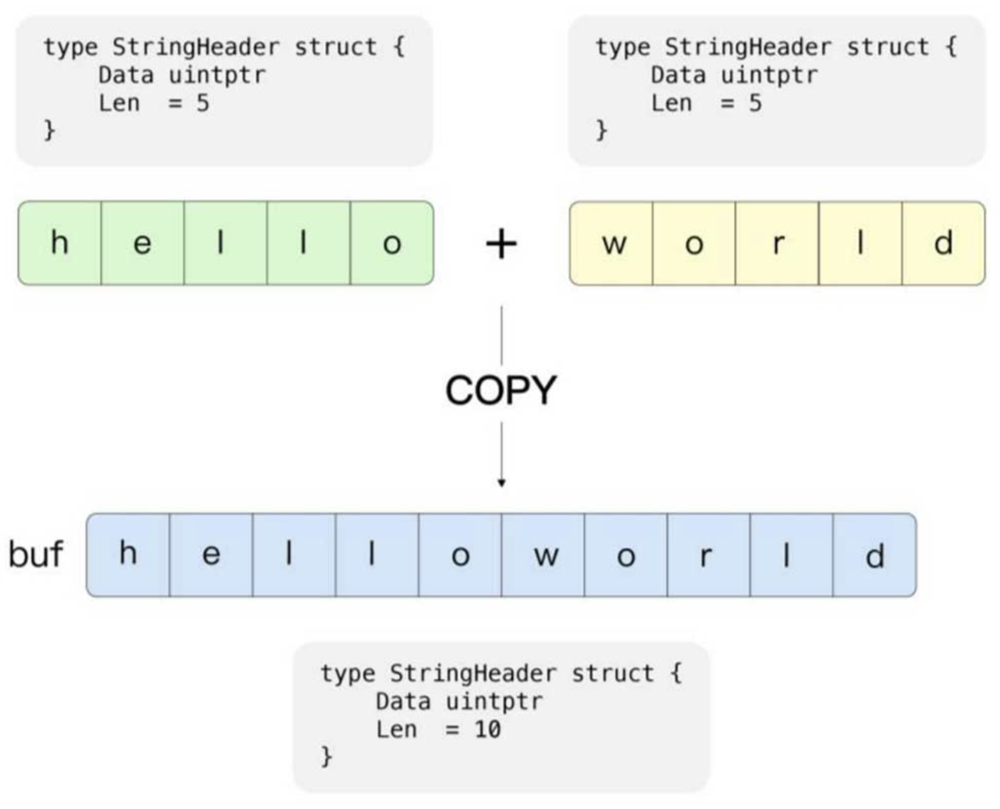

## 字符串简介

字符串在编程语言中无处不在，程序的源文件本身就是由众多字符组成的，在程序开发中的存储、传输、日志打印等环节，都离不开字符串的显示、表达及处理。因此，字符与字符串是编程中最基础的学问。不同的语言对于字符串的结构、处理有所差异。

### 字符串长度

在编程语言中，字符串是一种重要的数据结构，通常由一系列字符组成

字符串一般有两种类型：

- 定长：在编译时指定长度，不能修改
- 不定长：具有动态的长度，可以修改

在 Go 语言中，字符串不能被修改，只能被访问

```go
var str = "hello word"

// 这里想把 e 改成 o，不支持

str[1]='o'
```

### 字符串的终止方式

字符串的终止有两种方式:

- 一种是 `C` 语言中的隐式申明，以字符 `\0` 作为终止符
- 一种是 `Go` 语言中的显式声明

## 底层数据结构

### 数据结构

`Go` 语言运行时字符串 `string` 的表示结构，源码见：<https://github.com/golang/go/blob/go1.20.1/src/reflect/value.go#L2739-L2750>

```go
// StringHeader is the runtime representation of a string.
// It cannot be used safely or portably and its representation may
// change in a later release.
// Moreover, the Data field is not sufficient to guarantee the data
// it references will not be garbage collected, so programs must keep
// a separate, correctly typed pointer to the underlying data.
//
// In new code, use unsafe.String or unsafe.StringData instead.
type StringHeader struct {
	Data uintptr
	Len  int
}

```

- `Data`：指向底层的字符数组
- `Len`：代表字符串的长度

字符串在本质上是一串字符数组

### 内存占用

`Go` 语言中所有的文件都采用 `UTF-8` 的编码方式，同时字符常量使用 `UTF-8` 的字符编码集

> `UFT-8` 是一种长度可变的编码方式，可包含世界上大部分的字符
> 
> 在 `UTF-8` 中，大部分字符都只占据 `1` 字节，但是特殊的字符（例如大部分中文）会占据 3 字节

示例中，变量 `str` 看起来只有 `4` 个字符，但是 `len(str)` 获取的长度为 `8`，字符串 `str` 中每个中文都占据了 `3` 字节

```go
package main

import "fmt"

func main() {
	str := "Go语言"
	// str 长度: 8
	fmt.Println("str 长度:", len(str))
}

```

## 字符串解析

### 字符串语法分析解析源码

字符串常量在词法解析阶段最终会被标记成 `StringLit` 类型的 `Token` 并被传递到编译的下一个阶段

在语法分析阶段，采取递归下降的方式读取 `Uft-8` 字符，单撇号或双引号是字符串的标识

源码：<https://github.com/golang/go/blob/go1.20.1/src/cmd/compile/internal/syntax/scanner.go#L127-L131>

```go
func (s *scanner) next() {
	// ...
	switch s.ch {
	// ...
	case '"':
		s.stdString()

	case '`':
		s.rawString()
		// ...
	}
	// ...
}

```

根据上面解析源码可以得知：

- 如果在代码中识别到单撇号，则调用 `rawString` 函数
- 如果识别到双引号，则调用 `stdString` 函数

`rawString` 函数和 `stdString` 函数对字符串的解析处理略有不同

### rawString 源码解析

对于单撇号的处理比较简单：一直循环向后读取，直到寻找到配对的单撇号

源码：<https://github.com/golang/go/blob/go1.20.1/src/cmd/compile/internal/syntax/scanner.go#L706-L727>

```go
func (s *scanner) rawString() {
	ok := true
	s.nextch()

	for {
		if s.ch == '`' {
			s.nextch()
			break
		}
		if s.ch < 0 {
			s.errorAtf(0, "string not terminated")
			ok = false
			break
		}
		s.nextch()
	}
	// We leave CRs in the string since they are part of the
	// literal (even though they are not part of the literal
	// value).

	s.setLit(StringLit, ok)
}

```

### stdString 源码解析

双引号调用 `stdString` 函数，如果出现另一个双引号则直接退出

如果出现了 `\`，则对后面的字符进行转义

在双引号中不能出现换行符，以下代码在编译时会报错：`newline in string`，这是通过对每个字符判断 `s.ch == '\n'` 实现的

源码：<https://github.com/golang/go/blob/go1.20.1/src/cmd/compile/internal/syntax/scanner.go#L674-L704>

```go
func (s *scanner) stdString() {
	ok := true
	s.nextch()

	for {
		if s.ch == '"' {
			s.nextch()
			break
		}
		if s.ch == '\\' {
			s.nextch()
			if !s.escape('"') {
				ok = false
			}
			continue
		}
		if s.ch == '\n' {
			s.errorf("newline in string")
			ok = false
			break
		}
		if s.ch < 0 {
			s.errorAtf(0, "string not terminated")
			ok = false
			break
		}
		s.nextch()
	}

	s.setLit(StringLit, ok)
}

```

## 字符串拼接

### 非运行时拼接

在 `Go` 语言中，可以方便地通过加号操作符 `+` 对字符串进行拼接。如下代码

```go
package main

import "fmt"

func main() {
	str := "hello " + "world"
	fmt.Println(str)
}

```

由于数字的加法操作也使用 `+` 操作符，因此需要编译时识别具体为何种操作：

- 在**抽象语法树阶段**：当加号操作符两边是字符串时，具体操作的 `Op` 会被解析为 `OADDSTR`

- 在**语法分析阶段**：调用 `noder.sum` 函数，将所有的字符串常量放到字符串数组中，然后调用 `strings.Join` 函数完成对字符串常量数组的拼接

### 运行时拼接

运行时字符串的拼接原理如图所示，其并不是简单地将一个字符串合并到另一个字符串中，而是找到一个更大的空间，并通过内存复制的形式将字符串复制到其中




拼接后的字符串大于或小于 `32` 字节时的操作：

- 当拼接后的字符串小于 `32` 字节时，会有一个临时的缓存供其使用
- 当拼接后的字符串大于 `32` 字节时，堆区会开辟一个足够大的内存空间，并将多个字符串存入其中，期间会涉及内存的复制

## 与字节数组转换

字节数组与字符串可以相互转换

如下所示，字符串 `a` 强制转换为字节数组 `b`，字节数组 `b` 强制转换为字符串 `c`

```go
package main

import "fmt"

func main() {
	a := "hello go"
	// a 强制转换为字节数组 b
	b := []byte(a)
	// 字节数组 b 强制转换为字符串 c
	c := string(b)

	// hello go
	fmt.Println(a)
	// [104 101 108 108 111 32 103 111]
	fmt.Println(b)
	// hello go
	fmt.Println(c)
}

```

字节数组与字符串的相互转换并不是简单的指针引用，而是涉及了内存复制

- 当字符串小于 `32` 字节时：可以直接使用缓存 `buf`
- 当字符串大于 `32` 字节时：需要向堆区申请足够的内存空间，最后使用 `copy` 函数完成内存复制

在涉及一些密集的转换场景时，需要评估这种转换带来的性能损耗

## string 非线程安全

线程安全是指在多线程环境下，程序的执行能够正确地处理多个线程并发访问共享数据的情况，保证程序的正确性和可靠性

能被称之为：线程安全，需要在多个线程同时访问共享数据时，满足如下几个条件：

- 不会出现数据竞争（data race）：多个线程同时对同一数据进行读写操作，导致数据不一致或未定义的行为
- 不会出现死锁（deadlock）：多个线程互相等待对方释放资源而无法继续执行的情况
- 不会出现饥饿（starvation）：某个线程因为资源分配不公而无法得到执行的情况

### 并发读

多个 goroutine 中并发访问同一个 string 变量的场景

```go
package main

import (
	"fmt"
	"sync"
)

func main() {
	var wg sync.WaitGroup
	str := "test"
	for i := 0; i < 5; i++ {
		wg.Add(1)
		go func() {
			defer wg.Done()
			fmt.Println(str)
		}()
	}
	wg.Wait()
}

```

输出结果：

```plain
test
test
test
test
test
```

定义了一个 string 变量 str，然后启动了 5 个 goroutine，每个 goroutine 都会输出 str 的值。由于 str 是不可变类型，因此在多个 goroutine 中并发访问它是安全的

不可变类型，指的是一种不能被修改的数据类型，也称为值类型（value type）。不可变类型在创建后其值不能被改变，任何对它的修改操作都会返回一个新的值，而不会改变原有的值

### 并发写

多个 goroutine 并发写入的场景

```go
package main

import (
	"fmt"
	"sync"
)

func main() {
	var wg sync.WaitGroup
	str := "test"
	for i := 0; i < 5; i++ {
		wg.Add(1)
		go func() {
			defer wg.Done()
			str += "!" // 修改 str 变量
			fmt.Println(str)
		}()
	}
	wg.Wait()
}

```

输出结果：

```plain
test!
test!!
test!!!
test!!
test!!!
```

每个 goroutine 中向 str 变量中添加了一个感叹号。由于多个 goroutine 同时修改了 str 变量，因此可能会出现数据竞争的情况

程序输出结果会出现乱序或不一致的情况，可以确认 string 类型变量在多个 goroutine 中是不安全的

### 使用互斥锁保证线程安全

要实现 string 类型变量的线程安全，第一种方式：使用互斥锁（Mutex）来保护共享变量，确保同一时间只有一个 goroutine 可以访问它

```go
package main

import (
	"fmt"
	"sync"
)

func main() {
	var wg sync.WaitGroup
	var mu sync.Mutex // 定义一个互斥锁
	str := "test"
	for i := 0; i < 5; i++ {
		wg.Add(1)
		go func() {
			defer wg.Done()
			mu.Lock() // 加锁
			str += "!"
			fmt.Println(str)
			mu.Unlock() // 解锁
		}()
	}
	wg.Wait()
}

```

使用了 sync 包中的 Mutex 类型来定义一个互斥锁 mu。在每个 goroutine 中，先使用 `mu.Lock()` 方法来加锁，确保同一时间只有一个 goroutine 可以访问 str 变量

再修改 str 变量的值并输出，最后使用 `mu.Unlock()` 方法来解锁，让其他 goroutine 可以继续访问 str 变量

需要注意，互斥锁会带来一些性能上的开销
