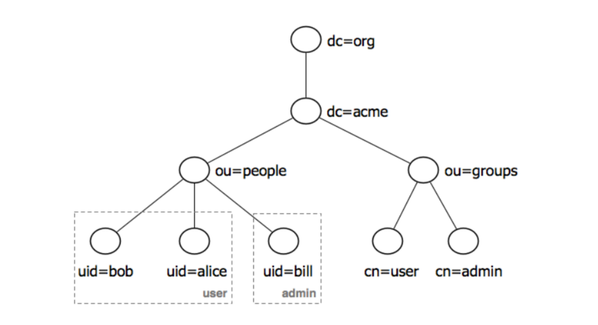
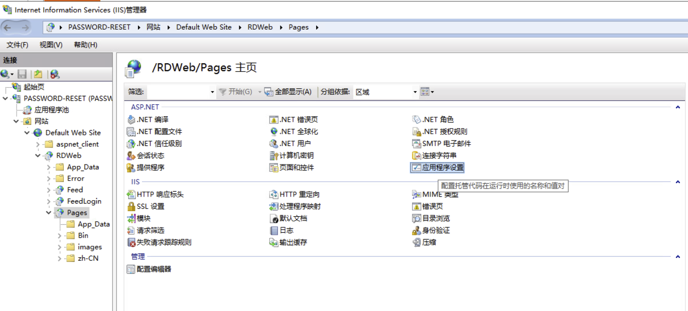

## AD 域简介

会用到的连接端口：

- Microsoft-DS traffic : 445/TCP 445/UDP

- Kerberos : 88/TCP 88/UDP
- LDAP ： 389/TCPAK 636/TCP(如果使用SSL)

- LDAP ping : 389/UDP

- DNS : 53/TCP 53/UDP

访问 AD 的工具

- ADSI 编辑器 微软自带，输入 `adsiedit.msc` 可访问
- ADExplorer ，<https://docs.microsoft.com/en-us/sysinternals/downloads/adexplorer>

## 域服务器管理

查看主域控所有节点

```bash
netdom query fsmo
```

查看所有域控服务器信息

```bash
nltest /dclist:alpha-quant.tech
```

查看客户端通过哪台域服务器进行验证登录

```basg
set logonserver
```

域服务器同步异常排查

可以通过 dcdiag、repadmin 等命令进行排查

```bash
dcdiag
```

### 域控制器配置支持 FAST 身份验证

## 操作域

### 客户端查看

查看域控所有域用户（管理员）：

```powershell
net user /domain
```

查看当前域指定用户（管理员）：

```powershell
net user zhangsan /domain
```

查看域控用户组（管理员）：

```powershell
net group /domain
```

查看当前域指定组详细信息（管理员）：

```powershell
net group "domain users" /domain
```

查看域控时间：

```powershell
net time /domain
```

### 服务端查看

查看域控域所有域用户详细信息：

```powershell
dsquery user
```

查看域控域指定用户详细信息：

```powershell
dsquery user -name "UserName"
```

查看所有域控制器：

```powershell
dsquery server
```

查看域控组织单元：

```powershell
dsquery ou
```

查看域控计算机：

```powershell
dsquery computer
```

查询最近 1 周没有活动的用户：

```powershell
dsquery user -inactive 1
```

查询最近 1 周没有活动的计算机：

```powershell
dsquery computer -inactive 1
```

查询 30 天未变更密码的计算机：

```powershell
dsquery computer -stalepwd 30
```

禁用最近 4 周没有活动的计算机：

```powershell
dsquery computer -inactive 4 | dsmod computer -disable yes
```

禁用最近 4 周没有登陆的用户：

```powershell
dsquery user -inactive 4 | dsmod user -disabled yes
```

### 加入 AD 域

把计算机 `zhangsan-pc`，加入到 `msh.local` 域，30 秒后重启

```powershell
netdom join zhangsan-pc /domain:msh.local /UserD:sh.it /PasswordD:P@ssw0rd /reboot:30
```

计算机退出域（默认会立即重启计算机）

```powershell
netdom remove %computername% /domain:domain /UserD:user /PasswordD:password
```

## LDAP

检查使用域账号 bind 是否正常

```bash
ldapsearch -H ldap://xxx.xxx.xxx.xxx:389 -x -D "cn=德哥,ou=digoal,ou=SKYMOBI,dc=sky-mobi,dc=com" -W
```



微软将 Active Directory 划分为若干个分区(这个分区我们称为 Naming Context，简称 NC)，每个 Naming Context 都有其自己的安全边界

微软自定义了的三个预定义的 Naming Context

- Configuration NC(Configuration NC)
- Schema NC(Schema NC)
- Domain NC(DomainName NC)

Configuration NC 内存储的主要是配置信息，关站点，服务，分区和 Active DirectorySchema 的信息，处于根域之下，并复制到林中的每个域控中。

Schema NC 存储的 Active Directory 中存储的对象的定义，个人感觉类似 Mysql 中的元数据库的概念，包含 Schema 信息，定义了 Active Directory 中使用的类和属性。

Domain NC 每个域都有一个域 Naming Context，不同的域内有不同的域 Naming Context，其中包含特定于域的数据。之前我们说过，域内的所有计算机，所有用户的具体信息都存在 Active Directory 底下

## NTP

AD 域控配置 NTP 时间服务器方法

查看该域控是否为 NTPServer；如下图 Ntpserver 中，“Enabled” 值为 “1” 说明当前域控是 NTP 服务器；若该值为 “0”，则需要在注册表的下列位置

```powershell
w32tm /query /configuration
#  HKEY_LOCAL_MACHINE\SYSTEM\CurrentControlSet\Services\W32Time\TimeProviders\NtpServer
# 将 Enabled 值改为 1
```

用命令查看主机的时间源信息，可以看到当前 PDC 主机的时间来源为系统时钟

```powershell
w32tm /query /status
```

验证 NTP 时间源是否与 AD 域通讯是否正常

```powershell
w32tm /stripchart /computer:[NTP_IP]
```

在域控主机上执行命令

```powershell
w32tm /config /manualpeerlist:[NTP_IP] /syncfromflags:manual /reliable:yes /update
```

## Web 重置密码

参考：<https://www.xh86.me/?p=924>

在公司日常运维中会发现目前很多公司 的 AD 域成员（域用户）密码到期后修改密码的方法只有两种：

第一种，密码到期提醒策略，用户电脑接入公司内网自行进 行修改，修改办法：CTrl+Alt+delete 键进行修改，此办法对于公司的销售人员、外出办公或出差同事来说，不适宜。

第二种，用户密码到期后，无法登陆，申请后台进行重置密 码，此办法可以解决问题，但是不是长久之计，一般制度健 全的公司，申请流程审批很漫长，浪费时间。

推荐通过 WEB 界面自行修改密码

在打开的服务器管理界面点击”添加角色和功能”；选择”基于角色或基于功能的安装”；选择 Web 服务和远程桌面 Web 服务；等待片刻，安装滚动条完成后，重启服务器来完成配置

配置 IIS 服务：打开”管理工具”选择 IIS 管理器；配置IIS 启用密码修改功能，将 “PasswordChangeEnabled”的值改为”True”




打开浏览器，输入访问密码修改界面

```
<访问入口>/RDWeb/PAGES/ZH-cn/password.aspx?Error=PasswordSuccess
```

在上面打开的界面中，输入域名\用户名、旧密码、2 次新密码，点击修改测试

## 参考资料

- Active Directory 域服务迁移 <https://learn.microsoft.com/zh-cn/training/modules/active-directory-domain-services-migration/>
- <https://blog.csdn.net/yleihj/article/details/127065802>

