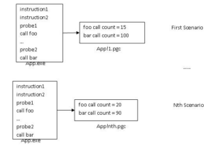
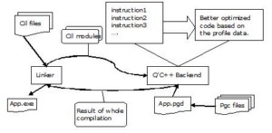

## PGO 简介

PGO是一个可以平均提高任何程序5%~8%性能的技术，全称是Profile Guided Optimization，它的思路其实很简单，就是编译器在对变量和函数如何放置排布和使用问题上，其实是有很大的自由权利的

这里没有一个绝对的最优解，同一段代码，在对于不同应用场景的最优排布方式可能是不同的，传统编译方式都是以块代码进行排布和优化

而 PGO 技术就是自适应编译，通过对程序增加探针进行 profile，运行程序之后，再在下一次编译时根据 profile 结果进行结构的优化调整

## 具体优化

作为一个编译器，有哪些决定可以去做，并且会怎样影响到程序的效率。

- Inlining – 根据函数的调用数量和频次，编译器可以做出更好的内联决定。
- Virtual Call Speculation – 如果一个特定的继承类经常被传递给一个函数，那么它的重载函数可以被inline(内联)，这会减少虚表(vtable)的查询次数。
- Basic Block Reordering（基础结构重新排序） – 尽量将执行顺序最多的路径的代码块放在一起，这样可以提高指令缓存的命中来实现。同时将使用较少的代码挪到最底部，结合下面的“function layout”一起可以显著减少大型应用程序的工作集（一个时间间隔内使用的页面数）。
- Size/Speed Optimization – 根据profile信息，编译器可以找到常用的函数的使用情况，可以将常用的函数进行加速，不常用的函数的代码体积减少。
- Function Layout – 将经常被关联调用的函数放在同一个代码段落里，来减少工作集。
- Conditional Branch Optimization – 比如if/else，如果条件经常为false，则else的代码块会放置在if代码块之前，提高指令缓存命中。

## PGO 的阶段

### instrumental phase

在这个阶段链接器将 cli 文件传递给 Bakend 编译器，Bakend 编译器会插入一些探针指令，并且会和可执行文件一起生成一个 `.pgd` 文件，这是一个后续其他阶段会用到的数据库文件

### training phase

第二阶段是训练阶段，在具体场景下运行程序，前面插入的探针将会记录运行时的信息，数据会被存放在 `.pgc` 文件中，每次运行都会产生一个`appname!#.pgc` 的文件，如上图，第一次运行会产生 `App!1.pgc`，第n次会产生 `App!n.pgc`

在这里训练时要注意，训练时的场景要尽量和实际使用场景相同

### PG Optimization Phase

第 3 部分是 PG 优化部分，会将 pgc 文件合并成 pgd 文件，被 Bakend 编译器做决策时提供数据支持，生成更高效的可执行文件