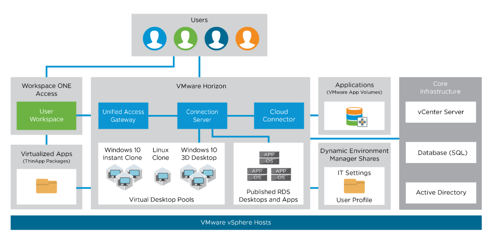

## Horizon 简介

在 Horizon 的架构下，连接服务器（Connection Server，以下简称 CS）是一切的核心，CS 主要负责以下工作：

- 与 Windows AD 对接，进行身份认证
- 管理桌面池、虚拟应用池
- 用户授权
- 与 vCenter 集成实现即时克隆等功能
- 在用户和虚拟桌面间建立安全隧道（可选功能）

Horizon 下支持部署多台 CS 以保证高可用性，环境中部署的第一台为主 CS 节点（Horizon 标准服务器），其他 CS 节点（Horizon 副本服务器）可以加入主 CS 节点以组成集群。多台 CS 节点可以同时工作，单台故障后通过其他节点也可以继续管理和使用桌面。

为了实现虚拟桌面的单一的访问入口，可以为 CS 配置负载均衡器。

## 发布桌面

Horizon 8 支持多种虚拟桌面发布方式，例如自动桌面池（又包含完整克隆和即时克隆）、手动桌面池、RDS 桌面池

- 手动桌面池相当于直接将已有的虚拟机/物理机通过 Horizon 发布出去

## Agent

在功能选项中，可以根据需求开启或关闭功能，例如 USB 重定向功能

填写主 CS 服务器的 FQDN，其他选项保持默认即可

## 参考资料

- <https://blog.csdn.net/yleihj/article/details/126887722>

- <https://blog.csdn.net/When_the_wind_bl/article/details/139705875>

- <https://daylight.blog.csdn.net/article/details/123704540>
