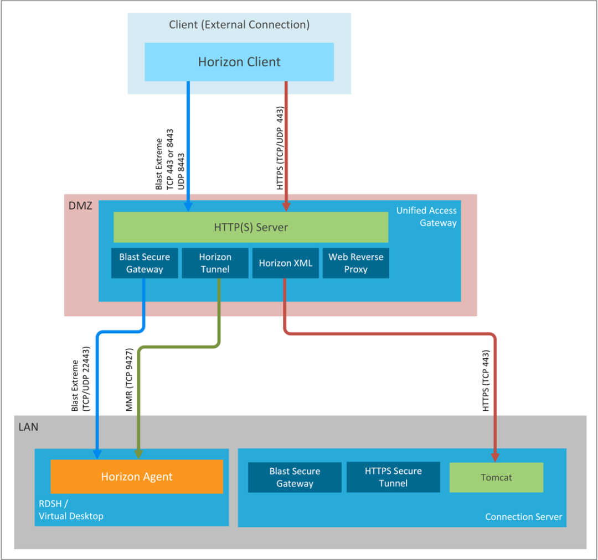
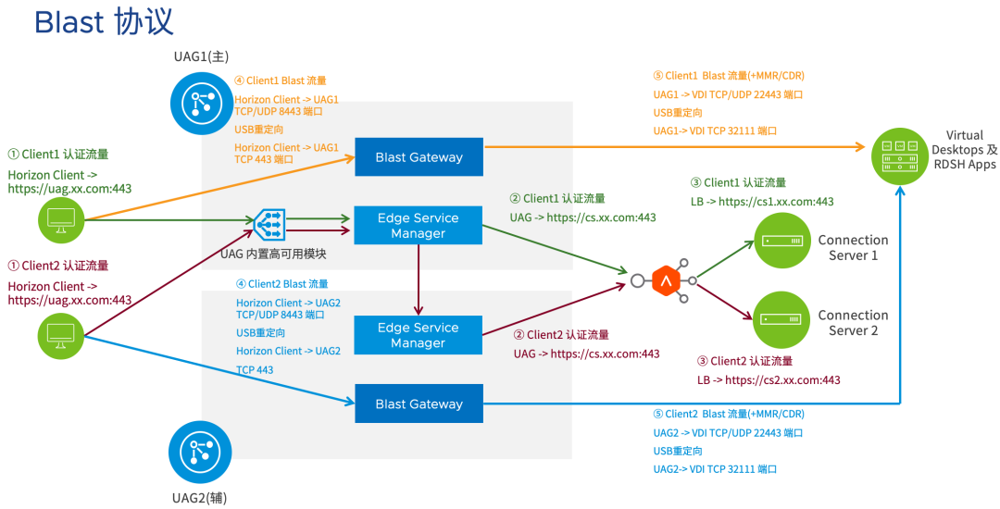

## UAG 简介

UAG 全称 Unified Access Gateway，在 Horizon 环境中可以放置在网络边界，隔离来自互联网的 Client （或其他网络区域）和托管在内网的 Horizon 桌面。一个典型的部署架构如下图所示：

UAG 支持多网卡部署，因此可以很好地适应各种网络拓扑，通常来说 UAG 会为 Horizon 提供两项功能：

- 认证代理 ：用户使用 VDI 时，会将认证请求发送给 UAG ，UAG 将请求转发给后端的 Connection Server 进行处理
- VDI 桌面流量的代理（安全网关）：和 Connection Server 的安全网关功能类似，开启后用户桌面数据将通过 UAG 集中转发

一般在生产环境下需要部署多台 UAG 来提供高可用，UAG 自身也支持为多台设备配置浮动 IP 来提供简单的 HA 功能。第一台开启 HA 功能的 UAG 会成为主节点，浮动 IP 托管在主节点上，所有到 UAG 的访问均会先发给主 UAG 节点，主 UAG 节点再做请求的分发。当主节点故障后备节点会进行接管

## UAG 负载均衡模式

### 单 VIP 配置 L7 & L4

### 单一四层虚拟服务

