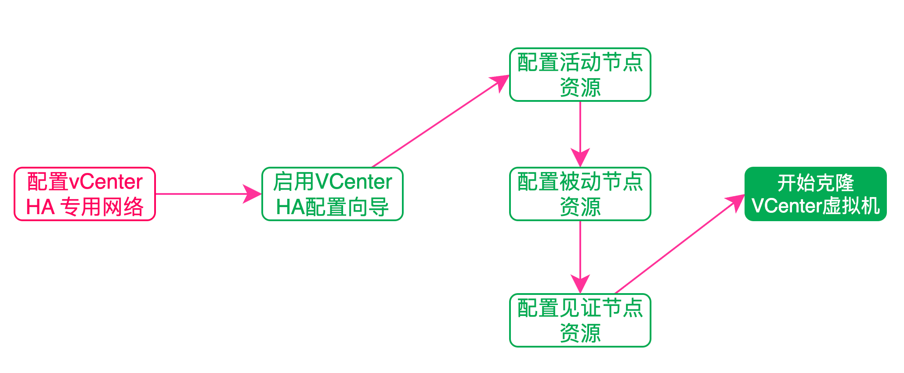

## vCenter HA 简介

VMware 提供了 vCenter High Availability (以下简称 vCenter HA) 可防止 vCenter Server 发生主机和硬件故障

vCenter HA 不仅能够在主机和硬件出现故障时提供保护，而且还能够在 vCenter Server 应用程序出现故障时提供保护

使用自动故障切换功能从主动切换到被动，vCenter HA 支持的高可用性可最大限度减少停机时间

## 集群架构

vCenter HA的整体解决方案实际采用了【主动节点、被动节点和见证节点】的三节点集群整体架构

第一个实例初始用作主动节点，该节点被克隆两次，分别克隆为被动节点和见证节点；三个节点一起可提供主动-被动故障切换解决方案

三节点安装起始为主节点，然后安装向导开始克隆主节点为两次，分别克隆为被动节点和见证节点

实际运行中，主动节点会不断将数据复制到被动节点；vCenter HA 配置完成后，只有主动节点具有活动管理界面（公共IP），当主备切换时，该（公共IP）将进行自动切换

## 配置过程

必须在 vCenter Server 上启用 SSH

部署 vCenter HA 专用网络实际上是创建端口组，可以选择基虚拟机的标准端口组，也可以选择基于分布式交换机的分布式端口组

（1）新建分布式端口组 vCenter-HA，选择默认参数

（2）专网网络配置完成后，开始使用 vSphere 自带的向导设置 vCenter HA（选中左侧 vCenter 后，在配置中可以找到 vCenter HA）

（3）配置主动节点、被动节点以及见证节点的管理网络、HA 网络以及克隆 vCenter 数据存放的目的存储；注意：见证节点不需要对外提供 Web 服务，因此不需要选择管理网络资源
