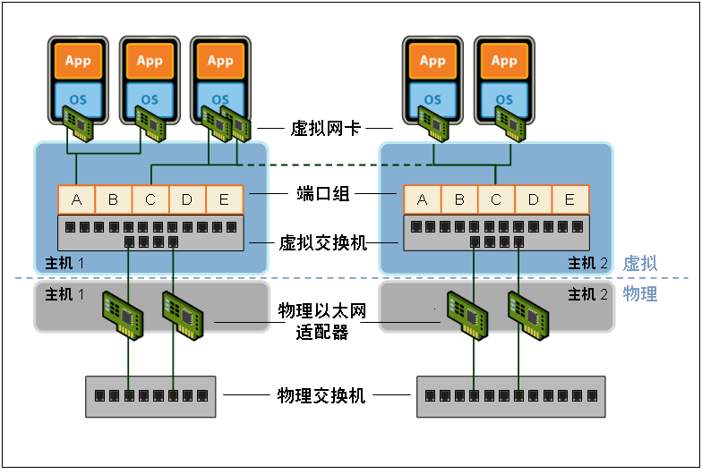
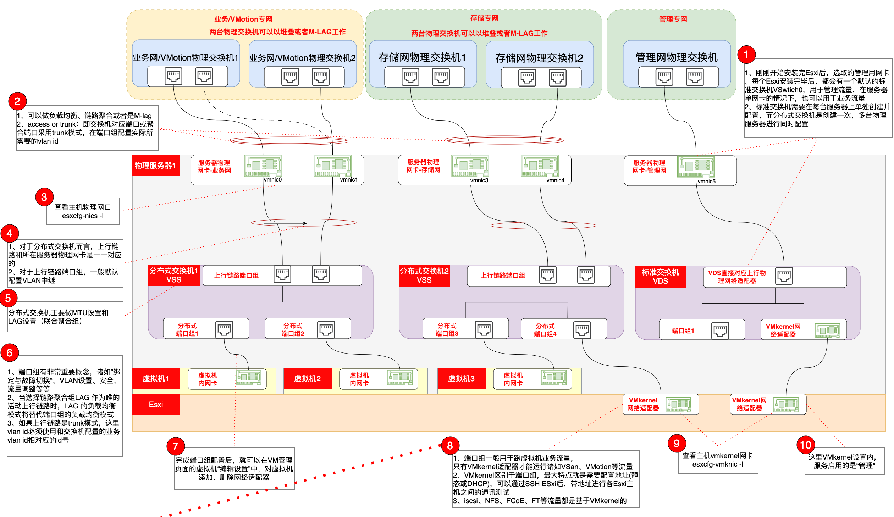

## 虚拟交换机

VMware 的虚拟交换机，分为标准交换机与分布式交换机。

### 标准交换机

标准交换机配置比较容易与简单，安装 vSphere 后默认就已经配置好，然后只需要在上面配置 vmnetwork 或者 vmkernel（VMkerne 主要用于集群内部信息传递，vmotion 等

VM Network 主要用于业务网络使用），划分不同的 vlan 就可以试用了。缺点是每台 ESXI 宿主机的标准交换机都是独立的，配置是需要单独分开配置的。那么如果现在有 100 台物理机，就会有 100 台标准交换机。假设每台需要配置 2 个 VLAN，那么就要手动配置 2*100=2000 次，效率非常低，非常麻烦。

### 分布式交换机

分布式交换机，就是用来解决上述需要手动单独配置的问题的，需要安装 vCenter 后才能进行分布式交换机的部署。分布式交换机，是会对同一个集群内的宿主机共享访问的，相当于所有 ESXI 宿主机，都接入到分布式交换机。那么所有的 VLAN 配置，只需要在分布式交换机上面配置一次，就可以了。然后把虚拟机的网卡选择对应的 VLAN 标签，就可以将虚拟机划入对应的子网

## VMware VSphere 虚拟网络

## 参考资料

- <https://www.ethanzhang.xyz/2023/05/30/VMware%20VSphere%E8%99%9A%E6%8B%9F%E7%BD%91%E7%BB%9C%E7%9A%84%E6%B7%B1%E5%BA%A6%E7%A0%94%E7%A9%B6/>