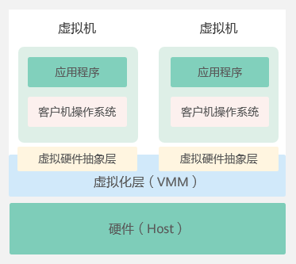
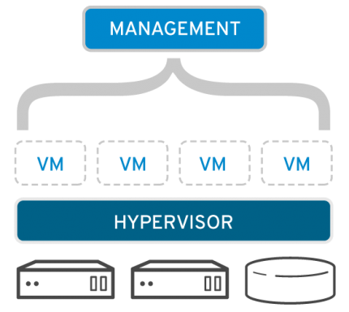
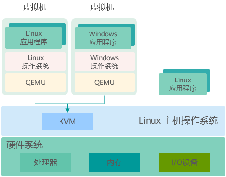
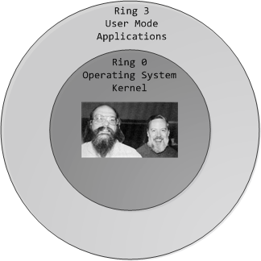
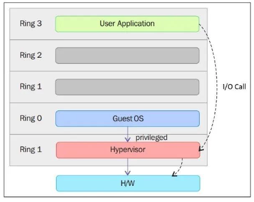

<https://mp.weixin.qq.com/s/1mmet00GTf2_PzeXBBmAbQ>

## 虚拟化

### 虚拟化的概念

虚拟化，是指通过虚拟化技术将一台计算机虚拟为多台逻辑计算机。虚拟化是对计算资源的抽象和模拟，计算资源包括 CPU、内存、硬盘、网络等。虚拟化创建虚拟资源，并将它们映射到计算资源上。例如，在一台 32 核 CPU 的物理服务器上，可以创建并启动一个或多个两核虚拟机。

在一台计算机上同时运行多个逻辑计算机，每个逻辑计算机可运行不同的操作系统，并且应用程序都可以在相互独立的空间内运行而互不影响，从而显著提高计算机的工作效率虚拟化使用软件的方法重新定义划分 IT 资源，可以实现 IT 资源的动态分配、灵活调度、跨域共享，提高 IT 资源利用率，使 IT 资源能够真正成为社会基础设施，服务于各行各业中灵活多变的应用需求。 

### 虚拟化的作用

提高计算机资源的利用率和程序运行环境的安全隔离，还可以有效限制程序的资源占用 

1. 降低运营成本 - 服务器虚拟化降低了 IT 基础设施的运营成本，令系统管理员摆脱了繁重的物理服务器、OS、中间件及兼容性的管理工作，减少人工干预频率，使管理更加强大、便捷
2. 提高应用兼容性 - 服务器虚拟化提供的封装性和隔离性使大量应用独立运行于各种环境中，管理人员不需频繁根据底层环境调整应用，只需构建一个应用版本并将其发布到虚拟化后的不同类型平台上即可
3. 加速应用部署 - 采用服务器虚拟化技术只需输入激活配置参数、拷贝虚拟机、启动虚拟机、激活虚拟机即可完成部署，大大缩短了部署时间，免除人工干预，降低了部署成本
4. 提高服务可用性 - 用户可以方便地备份虚拟机，在进行虚拟机动态迁移后，可以方便的恢复备份，或者在其他物理机上运行备份，大大提高了服务的可用性
5. 提升资源利用率 - 通过服务器虚拟化的整合，提高了 CPU、内存、存储、网络等设备的利用率，同时保证原有服务的可用性，使其安全性及性能不受影响
6. 动态调度资源 - 在服务器虚拟化技术中，数据中心从传统的单一服务器变成了统一的资源池，用户可以即时地调整虚拟机资源，同时数据中心管理程序和数据中心管理员可以灵活根据虚拟机内部资源使用情况灵活分配调整给虚拟机的资源
7. 降低能源消耗 - 通过减少运行的物理服务器数量，减少 CPU 以外各单元的耗电量，达到节能减排的目的

与物理环境相比，通过虚拟化可以在同一硬件 (同一物理服务器) 上运行多个彼此独立、互不影响的 guest 操作系统 (多个虚拟机)，并能够按需配置 guest OS 的资源。

### 实现原理

Gerald J. Popek 和 Robert P. Goldberg 在 1974 年发表的论文《Formal Requirements for Virtualizable Third Generation Architectures》中，提出了虚拟化的三个充分条件：

- 等效：在虚拟机中运行的程序应该表现出与直接在物理机上运行时表现出的行为基本相同的行为；
- 资源控制：虚拟机管理程序 (hypervisor) 必须完全控制虚拟化的资源；
- 效率：大多数 guest OS 指令应由硬件直接执行，无需 hypervisor 参与。

以上三条，可以归纳为虚拟化的基本实现原理。

## Hypervisor 介绍

Hypervisor (管理程序) 又称为 VMM (Virtual Machine Monitor)，用来监控和控制虚拟机，执行虚拟化管理任务，如提供虚拟硬件、虚拟机生命周期管理、迁移虚拟机、资源分配、定义虚拟机管理的策略等。

Hypervisor 还负责控制物理资源，如内存转换和 I/O 映射。虚拟化的主要优势之一是它可以在同一个物理系统中运行多个 guest OS。

Guest OS 可以是相同的操作系统，也可以是不同的操作系统。例如在同一个物理机上，可以同时运行 Windows guest OS 和 Linux guest OS。Hypervisor 根据配置信息，为 guest OS 分配所需的资源 (CPU、内存等)。因此，Hypervisor 是虚拟化环境中的重要组成部分。

以 KVM 为例：

## 虚拟化实现方式

X86 架构最初并没有考虑虚拟化的问题，但经过十几年的发展，基于 x86 架构的开源虚拟化方案，已成为主流。在这一过程中，产生过不同类型的虚拟化实现方式：全虚拟化、半虚拟化和硬件辅助虚拟化。

这些实现方式都面对一个很重要的问题：如何解决 CPU 指令越级。

### CPU 指令越级

在计算机科学中，存在不同级别的保护环，保护计算机系统的安全。可以将这些保护环想象成指令区：

保护环的编号从 0-4，权限从大到小。

- Ring 0 的权限最大，直接与物理硬件 (如 CPU) 交互；
- Ring 1、ring 2 大多数情况下未使用。主流操作系统仅使用两个 ring (ring 0 和 ring 3)，对应 CPU 的两种主要模式：内核模式和用户模式。从操作系统的角度看，Ring 0 为内核模式，Ring 3 为用户模式。
- 应用程序运行在 ring 3 中。

Linux、Windows 等操作系统使用内核和用户模式 (ring 0、ring 3)。内核运行在特权模式下，也就是 ring 0 中。在 ring 3 中运行的应用程序，要想执行特定功能 (比如访问硬件资源)，必须对内核空间执行系统调用，操作系统的受信任代码将执行该任务，并将执行结果返回到用户空间。简而言之，在正常环境下操作系统运行在 ring 0 中，它需要最高的特权级别管理资源并提供对硬件的访问。

Ring 0 之上的环在 unprotected 处理器模式下运行指令。Hypervisor 需要访问主机的内存、CPU 和 I/O 设备。因为只有运行在 ring 0 中的代码才能执行这些操作，所以 hypervisor 需要运行在 ring 0 中，且必须在内核旁边。如果没有特定的硬件虚拟化支持，Hypervisor 运行在 ring 0 中，从根本上阻止了虚拟机操作系统在 ring 0 中运行。所以，虚拟机操作系统必须驻留在 ring 1 中。但虚拟机操作系统也应该访问所有资源，它不知道虚拟化层的存在；为了实现这一点，Guest OS 必须运行在 ring 0，与 hypervisor 类似。每次只能有一个内核可以运行在 ring 0，因此 guest OS 必须以较小的权限运行在另一个 ring 中，或者必须被修改为以用户模式运行。

这就引出了虚拟化的不同实现方式，也就是前面提到的 “全虚拟化” 和 “半虚拟化”。

### 全虚拟化

全虚拟化依赖特权级压缩和二进制翻译技术，克服在 ring 1 中运行 guest OS 和在 ring 0 中运行 hypervisor 所产生的限制。特权级压缩是指将本该运行在 ring 0 中的 guest OS 运行在 ring 1 中；二进制翻译用来解释和动态重写一些系统调用。

使用这种方式，关键指令将通过 hypervisor 进行转换、模拟。与运行在原生虚拟化架构上的虚拟机相比，二进制转换会产生更大的性能开销。

在使用全虚拟化时，不需要修改在虚拟机中运行的 guest OS。这意味着不需要修改 guest kernel，使其在 hypervisor 上运行。当 guest kernel 执行特权操作时，Hypervisor 提供 CPU 仿真来处理和修改受保护的 CPU 操作。

与半虚拟化相比，全虚拟化有更大的性能开销 (因为要做特权指令转换)。

### 半虚拟化

在半虚拟中，需要修改 guest OS，以允许这些指令访问 ring 0。也就是说，需要修改操作系统，以便在 hypervisor 和 guest 之间通过后端 (超调用) 路径进行通信。

在半虚拟化技术中，Hypervisor 提供了 API，Guest OS 调用 API，这需要对主机操作系统进行修改。特权指令调用与 hypervisor 提供的 API 功能进行交换。在这种情况下，修改后的 guest OS 可以在 ring 0 上运行。

在半虚拟化方式中，Guest kernel 被修改为在 hypervisor 上运行。也就是说 guest kernel 知道自己被虚拟化了。应该运行在 ring 0 中的特权指令 (操作) 已替换为 hypercalls 调用，这些调用与 hypervisor 对话。Hypercalls 调用 hypervisor，代表 guest Kernel 执行任务。由于guest Kernel 可以通过超级调用直接与 hypervisor 通信，因此与完全虚拟化相比，这种技术可以获得更高的性能。然而，这需要专门的 guest Kernel，该内核能够感知半虚拟化并提供所需的软件支持。

半虚拟化和全虚拟化的概念过去是实现虚拟化的常用方法，但并不是最好的、可管理的方式。因为硬件辅助虚拟化更加简单高效。

### 硬件辅助虚拟化

全虚拟和半虚拟在性能开销和复杂性方面，成为了 x86 体系架构虚拟化的主要挑战。在意识到这一点后，Intel 和 AMD 分别创建了新的 x86 架构的处理器扩展：Intel VT-x 和 AMD-V，对 CPU 指令做了改造，让 CPU 从根本上支持虚拟化。硬件辅助虚拟化旨在通过硬件功能高效地使用全虚拟化。

硬件辅助虚拟化不仅提供了新的指令，还引入了一个新的特权访问级别：ring 1。在新的 ring 1 中，可以运行 hypervisor。因此，Guest OS 就可以运行在 ring 0 中。通过硬件辅助虚拟化，OS 可以直接访问资源，无需任何仿真或修改内核。Hypervisor 现在可以在新引入的特权级别 (ring 1) 上运行，而 guest OS 则在 ring 0 上运行。此外，通过硬件辅助虚拟化，Hypervisor 的工作量也会更少，与前面提到的其他技术相比，需要执行的工作更少，从而降低了性能开销

简单地说，支持虚拟化的硬件为构建 hypervisor 提供了帮助，确保了 guest OS 的隔离，有助于实现更好的性能、降低虚拟化方案的复杂性。现代虚拟化技术就是利用此功能提供的虚拟化。KVM 就是一个例子，结合硬件辅助虚拟化，效果很好，非常满足 “虚拟化的三个充分条件”，所以它成为了主流的开源虚拟化解决方案。
