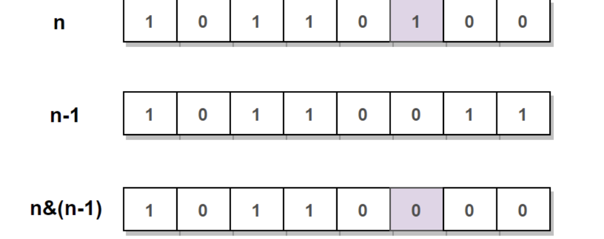

## 题目描述

输入一个整数，输出该数二进制表示中 1 的个数。

### 解题思路

`n&(n-1)` 位运算可以将 n 的位级表示中最低的那一位 1 设置为 0。不断将 1 设置为 0，直到 n 为 0。时间复杂度：O(M)，其中 M 表示 1 的个数。



常规解法，循环右移，数个数

```java
public class Solution {
  public int NumberOf1(int n) {

    int count = 0;
    while(n != 0) {
      count += (n & 1);
      n >>>= 1;
    }

    return count;
  }
}

```

一个二进制数 n-1 后与原二进制数进行 & 运算( 即 `n&(n-1)` )会消去最右边的1。

因为 `n&(n-1)` 每次都消去最右边的 1，最终 1 全被消去会得到 0，所以有几个 1 就可以进行几次 `n&(n-1)`。

```java
public class Solution {
  public int NumberOf1(int n) {

    int count = 0;
    while(n != 0) {
      n = n&(n-1);
      ++count;
    }

    return count;
  }
}
```

统计 1 的个数可以转换为将 n 个 1 相加后的结果，即忽略每个位权重的相加。

对于一个二位的二进制数，可能会是 `00`、`01`、`10`、`11`，当它和 `01` 进行与操作后，得到的值是保留最后一位的结果 记为 n1，当它和 `10` 进行操作之后，得到的值是保留第一位的结果记为 n2，此时如果将 n2 的值向右移动一位再加上 n1，就是每个位置忽略权重的相加。

一个 int 占 32 个位，先把数分成 16 组（两个数一组），每个组相加后的结果存在原来的位置，这个结果不是忽略权重的相加，其相加结果乘以了两个数中最低位的权重。于是，接下来把数又分为 8 组（四个数一组），将前四个数与后四个数进行最开始的操作，得到的和权重为最低位的。反复进行操作，直到所有和的权重都为 1 时，就是最终的结果

```java
public class Solution {
  public int NumberOf1(int n) {

    int temp = n;

    // 0x55555555 = 0101 0101 0101 0101  0101 0101 0101 0101
    // 0xaaaaaaaa = 1010 1010 1010 1010  1010 1010 1010 1010
    temp = (temp & 0x55555555) + ((temp & 0xaaaaaaaa) >>> 1);

    // 0x33333333 = 0011 0011 0011 0011  0011 0011 0011 0011
    // 0xcccccccc = 1100 1100 1100 1100  1100 1100 1100 1100
    temp = (temp & 0x33333333) + ((temp & 0xcccccccc) >>> 2);

    // 0x0f0f0f0f = 0000 1111 0000 1111  0000 1111 0000 1111
    // 0xf0f0f0f0 = 1111 0000 1111 0000  1111 0000 1111 0000 
    temp = (temp & 0x0f0f0f0f) + ((temp & 0xf0f0f0f0) >>> 4);

    // 0x00ff00ff = 0000 0000 1111 1111  0000 0000 1111 1111
    // 0xff00ff00 = 1111 1111 0000 0000  1111 1111 0000 0000
    temp = (temp & 0x00ff00ff) + ((temp & 0xff00ff00) >>> 8);

    // 0x0000ffff = 0000 0000 0000 0000  1111 1111 1111 1111
    // 0xffff0000 = 1111 1111 1111 1111  0000 0000 0000 0000
    temp = (temp & 0x0000ffff) + ((temp & 0xffff0000) >>> 16);

    return temp;
  }
}
```

