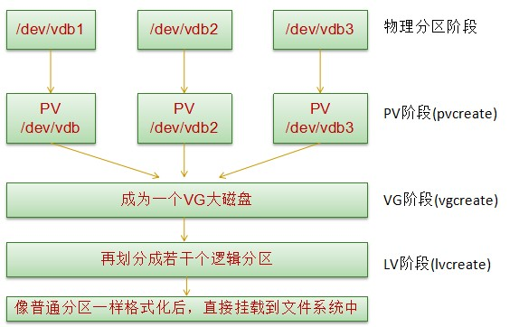

## LVM 简介

LVM是 Logical Volume Manager（逻辑卷管理）的简写，它是 Linux 环境下对磁盘分区进行管理的一种机制

LVM将一个或多个磁盘分区（PV）虚拟为一个卷组（VG），相当于一个大的硬盘，可以在上面划分一些逻辑卷（LV）

当卷组的空间不够使用时，可以将新的磁盘分区加入进来；还可以从卷组剩余空间上划分一些空间给空间不够用的逻辑卷使用


LVM 与文件系统之间的关系



## 基础概念

- PV(physical volume)：物理卷在逻辑卷管理系统最底层，可为整个物理硬盘或实际物理硬盘上的分区。它只是在物理分区中划出了一个特殊的区域，用于记载与LVM相关的管理参数。
- VG(volume group)：卷组建立在物理卷上，一卷组中至少要包括一物理卷，卷组建立后可动态的添加卷到卷组中，一个逻辑卷管理系统工程中可有多个卷组。
- LV(logical volume)：逻辑卷建立在卷组基础上，卷组中未分配空间可用于建立新的逻辑卷，逻辑卷建立后可以动态扩展和缩小空间。
- PE(physical extent)：物理区域是物理卷中可用于分配的最小存储单元，物理区域大小在建立卷组时指定，一旦确定不能更改，同一卷组所有物理卷的物理区域大小需一致，新的pv加入到vg后，pe的大小自动更改为vg中定义的pe大小。
- LE(logical extent)：逻辑区域是逻辑卷中可用于分配的最小存储单元，逻辑区域的大小取决于逻辑卷所在卷组中的物理区域的大小。由于受内核限制的原因，一个逻辑卷（Logic Volume）最多只能包含65536个PE（Physical Extent），所以一个PE的大小就决定了逻辑卷的最大容量，4 MB(默认) 的PE决定了单个逻辑卷最大容量为 256 GB，若希望使用大于256G的逻辑卷，则创建卷组时需要指定更大的PE。在Red Hat Enterprise Linux AS 4中PE大小范围为8 KB 到 16GB，并且必须总是 2 的倍数。

## 常用命令

### PV

1、 pvcreate 创建物理卷

用法：pvcreate [option] DEVICE

选项：

```none
-f：强制创建逻辑卷，不需用户确认
-u：指定设备的UUID
-y：所有问题都回答yes

例子:
  pvcreate /dev/sda5 /dev/sda6
```

2、pvscan：扫描当前系统上的所有物理卷

用法：pvscan [option]

选项：

```none
-e：仅显示属于输出卷组的物理卷
-n：仅显示不属于任何卷组的物理卷
-u：显示UUID
```

3、 pvdisplay：显示物理卷的属性

用法：pvdisplay [PV_DEVICE]

4、pvremove : 将物理卷信息删除，使其不再被视为一个物理卷

用法：pvremove [option] PV_DEVICE

选项：

```none
-f：强制删除
-y：所有问题都回答yes

例子:
  pvremove /dev/sda5
```

### VG

1、 vgcreate：创建卷组

用法：vgcreate [option] VG_NAME PV_DEVICE

选项：

```none
-s：卷组中的物理卷的PE大小，默认为4M
  -l：卷组上允许创建的最大逻辑卷数
  -p：卷级中允许添加的最大物理卷数

例子:
vgcreate -s 8M myvg /dev/sda5 /dev/sda6
```

2、vgscan：查找系统中存在的LVM卷组，并显示找到的卷组列表

用法：vgscan [option]

3、vgdisplay：显示卷组属性

用法：vgdisplay [option] [VG_NAME]

选项：

```none
-A：仅显示活动卷组的信息
-s：使用短格式输出信息
```

4、vgreduce：通过删除LVM卷组中的物理卷来减少卷组容量，不能删除LVM卷组中剩余的最后一个物理卷

用法：vgreduce VG_NAME PV_DEVICE

5、vgextend：动态扩展LVM卷组，它通过向卷组中添加物理卷来增加卷组的容量

用法：vgextend VG_NAME PV_DEVICE

例 vgextend myvg /dev/sda7

6、vgremove：删除卷组，其上的逻辑卷必须处于离线状态

用法：vgremove [-f] VG_NAME

```none
-f：强制删除
```

7、vgchange：常用来设置卷组的活动状态

用法：vgchange -a n/y VG_NAME

```none
-a n为休眠状态，休眠之前要先确保其上的逻辑卷都离线；

-a y为活动状态
```

### LV

1、 lvcreate：创建逻辑卷或快照

用法：lvcreate [选项] [参数]

选项：

```none
-L：指定大小
-l：指定大小（LE数）
-n：指定名称
-s：创建快照
-p r：设置为只读（该选项一般用于创建快照中）
```

Copy

注：使用该命令创建逻辑卷时当然必须指明卷组，创建快照时必须指明针对哪个逻辑卷

例: lvcreate -L 500M -n mylv myvg

2、lvscan：扫描当前系统中的所有逻辑卷，及其对应的设备文件

3、 lvdisplay：显示逻辑卷属性

用法：lvdisplay [/dev/VG_NAME/LV_NAME]

4、lvextend：可在线扩展逻辑卷空间

用法：lvextend -L/-l 扩展的大小 /dev/VG_NAME/LV_NAME

选项：

```none
-L：指定扩展（后）的大小。例如，-L +800M表示扩大800M，而-L 800M表示扩大至800M

-l：指定扩展（后）的大小（LE数）
```

Copy

例 lvextend -L 200M /dev/myvg/mylv

5、lvreduce：缩减逻辑卷空间，一般离线使用

用法：lvexreduce -L/-l 缩减的大小 /dev/VG_NAME/LV_NAME

选项：

```none
-L：指定缩减（后）的大小

-l：指定缩减（后）的大小（LE数）
```

Copy

例 lvreduce -L 200M /dev/myvg/mylv

7、lvremove：删除逻辑卷，需要处于离线（卸载）状态

用法：lvremove [-f] /dev/VG_NAME/LV_NAME

```none
-f：强制删除
```

Copy

