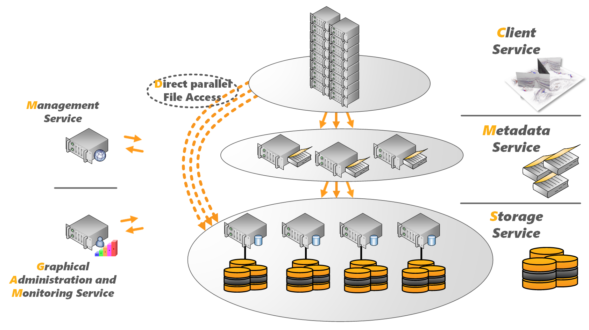

## BeeGFS 简介

BeeGFS 原名为 FhGFS，是由 Fraunhofer Institute 为工业数学计算而设计开发，由于在欧洲和美国的中小型HPC系统性能表现良好，在 2014 年改名注册为 BeeGFS 并受到科研和商业的广泛应用。

BeeGFS 既是一个网络文件系统也是一个并行文件系统。客户端通过网络与存储服务器进行通信（具有 TCP/IP 或任何具有 RDMA 功能的互连，如 InfiniBand，RoCE 或 Omni-Path，支持 native verbs 接口）。通过 BeeGFS 添加更多的服务器，其容量和性能被聚合在单个命名空间中。

BeeGFS 是遵循 GPL 的“免费开源”产品，文件系统没有许可证费用。由 ThinkParQ 提供专业支持，系统集成商可以为客户构建使用 BeeGFS 的解决方案。



## 组件

| 组件名称  | 组件包名称                            | 说明                                                                                                                                                          |
| ----- | -------------------------------- | ----------------------------------------------------------------------------------------------------------------------------------------------------------- |
| 管理服务  | beegfs-mgmtd                     | 管理服务用于监控所有已注册服务的状态，不存储用户任何数据<br/>注：在进行元数据服务、存储服务、客户端服务配置时，都需要指向管理服务节点IP地址，一般集群部署需要第一个部署的服务，有且只有一个                                                           |
| 元数据服务 | beegfs-meta                      | 元数据服务用于存储文件的元数据信息，如目录结构、权限信息、数据分片存放位置等，一个文件对应一个元数据文件，客户端打开文件时，由元数据服务向客户端提供数据具体存放节点位置，之后客户端直接与存储服务进行数据读写操作,可支持横向扩展，增加多个元数据服务用以提升文件系统性能                       |
| 存储服务  | beegfs-storage                   | 存储服务用于存储条带化后的数据块文件                                                                                                                                          |
| 客户端服务 | beegfs-client<br/>beegfs-helperd | 客户端服务用于集群存储空间挂载，当服务开启时自动挂载到本地路径，之后可将本地挂载点导出，提供linux/windows 客户端访问<br/>注：挂载路径通过/ etc/beegfs/beegfs-mounts.conf  配置文件指定<br/>beegfs-helperd 主要用于日志写入，不需要任何额外配置 |
| 命令行组件 | beegfs-utils<br/>beegfs-common   | 提供命令行工具，如 beegfs-ctl、beegfs-df、beegfs-fsck 等                                                                                                                |

- 配置文件路径：/etc/beegfs/{package-name}.conf
- 日志文件路径：/var/log/{package-name}.log
- 服务控制控制管理：systemctl status/start/stop/restart {package-name}
- 应用程序文件路径：/opt/beegfs/sbin/

注：{package-name} 为对应组件包名称，如 beegfs-mgmtd 等

## 镜像组

### BuddyGroups 简介

beegfs 通过 BuddyGroups 实现数据和元数据冗余，通常一个 Buddy Group 为一组两个目标，组内两个目标彼此进行数据复制，当一个目标出现故障时仍可以访问所有的数据，可以将 Buddy Group 两个目标存放于不同灾备区域（如不同机房、机架、节点），实现机房、机架、节点级别故障冗余。

Buddy Group 两个目标有主辅之分，一个目标为主存储（primary），一个目标为辅存储（secondary），进行数据读写时，读写操作先发送到主存储，之后主存储同步写入到辅存储，当两个副本读写操作完成后，返回前端应用操作完成。

### BuddyGroups 故障切换

当 Buddy Group 主目标无法访问时，等待短暂时间后仍无法恢复，则会被标记为脱机状态，此时辅目标将会成为新的主目标接管服务

可通过 `beegfs-ctl --listtargets --nodetype={node_type} --state` 查询目标状态，相关状态描述如下：

```bash
[root@node190 ~]# beegfs-ctl --listtargets --nodetype=meta --state
TargetID     Reachability  Consistency   NodeID
========     ============  ===========   ======
       1           Online         Good        1
       2           Online         Good        2

[root@node190 ~]# beegfs-ctl --listtargets --nodetype=storage --state
TargetID     Reachability  Consistency   NodeID
========     ============  ===========   ======
       1           Online         Good      190
       3           Online         Good      191
```

- Reachability（可达性）用于描述系统是否可以访问到目标，当管理服务监控到Buddy Group中的主目标无法访问，会自动进行故障转移，由辅目标提供读写操作
- Online：可以访问此目标
- Probably-offline：检测到此目标通信失败，有可能是服务重启或者短期网络故障造成，此状态下，关于该目标可能出现故障的信息将会广播到所有节点，以便系统做好故障转移准备
- Offline：无法达到此目标，如果此目标为某一Buddy Group组的主目标，将会在目标转换为脱机状态时立即发起故障转移，由同组 Buddy Group 辅目标接管读写操作
- Consistency（一致性）用于描述数据一致性状态
  - Good：目标数据被认为是好的
  - Needs-resync：目标数据被认为是不同步的，尝试重新同步中
  - Bad：目标数据被认为是不同步的，尝试重新同步失败

### 配置说明

#### 创建镜像组

自动创建镜像组：

```bash
beegfs-ctl --addmirrorgroup --automatic --nodetype={node_type}
```

注：如需手动指定 Buddy Group 目标分布，确保同一 Buddy Group 组两个目标落在不同故障域上，可使用

```bash
beegfs-ctl --addmirrorgroup --nodetype={node_type} --primary={target_id} --secondary={target_id} --groupid={group_id}
```

#### 激活元数据镜像

激活元数据镜像：

```bash
beegfs-ctl --mirrormd
```

注：执行此操作前，需要停止所有客户端挂载操作

```bash
systemctl stop beegfs-client
```

执行此操作后，需要重启元数据服务

```bash
systemctl restart beegfs-meta
```

重新挂载客户端

```bash
systemctl restart beegfs-client
```

#### 设置条带模式

设置条带模式：

```bash
beegfs-ctl --setpattern --pattern={pattern_type} --chunksize={chunk_size} --numtargets={target_num} {mount_path}
```

- `{pattern_type}`：设置使用的条带模式，可选 raid0（默认值）或 buddymirror
- `{chunk_size}`：每个存储目标条带大小，默认为 512K
- `{target_num}`：每个文件条带目标数，当设置为 buddymirror 模式时，参数值为 buddy group 组数

## 其他

### 指定集群通讯使用网卡

官方文档地址：<https://doc.beegfs.io/latest/advanced_topics/network_configuration.html>

添加需要使用的网卡名称到配置文件 `/etc/beegfs/tcp-only-interfaces.conf`

如使用网卡 bond0 作为 beegfs 集群通讯使用网卡，`echo bond0 > /etc/beegfs/tcp-only-interfaces.conf`

添加 `connInterfacesFile = /etc/beegfs/tcp-only-interfaces.conf` 配置到所有 beegfs 服务配置

## 参考资料

- <https://indico.mathrice.fr/event/5/contributions/714/attachments/737/989/Typical_Administrative_Tasks_last.pdf>
