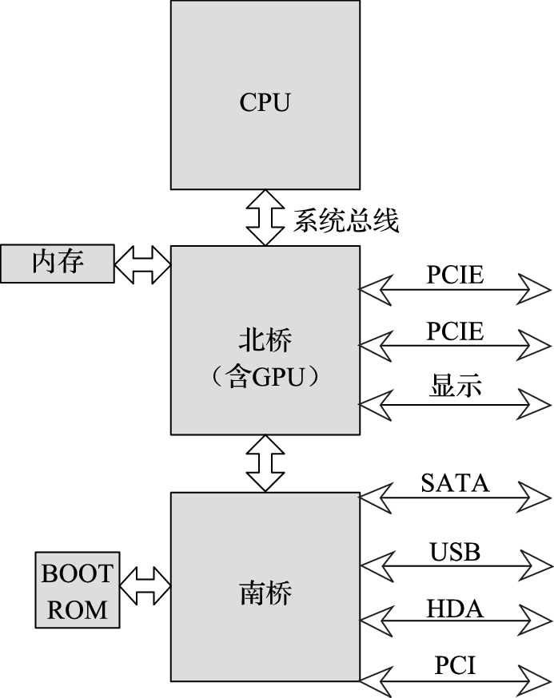

随着应用需求的变化和工艺水平的不断提升，冯・诺依曼结构中的控制器和运算器逐渐演变为计算机系统中的中央处理器部分，而输入、输出设备统一通过北桥和南桥与中央处理器连接，中央处理器中的图形处理功能则从中央处理器中分化出来形成专用的图形处理器。因此，现代计算机系统的硬件结构主要包括了中央处理器、图形处理器、北桥及南桥等部分。

中央处理器（Central Processing Unit，简称 CPU）主要包含控制器和运算器，在发展的过程中不断与其他部分融合。传统意义上的中央处理器在处理器芯片中更多地体现为处理器核，现代的处理器芯片上往往集成多个处理器核。

图形处理器（Graphic Processing Unit，简称 GPU）是一种面向 2D 和 3D 图形、视频、可视化计算和显示优化的处理器。作为人机交互的重要界面，GPU 在计算机体系结构发展的过程中，担任了越来越重要的角色。除了对图形处理本身之外，还开始担负科学计算加速器的任务。

北桥（North Bridge）是离 CPU 最近的芯片，主要负责控制显卡、内存与 CPU 之间的数据交换，向上连接处理器，向下连接南桥。

南桥（South Bridge）主要负责硬盘、键盘以及各种对带宽要求较低的 IO 接口与内存、CPU 之间的数据交换。

