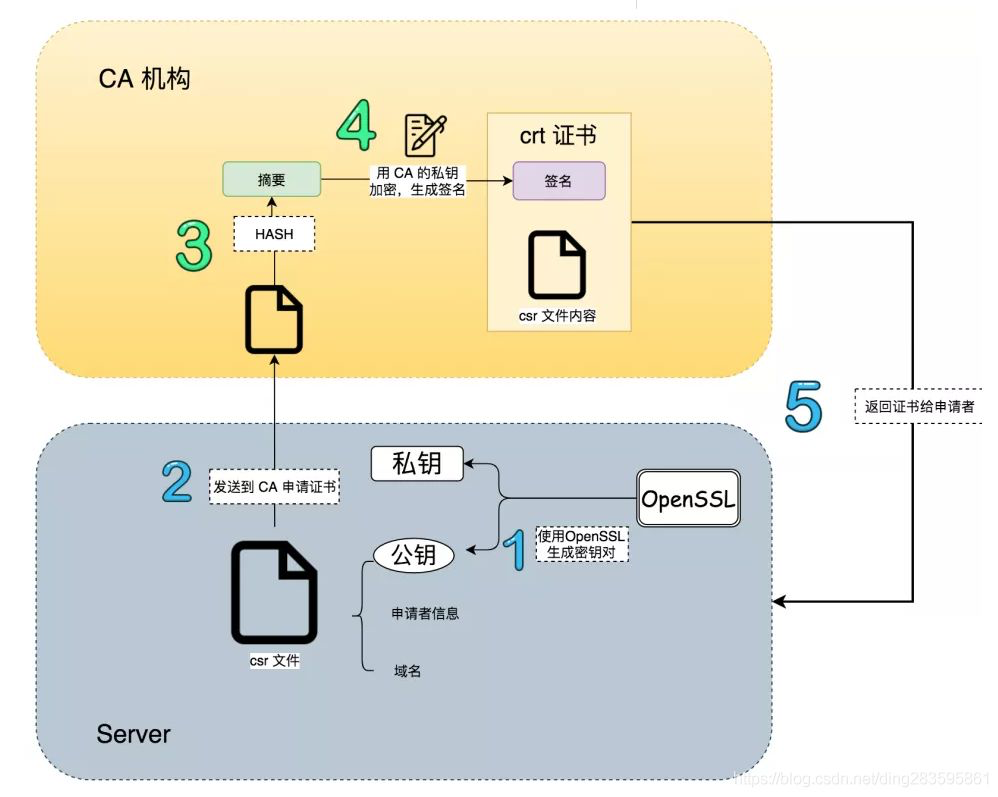
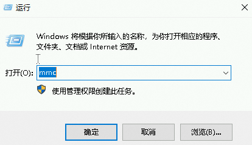
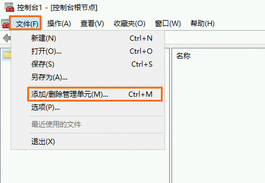
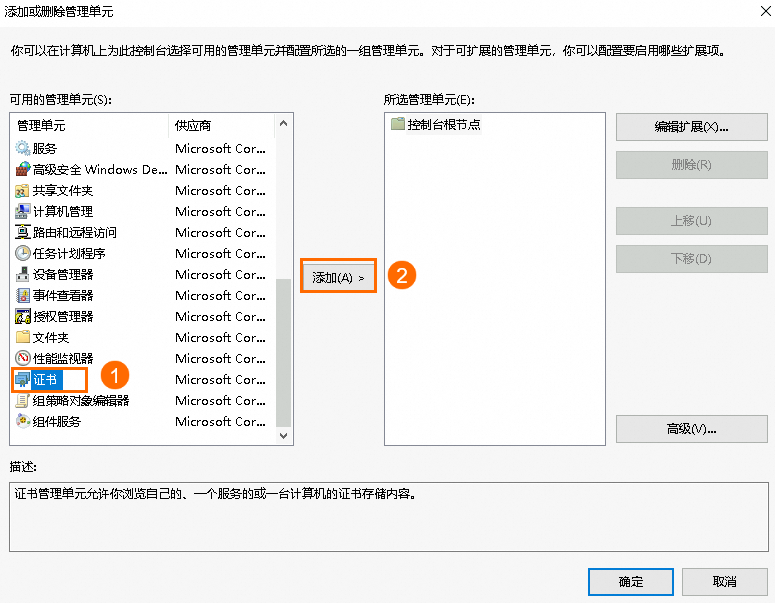
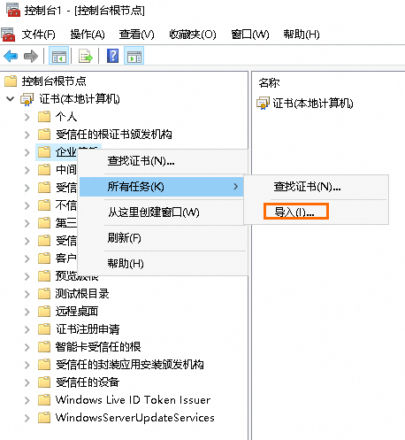
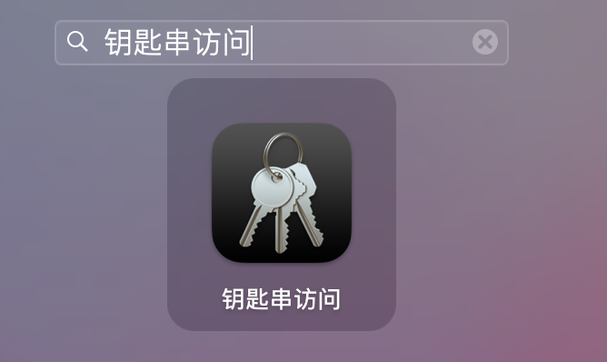
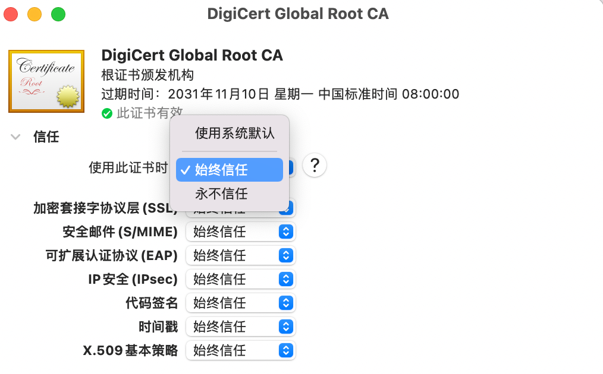

## OpenSSL

OpenSSL 是一个开源项目，其组成主要包括一下三个组件：

- openssl：多用途的命令行工具
- libcrypto：加密算法库
- libssl：加密模块应用库，实现了 ssl 及 tls

### 对称加密

对称加密需要使用的标准命令为 enc ，用法如下：

```bash
openssl enc -ciphername [-in filename] [-out filename] [-pass arg] [-e] [-d] [-a/-base64]
       [-A] [-k password] [-kfile filename] [-K key] [-iv IV] [-S salt] [-salt] [-nosalt] [-z] [-md]
       [-p] [-P] [-bufsize number] [-nopad] [-debug] [-none] [-engine id]
```

- `-in filename`：指定要加密的文件存放路径
- `-out filename`：指定加密后的文件存放路径
- `salt`：自动插入一个随机数作为文件内容加密，默认选项
- `e`：可以指明一种加密算法，若不指的话将使用默认加密算法
- `d`：解密，解密时也可以指定算法，若不指定则使用默认算法，但一定要与加密时的算法一致
- `a/-base64`：使用 base64 编码格式

### 单向加密

单向加密需要使用的标准命令为 dgst ，用法如下：

```bash
openssl dgst [-md5|-md4|-md2|-sha1|-sha|-mdc2|-ripemd160|-dss1] [-c] [-d] [-hex] [-binary]
       [-out filename] [-sign filename] [-keyform arg] [-passin arg] [-verify filename] [-prverify
       filename] [-signature filename] [-hmac key] [file...]
```

- `[-md5|-md4|-md2|-sha1|-sha|-mdc2|-ripemd160|-dss1]`：指定一种加密算法
- `-out filename`：将加密的内容保存到指定文件中

### 生成密码

生成密码需要使用的标准命令为 passwd ，用法如下：

```bash
openssl passwd [-crypt] [-1] [-apr1] [-salt string] [-in file] [-stdin] [-noverify] [-quiet] [-table] {password}
```

- `-1`：使用 md5 加密算法
- `-salt string`：加入随机数，最多 8 位随机数
- `-in file`：对输入的文件内容进行加密
- `-stdion`：对标准输入的内容进行加密

### 生成密钥对

首先需要先使用 genrsa 标准命令生成私钥，然后再使用 rsa 标准命令从私钥中提取公钥

genrsa 的用法如下：

```bash
openssl genrsa [-out filename] [-passout arg] [-des] [-des3] [-idea] [-f4] [-3] [-rand file(s)] [-engine id] [numbits]
```

- `-out filename`：将生成的私钥保存至指定的文件中
- `-des|-des3|-idea`：不同的加密算法
- `-numbits`：指定生成私钥的大小，默认是2048

ras 的用法如下：

```bash
openssl rsa [-inform PEM|NET|DER] [-outform PEM|NET|DER] [-in filename] [-passin arg] [-out filename] [-passout arg]
       [-sgckey] [-des] [-des3] [-idea] [-text] [-noout] [-modulus] [-check] [-pubin] [-pubout] [-engine id]
```

- `-in filename`：指明私钥文件
- `-out filename`：指明将提取出的公钥保存至指定文件中
- `-pubout`：根据私钥提取出公钥

### 生成密钥对

## 证书

传输层安全

- 安全通信
- 避免窃听
- 确认另一端连接者的身份

`CA (Certificate Authority)` 证书授权中心，是数字证书颁发和管理的机构。

`DN (Distinguished Name)` 标识名，指定实体身份的字段。

`CSR (Certificate Signing Request)` 数字证书签名请求，其中包含了公钥和`DN`。



根证书：是 CA 机构颁发 SSL 证书的核心，是信任链的起始点。受信任的根证书是属于证书颁发机构（CA），而 CA 机构是验证和颁发 SSL 证书的组织机构。

证书链：由两个环节组成，信任锚证书环节 和 已签名证书环节。信任锚证书环节可以对中间证书签名；中间证书的所有者可以用自己的私钥对另一个证书签名，两者结合就构成证书链。用户获取 SSL 证书之前，首先生成 证书签名请求 和 私钥，然后将生成的签名请求发送到证书颁发机构，再使用证书颁发机构的根证书的私钥签署用户的 SSL 证书，并将 SSL 证书发回给用户。

中间证书：证书颁发机构不会直接从根目录颁发 SSL 证书，一旦发生错误，颁发者或需求者需要撤销根证书，则使用根证书签名的每个证书都会被撤销信任。为了避免这种风险发生，CA 机构一般会引用中间根。CA 机构使用中间根的私钥来签署用户申请的 SSL 证书。这种中间根的形式可以重复多次，即使用中间根签署另一个中间证书。

根证书 CA 和 中间根 CA 的区别：根证书 CA 是拥有一个或多个受信任的根证书颁发机构，即 CA 机构已经扎根在主要浏览器的信任库中，而中间根 CA 或子 CA 是颁发中间根的证书颁发机构，他们不一定在浏览器的信任库中有根证书，而是将他们的中间根链接到信任的第三方根，被称为交叉签名。

链式根 和 单一根 之间的区别：单一根是由 CA 拥有的，可直接颁发证书。链式根是 SubCA 用于颁发证书的内容，是一个中间证书，必须链接到第三方受信任的 CA。链式根需要复杂的安装方法，因为中间根需要加载到托管证书的每个服务器和应用程序。链式根需要受到链接的 CA 支配，无法控制 root 用户，一旦 root CA 停业，就会受到巨大的牵连。

### 常见的生成工具

- OpenSSL
- JDK 自带的 KeyStone
- cfssl

### 各字段的含义

| 参数名称                 | 简称 | 参数值                                                 |
| ------------------------ | ---- | ------------------------------------------------------ |
| Country Name             | C    | 国家代码，比如中国就是 CN                              |
| State or Province Name   | ST   | 省名称                                                 |
| Locality Name            | L    | 城市名称                                               |
| Organization Name        | O    | 机构名称                                               |
| Organizational Unit Name | OU   | 机构单位名称                                           |
| Common Name              | CN   | 重点参数：授权给什么，因为机构是根节点所以是授权给自己 |
| Email Address            |      | 邮件地址                                               |

查看证书的内容

```bash
openssl x509 -in ca.crt -noout -text|egrep -i "issuer|subject|serial|dates"
openssl x509 -noout -text -in tls.crt
cfssl-certinfo -cert tls.crt
```

### 证书格式

PKCS 全称是 Public-Key Cryptography Standards ，是由 RSA 实验室与其它安全系统开发商为促进公钥密码的发展而制订的一系列标准，PKCS 目前共发布过 15 个标准。 常用的有：

1. `PKCS#7` Cryptographic Message Syntax Standard
2. `PKCS#10` Certification Request Standard
3. `PKCS#12` Personal Information Exchange Syntax Standard

`X.509` 是常见通用的证书格式。所有的证书都符合为 Public Key Infrastructure (PKI) 制定的 ITU-T X509 国际标准。

1. `PKCS#7` 常用的后缀是： `.P7B`、`.P7C`、`.SPC`
2. `PKCS#12` 常用的后缀有： `.P12`、`.PFX`
3. `X.509 DER` 编码(ASCII)的后缀是： `.DER`、`.CER`、`.CRT`
4. `X.509 PAM` 编码(Base64)的后缀是： `.PEM`、`.CER`、`.CRT`
5. .`cer/.crt` 是用于存放证书，它是 2 进制形式存放的，不含私钥
6. `.pem` 跟 crt/cer 的区别是它以 ASCII 来表示
7. `pfx/p12` 用于存放个人证书/私钥，他通常包含保护密码，2 进制方式
8. `p10` 是证书请求
9. `p7r` 是 CA 对证书请求的回复，只用于导入
10. `p7b`以树状展示证书链(certificate chain)，同时也支持单个证书，不含私钥

## 完整生成过程

### 创建自签名的 CA 证书

生成 CA 私钥：

```bash
openssl genpkey \
    -algorithm RSA \
    -out ca-key.pem \
    -pkeyopt rsa_keygen_bits:2048
```

生成 CA 证书：

```bash
openssl req \
    -x509 -new -nodes \
    -key ca-key.pem -sha256 \
    -days 36500 \
    -out ca-cert.pem \
    -subj "/C=CN/ST=Sichuan/L=Chengdu/O=AlphaQuant Trust Services/CN=alpha-quant.tech"
```

### 创建泛域名证书

生成服务器私钥：

```bash
openssl genpkey \
    -algorithm RSA \
    -out server-key.pem \
    -pkeyopt rsa_keygen_bits:2048
```

创建证书签名请求 (CSR)， 创建一个配置文件 `server.csr.cnf`：

```ini
[req]
default_bits       = 2048
prompt             = no
default_md         = sha256
distinguished_name = dn

[dn]
C  = CN
ST = Sichuan
L  = Chengdu
CN = *.alpha-quant.tech

```

然后生成 CSR：

```bash
openssl req \
    -new \
    -key server-key.pem \
    -out server.csr \
    -config server.csr.cnf
```

创建证书扩展文件，创建一个配置文件 `server.ext`：

```ini
authorityKeyIdentifier=keyid,issuer
basicConstraints=CA:FALSE
keyUsage = digitalSignature, nonRepudiation, keyEncipherment, dataEncipherment
extendedKeyUsage = serverAuth,clientAuth
subjectAltName = @alt_names

[alt_names]
DNS.1 = *.alpha-quant.tech
DNS.2 = alpha-quant.tech

```

签署服务器证书：

```bash
openssl x509 -req \
    -in server.csr \
    -CA ca-cert.pem \
    -CAkey ca-key.pem \
    -CAcreateserial \
    -out server-cert.pem \
    -days 36500 \
    -sha256 \
    -extfile server.ext
```

### Linux 安装 CA 证书

将 CA 证书复制到系统的信任证书目录：

对于 Ubuntu：

```bash
# 注意：Ubuntu 只能是 crt 后缀
sudo cp ca-cert.pem /usr/local/share/ca-certificates/ca-cert.crt
sudo update-ca-certificates
```

对于 CentOS：

```bash
sudo cp ca-cert.pem /etc/pki/ca-trust/source/anchors/
sudo update-ca-trust
```

验证 CA 证书是否已安装：

```bash
# openssl verify -CAfile /etc/ssl/certs/ca-certificates.crt server-cert.pem
openssl verify server-cert.pem
```

### Windows 安装 CA 证书

（1）打开证书管理控制台：按 `Win + R` 打开运行对话框，输入 `mmc` 并按回车键。



（2）在“文件”菜单中，选择“添加/删除管理单元...”。



（3）添加证书管理单元：在“添加/删除管理单元”对话框中，从左侧列表中选择“证书”，然后点击“添加”按钮。选择“计算机账户”，然后点击“下一步”。选择“本地计算机”，然后点击“完成”。



（4）导入 CA 证书：在“控制台根”节点下，展开“证书 (本地计算机)”。展开“受信任的根证书颁发机构”节点，然后右键点击“证书”，选择“所有任务” -> “导入...”。



（5）导入向导：在证书导入向导中，点击“下一步”。点击“浏览”并找到复制到 Windows 机器上的 `ca-cert.pem` 文件，然后点击“下一步”。选择“将所有的证书放入下列存储”并确认选择的是“受信任的根证书颁发机构”，然后点击“下一步”。点击“完成”完成证书的导入。导入成功后，应该会看到一个消息框提示“导入成功”。
### MacOS 安装证书

（1）打开“钥匙串访问”：可以通过 Spotlight 搜索 `钥匙串访问` 或者在 `/应用程序/实用工具/钥匙串访问` 中找到它并打开



（2）导入 CA 证书：在钥匙串访问页面，单击证书页签；将下载的根证书，拖放至钥匙串证书页签空白区域，macOS 会自动检测根证书是否有效


（3）信任 CA 证书：在导入证书后，需要将其设置为信任。找到导入的证书，通常会显示在“证书”类别中。双击导入的证书，打开证书信息窗口。在“信任”部分，展开选项卡并将“使用此证书时”设置为“始终信任”。关闭证书信息窗口，系统将提示您输入管理员密码来确认更改。



## 快速生成自签证书

生成证书

```bash
openssl req -x509 -nodes -days 700 -newkey rsa:2048 -keyout tls.key -out  ca.crt -subj "/CN=poc.com"
```

创建 kubernetes 证书

```bash
kubectl -n istio-system create secret tls istio-ingressgateway-certs --key tls.key --cert ca.crt --dry-run -o yaml | kubectl apply  -f -
```

## 生成带 subjectAltName 的证书

```bash
domainName=domain.com
consoleNS=ns
k8sSecretName=sso-x509-https-secret

# 支持 addext 参数需要将 OpenSSL 更新到 1.1.1d
openssl req -x509 -nodes -days 700 -newkey rsa:2048 -keyout ${consoleNS}-tls.key -out ${consoleNS}-ca.crt -subj "/CN=${domainName}" -addext "subjectAltName = DNS:${domainName}"

kubectl -n $consoleNS  create secret tls ${k8sSecretName}  --key ${consoleNS}-tls.key --cert ${consoleNS}-ca.crt --dry-run -o yaml |kubectl apply  -f -

```

## 检查证书

使用如下命令

```bash
openssl s_client -showcerts \
    -servername dev.alpha-quant.com.cn \
    -connect 10.244.244.11:443 </dev/null 2>&1 | \
grep -i "server certificate" -A 2 | \
perl -pe 's/\\x(..)/chr(hex($1))/eg'
```

获得输出：

```bash
Server certificate
subject=C = US, ST = State, L = City, O = Organization, OU = Unit, CN = *.alpha-quant.com.cn
issuer=C = US, ST = State, L = City, O = Organization, OU = Unit, CN = alpha-quant.com.cn
```

## 参考链接

- <https://www.tangyuecan.com/2021/12/17/%E5%B1%80%E5%9F%9F%E7%BD%91%E5%86%85%E6%90%AD%E5%BB%BA%E6%B5%8F%E8%A7%88%E5%99%A8%E5%8F%AF%E4%BF%A1%E4%BB%BB%E7%9A%84ssl%E8%AF%81%E4%B9%A6/>