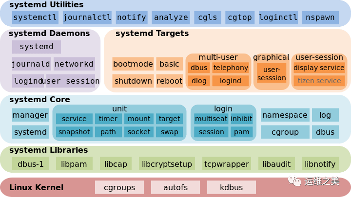

## Systemd 简介

Systemd 是一系列工具的集合，其作用也远远不仅是启动操作系统，它还接管了后台服务、结束、状态查询，以及日志归档、设备管理、电源管理、定时任务等许多职责，并支持通过特定事件（如插入特定 USB 设备）和特定端口数据触发的 On-demand（按需）任务

（1）更少的进程

Systemd 提供了 服务按需启动 的能力，使得特定的服务只有在真定被请求时才启动。

（2）允许更多的进程并行启动

在 SysV-init 时代，将每个服务项目编号依次执行启动脚本。Ubuntu 的 Upstart 解决了没有直接依赖的启动之间的并行启动。而 Systemd 通过 Socket 缓存、DBus 缓存和建立临时挂载点等方法进一步解决了启动进程之间的依赖，做到了所有系统服务并发启动。对于用户自定义的服务，Systemd 允许配置其启动依赖项目，从而确保服务按必要的顺序运行。

（3）使用 CGroup 跟踪和管理进程的生命周期

在 Systemd 之间的主流应用管理服务都是使用 进程树 来跟踪应用的继承关系的，而进程的父子关系很容易通过 两次 fork 的方法脱离。

而 Systemd 则提供通过 CGroup 跟踪进程关系，引补了这个缺漏。通过 CGroup 不仅能够实现服务之间访问隔离，限制特定应用程序对系统资源的访问配额，还能更精确地管理服务的生命周期。

（4）统一管理服务日志

Systemd 是一系列工具的集合， 包括了一个专用的系统日志管理服务：Journald。这个服务的设计初衷是克服现有 Syslog 服务的日志内容易伪造和日志格式不统一等缺点，Journald 用 二进制格式 保存所有的日志信息，因而日志内容很难被手工伪造。Journald 还提供了一个 journalctl 命令来查看日志信息，这样就使得不同服务输出的日志具有相同的排版格式， 便于数据的二次处理

## Unit

Systemd 可以管理所有系统资源，不同的资源统称为 Unit（单位）。

### Unit 文件类型

在 Systemd 的生态圈中，Unit 文件统一了过去各种不同系统资源配置格式，例如服务的启/停、定时任务、设备自动挂载、网络配置、虚拟内存配置等。而 Systemd 通过不同的文件后缀来区分这些配置文件

Systemd 支持的 12 种 Unit 文件类型

- .automount：用于控制自动挂载文件系统，相当于 SysV-init 的 autofs 服务
- .device：对于 /dev 目录下的设备，主要用于定义设备之间的依赖关系
- .mount：定义系统结构层次中的一个挂载点，可以替代过去的 /etc/fstab 配置文件
- .path：用于监控指定目录或文件的变化，并触发其它 Unit 运行
- .scope：这种 Unit 文件不是用户创建的，而是 Systemd 运行时产生的，描述一些系统服务的分组信息
- .service：封装守护进程的启动、停止、重启和重载操作，是最常见的一种 Unit 文件
- .slice：用于表示一个 CGroup 的树，通常用户不会自己创建这样的 Unit 文件
- .snapshot：用于表示一个由 systemctl snapshot 命令创建的 Systemd Units 运行状态快照
- .socket：监控来自于系统或网络的数据消息，用于实现基于数据自动触发服务启动
- .swap：定义一个用户做虚拟内存的交换分区
- .target：用于对 Unit 文件进行逻辑分组，引导其它 Unit 的执行。它替代了 SysV-init 运行级别的作用，并提供更灵活的基于特定设备事件的启动方式
- .timer：用于配置在特定时间触发的任务，替代了 Crontab 的功能

### Unit 和 Target

Unit 是 Systemd 管理系统资源的基本单元，可以认为每个系统资源就是一个 Unit，并使用一个 Unit 文件定义。在 Unit 文件中需要包含相应服务的描述、属性以及需要运行的命令。

Target 是 Systemd 中用于指定系统资源启动组的方式，相当于 SysV-init 中的运行级别。

简单说，Target 就是一个 Unit 组，包含许多相关的 Unit 。启动某个 Target 的时候，Systemd 就会启动里面所有的 Unit。从这个意义上说，Target 这个概念类似于”状态点”，启动某个 Target 就好比启动到某种状态

## Systemd 目录

Unit 文件按照 Systemd 约定，应该被放置指定的三个系统目录之一中。这三个目录是有优先级的，如下所示，越靠上的优先级越高。因此，在三个目录中有同名文件的时候，只有优先级最高的目录里的那个文件会被使用。

- /etc/systemd/system：系统或用户自定义的配置文件
- /run/systemd/system：软件运行时生成的配置文件
- /usr/lib/systemd/system：系统或第三方软件安装时添加的配置文件。
  - CentOS 7：Unit 文件指向该目录
  - ubuntu 16：被移到了 /lib/systemd/system

Systemd 默认从目录 /etc/systemd/system/ 读取配置文件。但是，里面存放的大部分文件都是符号链接，指向目录 /usr/lib/systemd/system/，真正的配置文件存放在那个目录

可以创建一个用户级别的 systemd 服务来实现开机启动。这种方式更加灵活和规范，适用于需要长期运行的服务或后台任务。

- 创建一个 .service 文件，通常放置在 `~/.config/systemd/user/` 目录下，例如` ~/.config/systemd/user/my_service.service`。
- 编辑 .service 文件，定义服务的启动命令、工作目录等信息。
- 使用 systemctl --user 命令启用、停止、启动或重启服务

## 参考资料

- <https://blog.csdn.net/easylife206/article/details/101730416>

- <https://blog.csdn.net/m0_62816482/article/details/126748302>

- <https://www.liuvv.com/p/c9c96ac3.html>