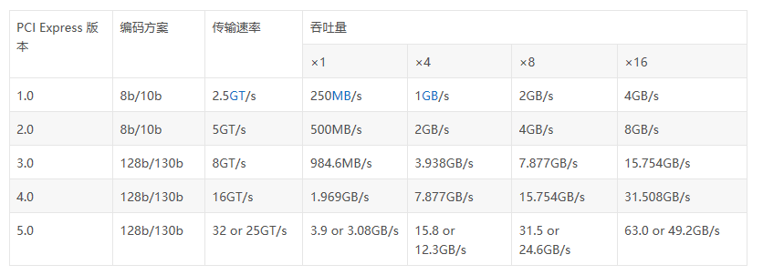

传输速率为每秒传输量 GT/s，而不是每秒位数 Gbps，因为传输量包括不提供额外吞吐量的开销位；比如 PCIe 1.x 和 PCIe 2.x 使用 8b / 10b 编码方案，导致占用了 20% （= 2/10）的原始信道带宽。

- GT/s —— Giga transation per second （千兆传输 / 秒），即每一秒内传输的次数。重点在于描述物理层通信协议的速率属性，可以不和链路宽度等关联

- Gbps —— Giga Bits Per Second （千兆位 / 秒）。GT/s 与 Gbps 之间不存在成比例的换算关系

 

PCIe 吞吐量（可用带宽）计算方法：吞吐量 = 传输速率 *  编码方案

### PCIe 2.0

例如：PCIe2.0 协议支持 5.0 GT/s，即每一条 Lane 上支持每秒钟内传输 5G 个 Bit；但这并不意味着 PCIe 2.0 协议的每一条 Lane 支持 5Gbps 的速率

为什么这么说呢？因为 PCIe 2.0 的物理层协议中使用的是 8b/10b 的编码方案。 即每传输 8 个 Bit，需要发送 10 个 Bit；这多出的 2 个 Bit 并不是对上层有意义的信息

那么， PCIe 2.0 协议的每一条 Lane 支持 `5 * 8 / 10 = 4 Gbps = 500 MB/s` 的速率

以一个 PCIe 2.0 x8 的通道为例，x8 的可用带宽为 `4 * 8 = 32 Gbps = 4 GB/s`

###  PCIe3.0

同理

PCIe3.0 协议支持 8.0 GT/s, 即每一条 Lane 上支持每秒钟内传输 8G 个 Bit

而 PCIe 3.0 的物理层协议中使用的是 128b/130b 的编码方案。 即每传输 128 个 Bit，需要发送 130 个 Bit

那么， PCIe 3.0 协议的每一条 Lane 支持 `8 * 128 / 130 = 7.877 Gbps = 984.6 MB/s` 的速率

一个 PCIe 3.0 x16 的通道，x16 的可用带宽为`7.877 * 16 = 126.031 Gbps = 15.754 GB/s`
