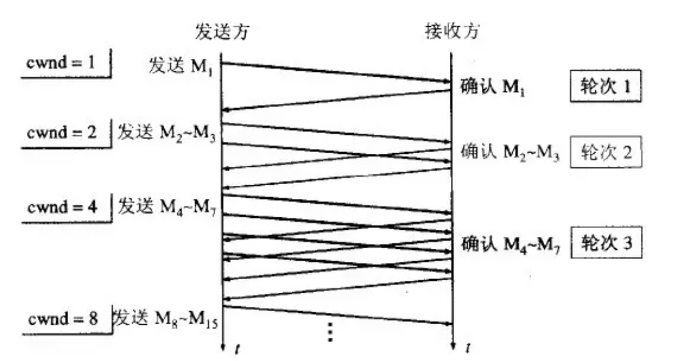
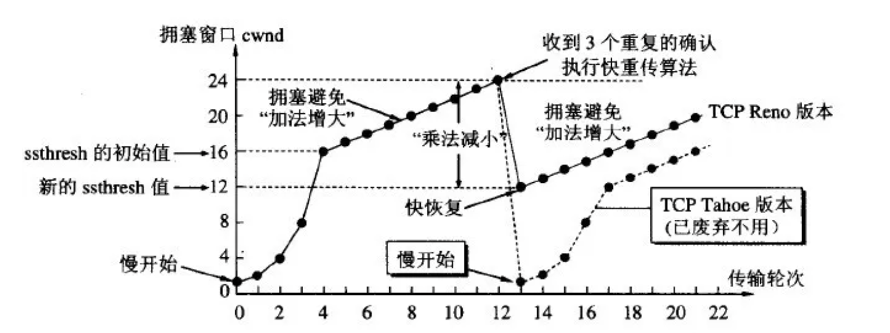

如果发送者发送数据过快，接收者来不及接收，那么就会有分组丢失。为了避免分组丢失，控制发送者的发送速度，使得接收者来得及接收，这就是流量控制。流量控制根本目的是防止分组丢失，它是构成TCP可靠性的一方面

## 拥塞控制和流量控制

拥塞控制：拥塞控制是作用于网络的，它是防止过多的数据注入到网络中，避免出现网络负载过大的情况；常用的方法就是：（ 1 ）慢开始、拥塞避免（ 2 ）快重传、快恢复

流量控制：流量控制是作用于接收者的，它是控制发送者的发送速度从而使接收者来得及接收，防止分组丢失的

## 拥塞控制的算法

### 慢开始算法

发送方维持一个叫做拥塞窗口cwnd（congestion window）的状态变量。拥塞窗口的大小取决于网络的拥塞程度，并且动态地在变化。发送方让自己的发送窗口等于拥塞窗口，另外考虑到接受方的接收能力，发送窗口可能小于拥塞窗口。

慢开始算法的思路就是，不要一开始就发送大量的数据，先探测一下网络的拥塞程度，也就是说由小到大逐渐增加拥塞窗口的大小。

这里用报文段的个数作为拥塞窗口的大小举例说明慢开始算法，实际的拥塞窗口大小是以字节为单位的。如下图：

从上图可以看到，一个传输轮次所经历的时间其实就是往返时间RTT，而且没经过一个传输轮次（transmission round），拥塞窗口cwnd就加倍。

为了防止cwnd增长过大引起网络拥塞，还需设置一个慢开始门限ssthresh状态变量。ssthresh的用法如下：当cwnd<ssthresh时，使用慢开始算法。
当cwnd>ssthresh时，改用拥塞避免算法。
当cwnd=ssthresh时，慢开始与拥塞避免算法任意

注意，这里的“慢”并不是指cwnd的增长速率慢，而是指在TCP开始发送报文段时先设置cwnd=1，然后逐渐增大，这当然比按照大的cwnd一下子把许多报文段突然注入到网络中要“慢得多”。

