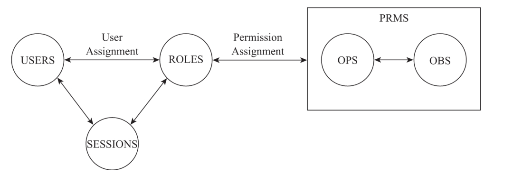
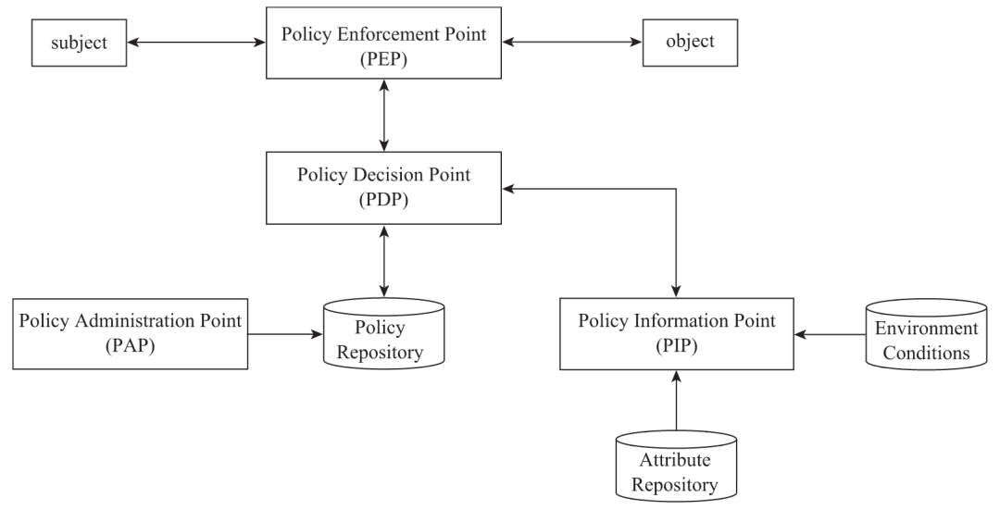

## IAM 定义

IAM 是 Identity and Access Management 的缩写，即身份与访问管理，或称为身份管理与访问控制。

IAM主要为了达到一个目的：让恰当的人或物，有恰当的权限，访问恰当的资源。其中“人或物”称为主体（Subject），“资源”称为客体（Object）

传统的 IAM 一般包含如下几部分，常被称为 “4A” 或 “5A”

- 账号（Account）
- 认证（Authentication）
- 权限（Authorization）
- 应用（Application）
- 审计（Audit）

## 账号（Account）

账号是用户在系统中的数字化载体，用于标识用户并访问受保护的资源。一般每个系统都会有账号，且不同系统的账号数据结构各异。

针对账号模块，IAM 需要解决如下几个问题：

- 哪些账号/字段代表了用户？这些账号散落在哪里？（身份源）
- 我（IAM）如何将这些账号拿过来？（上游账号同步）
- 我（IAM）如何关联、映射、使用这些账号数据？（统一身份源）
- 哪些系统需要用到这些账号？我怎么把账号给它们？（下游账号同步）

### 子模块

- 账号管理：包括账号的增删改查、启用禁用、重置密码、解锁账号等
- 组织/用户组管理：用于将用户和权限关联起来，减少分配权限的操作
- 账号生命周期管理：管理员工的入职、升职、调岗、离职等整个生命周期
- 身份源集成同步：从上游应用中获取账号数据，将账号、字段进行关联、映射和转换，作为用户唯一标准的数据同步给下游应用

### 协议

- AD/LDAP：LDAP（Lightweight Directory Access Protocol，轻型目录访问协议），是一种用于维护树形目录信息和提供访问控制的协议，通常所说的 AD/LDAP 指的是 Windows 的 AD 和 Linux 的 OpenLDAP，是一种树形的数据库，在企业内部常被用于管理用户数据和用户认证
- SCIM：SCIM（System for Cross-domain Identity Management，跨域身份管理），是一种简化同步和管理身份数据的协议，常用于公有云应用

### 三户模型

“三户”的定义下如，供参考：

（1）客户

指自然人或者法人。法人一般被称之为企业客户。如无特指，一般客户指个人客户。这个对象的业务主键是证件号（如，身份证）

（2）用户

指通过注册的方式进入系统，使用系统提供的服务的实体，也称为登录账户，即用户在系统中登录凭证和个人信息。对应的，法人客户在系统中注册后，被称之为商户

（3）账户

这里特指支付账户，指用户在支付系统中用于交易的资金所有者权益的凭证

客户是体现了社会域的信息，用户体现了业务域的信息，帐户体现的是资金域的信息

## 认证（Authentication）

IAM 中的认证指的是狭义的认证，常见于主体申请访问资源时

### 认证场景

IAM 中有三个主要的场景：

1. 未认证的主体需要认证——登录
2. 已认证的主体跳转到其他应用时自动认证——SSO，单点登录
3. 已认证的主体访问敏感资源时需要二次认证——MFA，多因素认证

### 认证方式

认证方式是主体证明“我是我”的手段，主要有“所知、所有、所是”三大类认证方式

（1）所知

主体所知道的信息，比如密码、密保问题等

（2）所有

主体所拥有的物品，比如短信验证码、数字证书、OTP 等

（3）所是

主体所拥有的生物特征，比如人脸、指纹、签名等

认证方式和MFA息息相关，MFA（Multi-Factor Authentication，多因素认证）是指使用两种以上的认证来进行身份验证，以提高账号的安全性

### 认证协议

认证协议主要用于在用户、业务系统、身份认证服务之间传递用户信息，告诉业务系统“此用户是谁”

主流的认证协议/实现单点登录的方案有 Cookie、JWT、SAML、CAS、OIDC 等

认证协议通常和单点登录息息相关，单点登录（Single Sign On，SSO）是指在多个应用系统中，用户只需要登录一次就可以访问所有相互信任的应用系统

### 认证源

认证源指的是用户在登录当前系统时，由第三方提供认证服务，系统信任第三方的认证结果。例如使用微信登录某 APP，就是将微信作为认证源。

IAM 一般会根据场景提供 AD/LDAP、企业微信/钉钉、OA 等不同的认证源方案

## 授权（Authorization）

授权是将权力交付给用户或机构代为行使，此时使用户或机构获得访问资源的权限

### “授权”范围

以 RBAC 模型为例，授权其实要做三件事：

1. 将操作和对象（也称资源）打包为权限，即图中的权限（PRMS，Pemission），包括操作（OPS，Operations）和对象（OBS，Objects）
2. 将权限分配给主体（狭义的授权），即图中的 Permission Assignment 和 User Assignment
3. 当主体访问资源时鉴权，鉴别用户的身份和判断权限

### 权限分类

权限其实就是将操作和对象打包起来。根据不同场景、不同要求可以有不同的方案

个人习惯将权限分为以下四种，控制的力度和精细度逐渐增加：

（1）应用权限

控制主体能否访问某个应用，拥有权限就可以访问应用的所有内容，是最粗粒度的访问控制

（2）页面权限

控制页面层面的元素是否可见，包括页面、菜单、按钮等。做好页面权限一般可以满足企业内部大部分的需求

（3）操作权限

控制主体能否执行某个操作，例如可改新增、修改、删除等，一般和一个接口对应，在主体请求接口时判断。页面权限和操作权限也被统称为功能权限

（4）数据权限

控制数据的查询和展示，不同主体看到的数据不同，包括行权限和列权限。如果说功能权限是控制“能不能”，数据权限则是控制“有多少”

### 权限模型

谈到授权，谈得最多的是权限模型。但需要注意，权限模型只是对权限进行分配的思路和方案，解决“如何将某些权限分配给某些主体”的问题，不是“授权”的全部。

具体使用哪种权限模型，需要根据场景和需求来定，不要拘泥于权限模型而忽略实际业务。

下面介绍常见的几种权限模型：

- ACL（Access Control Lists，访问控制列表），通过将主体（用户或用户组）直接和权限（包含操作和资源）关联成列表，控制主体能访问哪些资源
- DAC（Discretionary Access Control，自主访问控制），可以通过ACL或ACM来实现，特点是拥有权限的主体可以将自身的权限赋予给其他主体或收回，常见于操作系统
- MAC（Mandatory Access Control，强制访问控制），通过对主体和客体进行安全标记（密级），来判断主体能否对客体进行相关操作，常见于军工行业
- RBAC（Role Based Access Control，基于角色的访问控制），通过引入“角色”的概念，将主体和权限之间的关系解耦，是常见、成熟、有效的权限模型
- ABAC（Attribute Based Access Control，基于属性的访问控制），通过动态计算一个或一组属性是否满足某种条件来进行授权判断，常用于公有云，不同场景下形态各异

### 鉴权

IAM 中的“授权模块”还包括“鉴权”的部分，与“分配权限”（Assignment，也常称为授权）相对应

鉴权是验证主体是否拥有访问客体的权限，完整的鉴权应该包括身份认证和权限决策两部分

大多数情况下完成身份认证即完成了鉴权，这部分属于“认证”模块（英语中 Authentication 也有鉴权的意思）

但在比较复杂的场景，比如使用ABAC、零信任时，当主体访问资源时，决策点PDP需要根据属性或策略规则动态计算主体是否拥有足够的权限，并依据计算结果放行或拦截访问，此部分也应当属于鉴权

ABAC 策略判断流程：

## 应用（Application）

狭义的应用只是业务系统在 IAM 中的映射，即 APP ID 和 APP Secret

广义的应用是上文中账号、认证、授权的交互对象和载体，一般作为客体来使用

### 预集成应用

由于应用之间的规范、协议各有差异，IAM往往会预集成一部分应用，提前对接好其账号、认证、授权等模块，方便客户开箱即用

针对普通用户，IAM 一般会提供统一的应用门户（仪表盘），显示企业内自己所拥有权限的所有应用，也可以手动添加自己的应用，方便用户日常使用

## 审计（Audit）

审计日志需要记录用户的所有操作，需要记录主体、操作、客体、类型、时间、地点、结果等内容

根据不同的维度可以划分为不同的操作日志，如操作日志和登录/登出日志、用户日志和管理员日志、业务系统日志和IAM系统日志等