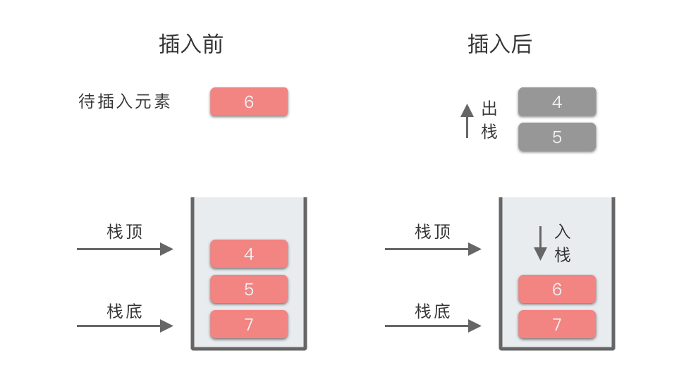

## 单调栈简介

单调栈（Monotone Stack）：一种特殊的栈

- 在栈的「先进后出」规则基础上，要求「从 栈顶 到 栈底 的元素是单调递增（或者单调递减）」

其中

- 满足从栈顶到栈底的元素是单调递增的栈，叫做「单调递增栈」
- 满足从栈顶到栈底的元素是单调递减的栈，叫做「单调递减栈」

注意：这里定义的顺序是从「栈顶」到「栈底」

### 单调递增栈

单调递增栈：只有比栈顶元素小的元素才能直接进栈，否则需要先将栈中比当前元素小的元素出栈，再将当前元素入栈

这样就保证了：栈中保留的都是比当前入栈元素大的值，并且从栈顶到栈底的元素值是单调递增的

单调递增栈的入栈、出栈过程如下：

- 假设当前进栈元素为 `x`，如果 `x` 比栈顶元素小，则直接入栈
- 否则从栈顶开始遍历栈中元素，把小于 `x` 或者等于 `x` 的元素弹出栈，直到遇到一个大于 `x` 的元素为止，然后再把 `x` 压入栈中

下面以数组 `[2, 7, 5, 4, 6, 3, 4, 2]` 为例，模拟一下「单调递增栈」的进栈、出栈过程。具体过程如下：

- 数组元素：`[2, 7, 5, 4, 6, 3, 4, 2]`，遍历顺序为从左到右

| 第 i 步 | 待插入元素 | 操作                   | 结果（左侧为栈底） | 作用                                  |
| :-----: | :--------: | ---------------------- | ------------------ | ------------------------------------- |
|    1    |     2      | 2 入栈                 | `[2]`              | 元素 2 的左侧无比 2 大的元素          |
|    2    |     7      | 2 出栈，7 入栈         | `[7]`              | 元素 7 的左侧无比 7 大的元素          |
|    3    |     5      | 5 入栈                 | `[7, 5]`           | 元素 5 的左侧第一个比 5 大的元素为：7 |
|    4    |     4      | 4 入栈                 | `[7, 5, 4]`        | 元素 4 的左侧第一个比 4 大的元素为：5 |
|    5    |     6      | 4 出栈，5 出栈，6 入栈 | `[7, 6]`           | 元素 6 的左侧第一个比 6 大的元素为：7 |
|    6    |     3      | 3 入栈                 | `[7, 6, 3]`        | 元素 3 的左侧第一个比 3 大的元素为：6 |
|    7    |     4      | 3 出栈，4 入栈         | `[7, 6, 4]`        | 元素 4 的左侧第一个比 4 大的元素为：6 |
|    8    |     2      | 2 入栈                 | `[7, 6, 4, 2]`     | 元素 2 的左侧第一个比 2 大的元素为：4 |

最终栈中元素为 `[7, 6, 4, 2]`。因为从栈顶（右端）到栈底（左侧）元素的顺序为 `2, 4, 6, 7`，满足递增关系，所以这是一个单调递增栈

