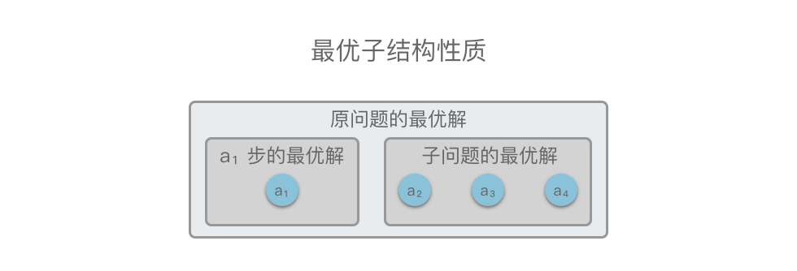
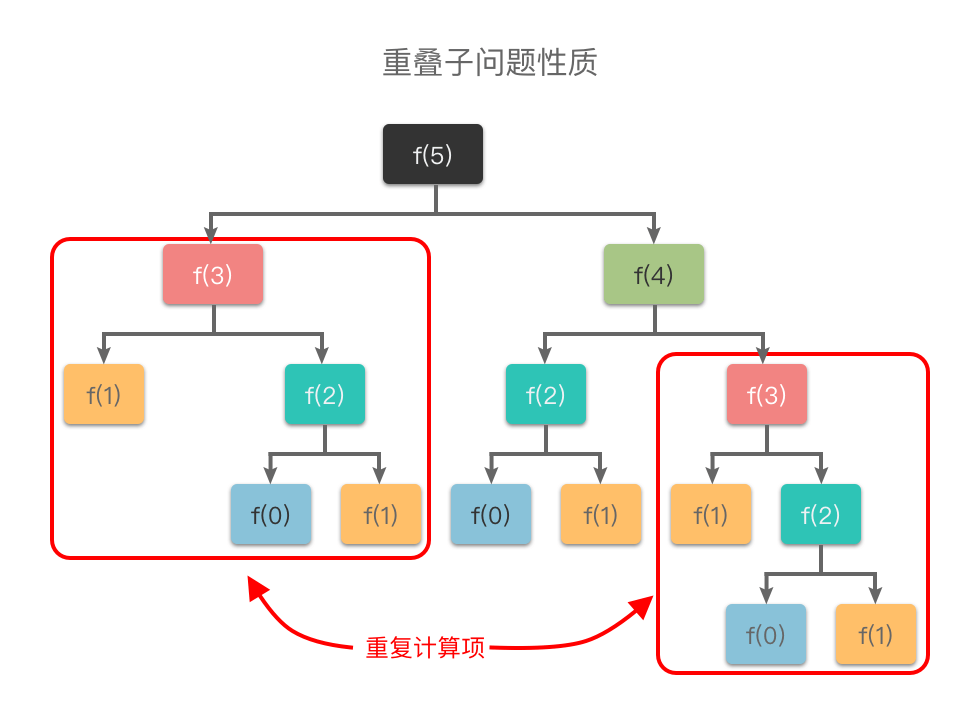
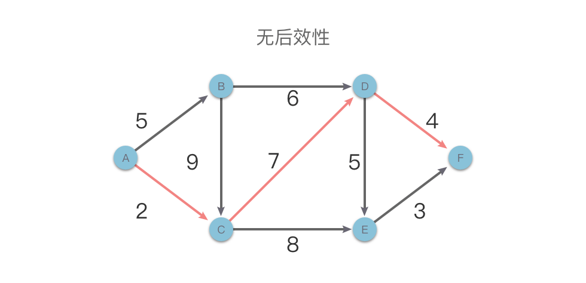

## 动态规划简介

### 动态规划的定义

动态规划（Dynamic Programming）：简称 DP，是一种求解多阶段决策过程最优化问题的方法。在动态规划中，通过把原问题分解为相对简单的子问题，先求解子问题，再由子问题的解而得到原问题的解

动态规划最早由理查德 · 贝尔曼于 1957 年在其著作「动态规划（Dynamic Programming）」一书中提出。这里的 Programming 并不是编程的意思，而是指一种「表格处理方法」，即将每一步计算的结果存储在表格中，供随后的计算查询使用

### 动态规划的核心思想

动态规划的核心思想：

1. 把「原问题」分解为「若干个重叠的子问题」，每个子问题的求解过程都构成一个 「阶段」。在完成一个阶段的计算之后，动态规划方法才会执行下一个阶段的计算
2. 在求解子问题的过程中，按照「自顶向下的记忆化搜索方法」或者「自底向上的递推方法」求解出「子问题的解」，把结果存储在表格中，当需要再次求解此子问题时，直接从表格中查询该子问题的解，从而避免了大量的重复计算

这看起来很像是分治算法，但动态规划与分治算法的不同点在于：

1. 适用于动态规划求解的问题，在分解之后得到的子问题往往是相互联系的，会出现若干个重叠子问题
2. 使用动态规划方法会将这些重叠子问题的解保存到表格里，供随后的计算查询使用，从而避免大量的重复计算

### 动态规划的简单例子

通过一个简单的例子来介绍一下什么是动态规划算法

斐波那契数列：数列由 `f(0)=1`, `f(1)=2` 开始，后面的每一项数字都是前面两项数字的和。也就是：

$$
f(n)=\left\{\begin{array}{ll}
0 & n=0 \\
1 & n=1 \\
f(n-2)+f(n-1) & n>1
\end{array}\right.
$$

通过公式 `f(n) = f(n-2) + f(n-1)` 可以将原问题 `f(n)` 递归地划分为 `f(n-1)` 和 `f(n-2)` 这两个子问题。其对应的递归过程如下：


为了避免重复计算，可以使用动态规划中的「表格处理方法」来处理

这里使用「自底向上的递推方法」求解出子问题 `f(n−2)` 和 `f(n*−1)` 的解，然后把结果存储在表格中，供随后的计算查询使用。具体过程如下：

1. 定义一个数组 `dp`，用于记录斐波那契数列中的值
2. 初始化 `dp[0]=0, dp[1]=1`
3. 根据斐波那契数列的递推公式 `f(n) = f(n-2) + f(n-1)` ，从 `dp(2)` 开始递推计算斐波那契数列的每个数，直到计算出 `dp(n)`
4. 最后返回 `dp(n)` 即可得到第 n 项斐波那契数

```go
func fib(n int) int {
	if n == 0 {
		return 0
	}
	if n == 1 {
		return 1
	}

	dp := make([]int, n+1)
	dp[0] = 0
	dp[1] = 1
	for i := 2; i <= n; i++ {
		dp[i] = dp[i-1] + dp[i-2]
	}
	return dp[n]
}

```

这种使用缓存（哈希表、集合或数组）保存计算结果，从而避免子问题重复计算的方法，就是「动态规划算法」

## 动态规划的特征

使用动态规划方法解决的问题必须满足以下三个特征：

1. 最优子结构性质
2. 重叠子问题性质
3. 无后效性

### 最优子结构性质

原问题 `S={a1,a2,a3,a4}`，在 `a1` 步选出一个当前最优解之后，问题就转换为求解子问题 `S={a2,a3,a4}`。如果原问题 S 的最优解可以由「 第 a1 步得到的局部最优解 」和「 子问题S的最优解 」构成，则说明该问题满足最优子结构性质

也就是说，如果原问题的最优解包含子问题的最优解，则说明该问题满足最优子结构性质



### 重叠子问题性质

重叠子问题性质：指的是在求解子问题的过程中，有大量的子问题是重复的，一个子问题在下一阶段的决策中可能会被多次用到。如果有大量重复的子问题，那么只需要对其求解一次，然后用表格将结果存储下来，以后使用时可以直接查询，不需要再次求解



斐波那契数列」例子中，`f(0)、f(1)、f(2)、f(3)` 都进行了多次重复计算。动态规划算法利用了子问题重叠的性质，在第一次计算  `f(0)、f(1)、f(2)、f(3)` 时就将其结果存入表格，当再次使用时可以直接查询，无需再次求解，从而提升效率

### 无后效性

无后效性：指的是子问题的解（状态值）只与之前阶段有关，而与后面阶段无关。当前阶段的若干状态值一旦确定，就不再改变，不会再受到后续阶段决策的影响

也就是说，一旦某一个子问题的求解结果确定以后，就不会再被修改

举个例子，下图是一个有向无环带权图，我们在求解从 A 点到 F 点的最短路径问题时，假设当前已知从 A 点到 D 点的最短路径（2+7=9）。那么无论之后的路径如何选择，都不会影响之前从 A 点到 D 点的最短路径长度。这就是「无后效性」

而如果一个问题具有「后效性」，则可能需要先将其转化或者逆向求解来消除后效性，然后才可以使用动态规划算法



## 动态规划的基本思路

在使用动态规划方法解决某些最优化问题时，可以将解决问题的过程按照一定顺序（时间顺序、空间顺序或其他顺序）分解为若干个相互联系的「阶段」。然后按照顺序对每一个阶段做出「决策」，这个决策既决定了本阶段的效益，也决定了下一阶段的初始状态。依次做完每个阶段的决策之后，就得到了一个整个问题的决策序列

这样就将一个原问题分解为了一系列的子问题，再通过逐步求解从而获得最终结果


这种前后关联、具有链状结构的多阶段进行决策的问题也叫做「多阶段决策问题」

通常我们使用动态规划方法来解决问题的基本思路如下：

1. 划分阶段：将原问题按顺序（时间顺序、空间顺序或其他顺序）分解为若干个相互联系的「阶段」。划分后的阶段⼀定是有序或可排序的，否则问题⽆法求解
   - 这里的「阶段」指的是⼦问题的求解过程。每个⼦问题的求解过程都构成⼀个「阶段」，在完成前⼀阶段的求解后才会进⾏后⼀阶段的求解
2. 定义状态：将和子问题相关的某些变量（位置、数量、体积、空间等等）作为一个「状态」表示出来。状态的选择要满⾜⽆后效性
   - 一个「状态」对应一个或多个子问题，所谓某个「状态」下的值，指的就是这个「状态」所对应的子问题的解
3. 状态转移：根据「上一阶段的状态」和「该状态下所能做出的决策」，推导出「下一阶段的状态」。或者说根据相邻两个阶段各个状态之间的关系，确定决策，然后推导出状态间的相互转移方式（即「状态转移方程」）
4. 初始条件和边界条件：根据问题描述、状态定义和状态转移方程，确定初始条件和边界条件
5. 最终结果：确定问题的求解目标，然后按照一定顺序求解每一个阶段的问题。最后根据状态转移方程的递推结果，确定最终结果

动态规划问题的关键点在于「如何状态设计」和「推导状态转移条件」，还有各种各样的「优化方法」
