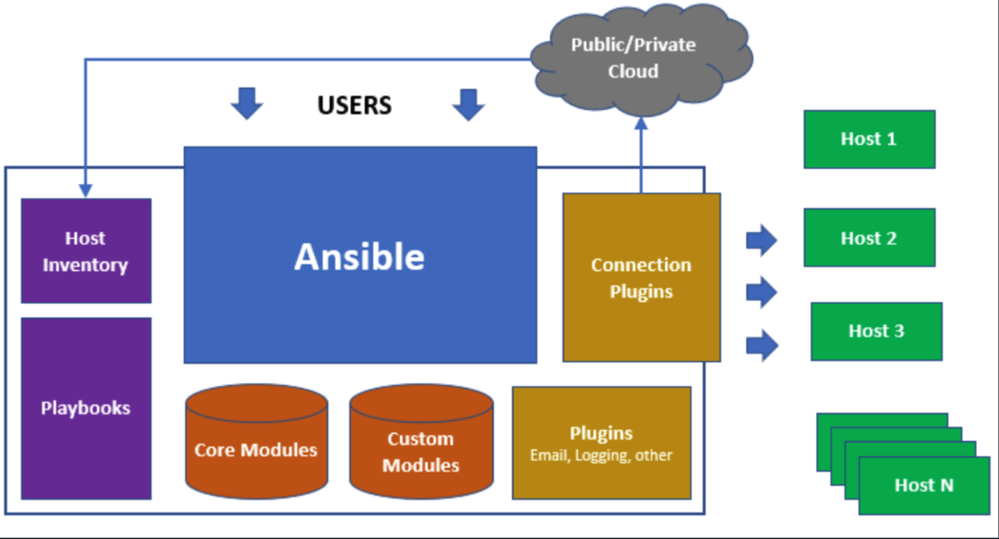
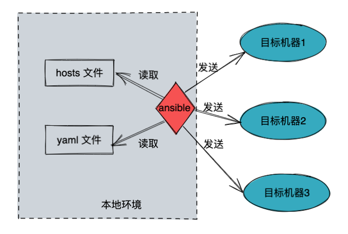

## Ansible 简介

Ansible 是一款基于 Python 开发，能够实现了批量系统配置、程序部署、运行命令等功能的自动化运维工具。Ansible 主要是基于模块进行工作的，本身没有批量部署的能力，真正实现部署功能的是运行的模块。

## Ansible 架构



- Ansible ：运行在中央计算机上；
- Connection Plugins ：连接插件，主要用于本地与操作端之间的连接与通信；
- Host Inventory：指定操作的主机，是一个配置文件里面定义监控的主机；
- Modules：核心模块、自定义模块等等；
- Plugins ：使用插件来完成记录日志、邮件等功能；
- Playbooks：执行多任务，通过 SSH 部署模块到节点上，可多个节点也可以单个节点。

Ansible 主要有两种类型的服务器：控制机器和节点。



控制机器用于控制协调，而节点由控制机器通过 SSH 进行管理，并且控制机通过 inventory 来描述节点的位置。在节点的编排上，Ansible 通过 SSH 部署模块到节点上，模块临时存储在节点上，并以标准输出的 JSON 协议进行通信，从而在远程机上检索信息，发送命令等。

## 配置文件

`.ansible.cfg` 的路径：~/.ansible.cfg

```ini
[defaults]
# inventory 是声明 hosts 配置文件
inventory=~/.ansible/hosts
```

## 常用命令

1、ansible

ansible 命令其实在运维工作中用的最多的命令，它的主要目的或者说是主要的应用场景是：在做临时性的操作的时候 (比如只想看看被控端的一台主机或者多台主机是否存活), 在 man 中的定义是:run a command somewhere else
ansible 通过 ssh 实现配置管理、应用部署、任务执行等功能。

2、ansible-doc

ansible-doc 是查看 ansible 模块 (插件) 文档说明，针对每个模块都有详细的用法说明，功能和 Linux 的 man 命令类似

3、ansible-playbook

ansible-playbook 是日常用的最多的命令，其工作机制是：通过读取预先编写好 yml 格式的 playbook 文件实现批量管理，即按一定的条件组成 ansible 的任务集，然后执行事先编排好的这个任务集。可见于多机器安装部署程序等。

4、ansible-galaxy

ansible-galaxy 命令是一个下载互联网上 roles 集合的工具 (这里提到的 roles 集合其实就是多个 playbook 文件的集合)

roles 集合所在地址 <https://galaxy.ansible.com>

5、ansible-pull

ansible-pull 指令设计到了 ansible 的另一种的工作模式:pull 模式 (ansible 默认使用的是 push 模式)，这个和通常使用的 push 模式的工作机制正好相反 (push 拉取，pull 推送)

6、ansible-console

ansible 自己的终端

7、ansible-config

ansible-config 命令用于查看，编辑管理 ansible 的配置文件。

8、ansible-connection

这是一个插件，指定执行模式 (测试用)

9、ansible-inventory

查看被控制端主机清单的详细信息默认情况下它使用库存脚本，返回 JSON 格式。

10、ansible-vault

ansible-vault 主要用于配置文件的加密，如编写的 playbook 配置文件中包含敏感的信息，不希望其他人随便的看，ansible-vault 可加密 / 解密这个配置文件

## 参考文档

- <https://www.cnblogs.com/brianzhu/category/1368500.html>
